# 1. what is data analysis

```textile
是把隐藏在一些看似杂乱无章的数据背后的信息提炼出来,总结出所研究对象的内在规律,使得数据
的价值最大化

1. 分析用户的消费行为
   - 制定促销活动的方案
   - 制定促销时间和粒度
   - 计算用户的活跃度
   - 分析产品的回购力度
2. 分析广告点击率
   - 决定投放时间
   - 制定广告定向人群方案
   - 决定相关平台的投放
```

It is about extracting the information hidden behind seemingly chaotic data, summarizing the underlying patterns of the studied subjects, and maximizing the value of the data.

1. Analyzing user consumption behavior
   
   - Formulating promotional activity plans
   - Determining the timing and granularity of promotions
   - Calculating user activity levels
   - Analyzing product repurchase rates

2. Analyzing ad click-through rates
   
   - Deciding on the timing of ad placements
   - Developing targeted advertising plans
   - Determining the relevant platforms for ad placements

```textile
数据分析实现流程
• 提出问题
• 准备数据
• 分析数据
• 获得结论
• 成果可视化

Data Analysis Implementation Process
- Define the problem
- Prepare the data
- Analyze the data
- Draw conclusions
- Visualize the results
```

```textile
数据分析三剑客 (big three libraries)
1. numpy
2. pandas
3. matplotlib
```

# 2. Numpy

```textile
numerical calculation
```

```textile
numpy模块
• NumPy(Numerical Python)是 Python 语言中做科学计算的基础库
重在于数值计算,也是大部分Python科学计算库的基础,多用于在大型、多维数组上执行的数值运算。
```

## 2.1 basic operations

### 2.1.1 dimension

```python
import numpy as np 

for 1-D array:
arr1 = np.array([1,2,3,4,5])

for 2-D array:
arr2 = np.array([[1,2,3],[4,5,6]]) 
# 套2個list / 3-D = [[[xxx]...[yyy]]] 套3個list
```

### 2.1.2 array

```python
array1 = np.array([1, 2, 3])
array2 = np.array([4, 5, 6])
array3 = array1 + 1
print(array3)  # [2 3 4]

array4 = array1 * array2
print(array4)  # [ 4 10 18]
```

### 2.1.3 element types

```python
arr = np.array([1,'two',3.0])
# output = ['1','two','3.0']
arr = np.array([1,2,3.0])
# output = [1.0,2.0,3.0]
arr = np.array([1,2,3])
# output = [1,2,3]
```

```textile
数组和列表的区别是什么?
1. 数组中只可以存储相同类型的元素
2. 如果数组中出现了不同类型的元素,则根据数据类型的优先级会将不同类型的数据转换为相同类型
   的数据
3. 数据类型的优先级: (note: important)
   - 字符串 > 浮点型 > 整形
   - string > float > int

What is the difference between an array and a list?
1. An array can only store elements of the same type.
2. If different types of elements appear in an array, they will be converted to the same type based on data type priority.
3. Data type priority: (note: important)
   - String > Float > Integer
   - string > float > int
```

```python
x_array = np.array([1,2,3,4,5])

type(x_array) # <class 'numpy.ndarray'> (show current data format)
x_array.dtype # dtype('int64') (show current data type)
x_array.size  # 5 (show element's number in array)
x_array.ndim  # 1 (show array dimension)

# for changing type
.asarray() / .astype() # change dtype
```

```python
# for changing type
y_array = np.array(x_array, dtype = np.float32)
print(y_array) # [1. 2. 3. 4. 5.]

x_array = np.array([1,2,3])
y_array = np.asarray(x_array, dtype=np.float32)
print(y_array) # [1. 2. 3.]

x = np.array([1,2,3],dtype='int')
print(x.dtype) # int64
y = x.astype('float')
print(y.dtype) # float64
```

## 2.2 index / slice

- for index

```python
array1 = np.array([[1,2,3],[4,5,6],[7,8,9]])
print(array1[1][1]) # 5
```

- for slice

```python
# for raw
array1 = np.array([1, 2, 3, 4, 5])
print(array1[0:3]) # [1 2 3]
print(array1[-2:]) # [4 5]

# for column
array1 = np.array([[1,2,3],[4,5,6],[7,8,9]])
print(array1[:,1]) # [2 5 8] 

# for raw and column
array1 = np.array([[1,2,3],[4,5,6],[7,8,9]])
print(array1[0:2,0:3]) #(raw, column)
"""
[[1 2 3]
 [4 5 6]]
"""
```

## 2.3 bool

```python
array1 = np.array([1, 2, 3, 4, 5, 6, 7, 8])
bool1 = np.array([True, True, False, False, True, True, False, True])
print(array1[bool1]) # [1 2 5 6 8]
```

```textile
note: important
array1 and bool1 must have the same length
```

- bool 比大小

```python
array1 = np.array([1, 2, 3, 4, 5, 6, 7, 8])
print(array1 > 5)
# [False False False False False  True  True  True]
```

- 2 array compare

```python
array1 = np.array([1, 2, 3, 4])
array2 = np.array([1, 2, 7, 8])
print(array1 == array2)
# [ True  True False False]
```

## 2.4 calculation

```python
1. arr.copy()

basic calculation
2. arr.sum() / .min() / .max()    note: .amin() / .amax() are the same
3. .prod() / .mul() / .dot()      **important**
4. .arround()

logical compare
5. .clip() / .logical_and() / .logical_or() / .where()

basic statistic
6. .argmin() / .argmax()
7. .ptp() / .mean() / .median()
8. .std() / .var()
```

- group 1: copy

```textile
当进行变量赋值的时候就要考虑哪种方式才是你想要的，这也是经常出错的地方，而且很难发现。
```

```python
# if you dont use copy:

x1_array = np.array([[1,2,3],[4,5,6]])
x2_array = x1_array
x2_array[1,1] = 100
print(x2_array) 
print(x1_array)
"""
[[  1   2   3]
 [  4 100   6]]
[[  1   2   3]
 [  4 100   6]]
"""

# if using copy:
x1_array = np.array([[1,2,3],[4,5,6]])
x2_array = x1_array.copy()
x2_array[1,1] = 100
print(x2_array)
print(x1_array)
"""
[[  1   2   3]
 [  4 100   6]]
[[1 2 3]
 [4 5 6]]
"""
```

- group 2: sum / min / max

```python
x1_array = np.array([[1,2,3],[4,5,6]])
s1 = np.sum(x1_array,axis=1)
s0 = np.sum(x1_array,axis=0)
print(s1) # [ 6 15] for rows sum
print(s0) # [5 7 9] for columns sum

x1_array = np.array([[1,2,3],[4,5,6]])
print(np.min(x1_array,axis=1)) # [1 4]

x1_array = np.array([[1,2,3],[4,5,6]])
print(np.max(x1_array,axis=0)) # [4 5 6]
```

- group 3: prod / mul / dot

```python
x1_array = np.array([[1,2,3],[4,5,6]])
s1 = np.prod(x1_array,axis=1)
print(s1) # [  6 120] for rows 
```

```python
x = np.array([5,5])
y = np.array([2,2])
z1 = np.array([[2],
              [3]])
z2 = np.array([[2,5],
              [3,3]])

m1 = np.multiply(x,y) # [10,10]  ## 相應位置相乘

d1 = np.dot(x,y) # 20   
d2 = np.dot(x,z1) # [25]
d2 = np.dot(z1,x) # error 
d3 = np.dot(x,z2) # [25 40]
d3 = np.dot(z2,x) # [35 30]
## note: important
```

- group 4: around

```python
numpy.around(a, decimals) 函数返回指定数字的四舍五入值。

参数说明:
  a: 数组
  decimals:舍入的小数位数。默认值为0。如果为负,整数将四舍五入到小数点左侧的位置
```

```python
x1_array = np.array([1.234,2.9,3.58,99.12])
print(np.around(x1_array))
# [ 1.  3.  4. 99.]
print(np.around(x1_array,1))
# [ 1.2  2.9  3.6 99.1]
```

- group 5: clip / logical_and / logical_or / where

```python
x1_array = np.array([[1,2,3],[4,5,6]])
s1 = x1_array.clip(2,4)
print(s1) # for rows 
"""
[[2 2 3]
 [4 4 4]]

if number is smaller than 2, number changes to 2. 
if number is bigger than 4, number changes to 4 
"""
```

```python
x = np.array([1,0,0,4])
y = np.array([1,1,0,2])
print(np.logical_and(x,y)) # [ True False False  True]
print(np.logical_or(x,y))  # [ True  True False  True]
```

```python
x_array = np.array([10,20,30,40,50])
print(np.where(x_array > 30))  # (array([3, 4]),) ## return index

y_array = x_array[x_array > 30]
print(y_array)                 # [40 50]
```

- group 6: argmin / argmax

```python
x1_array = np.array([[1,2,3],[4,5,6]])
s1 = np.argmax(x1_array, axis=1)
print(s1) # [2, 2]
## find the max values' index 
```

- group 7: ptp / mean / median 

```python
numpy.ptp():计算数组中元素最大值与最小值的差(最大值-最小值)
calculate difference: (max - min)
```

```python
arr = np.random.randint(0,10,size=(3,3))
print(arr)
"""
[[0 8 1]
 [9 0 7]
 [1 4 4]]
"""
print(np.ptp(arr,axis=0))     # [9 8 6]
print(np.median(arr,axis=0))  # [1. 4. 4.] 
print(np.mean(arr,axis=0))    #[3.33333333 4.         4.        ]
```

```textile
note: 
median and mean would use float to show the result
```

- group 8: std / var

```python
标准差std():标准差是一组数据平均值分散程度的一种度量。
  公式: std = sqrt(mean((x - x.mean())**2))
  如果数组是[1,2,3,4],则其平均值为2.5。因此,差的平方是 [2.25,0.25,0.25,2.25],
  并且其平均值的平方根除以4,即sqrt(5/4),结果为 1.1180339887498949。
```

```python
方差var():统计中的方差(样本方差)是每个样本值与全体样本值的平均数之差的平方值的平均数,
         即mean((x-x.mean())**2)。换句话说,标准差是方差的平方根
```

```python
arr = np.random.randint(0,10,size=(3,3))
print(arr)
"""
[[5 6 8]
 [0 3 1]
 [7 2 4]]
"""
print(arr.var(axis=0)) # [8.66666667 2.88888889 8.22222222]
print(arr.std(axis=0)) # [2.94392029 1.69967317 2.86744176]
```

## 2.5 common module

### 2.5.1 sort family

```python
.sort()
.argsort()
.searchsorted()
.lexsort()
```

```python
x = np.array([[2,3,1],[4,2,0]])

s1 = np.sort(x)
#[[1 2 3]
# [0 2 4]]
s2 = np.sort(x, axis = 0)  ## sort with column 
#[[2 2 0]
# [4 3 1]]

s3 = np.argsort(x) ## using 'index' to sort
#[[2 0 1]
# [2 1 0]]

x1 = np.array([1,2,3,4,5,6])
z = np.array([2.5,4.5])

print(np.searchsorted(x1,z)) # [2 4]  # return "index" 

array = np.array([[1, 5], [4, 3], [3, 3], [2, 4]])
indices = np.lexsort(array.T)
print(indices)
print(array.T)
"""
[2 1 3 0] # show the index 
[[1 4 3 2]
 [5 3 3 4]] # compare second row first, if the same compare first row
## note: it will using "the final" row to compare first

ex: 
array = np.array([[1, 5, 1], [4, 3, 1], [3, 3, 2], [2, 4, 2]])
[1 0 2 3]
[[1 4 3 2]
 [5 3 3 4]
 [1 1 2 2]]
"""
```

### 2.5.2 shape

```python
1. .reshape()
2. [np.newaxis] # 維度增加 (dimension increase)
3. arr_name.squeeze() # 压缩多余的维度 (reduce redundant dimensions)
4. arr.T 
5. identity()   # diagonal value == 1, otherwise == 0 
cascade operations
6. np.concatenate((a,b)) # 拼接
7. np.stack((a,b)) / np.hstack() / .vstack()
8. arr.flatten()
```

1. reshape

```python
arr = np.array([1,2,3,4,5,6,7,8,9])
print(arr.reshape(3,3))
"""
[[1 2 3]
 [4 5 6]
 [7 8 9]]
"""
# 2D array
arr_2d = np.array([[1, 2, 3], [4, 5, 6]])

# Reshape 2D to 3D
arr_3d = np.reshape(arr_2d, (3, 1, 2))
print(arr_3d)
"""
[[[1 2]]

 [[3 4]]

 [[5 6]]]
"""
```

```textile
note:
1. from x-D to (x+1)-D 
2. if total element = 9, shape only can be (1,9),(3,3),(9,1)
```

2. newaxis

```python
arr = np.arange(5)

x = arr[np.newaxis,:] # : for all element
print(x) # [[0 1 2 3 4]]

x1 = arr[np.newaxis,0:3]
print(x1) #[[0 1 2]]

x2 = arr[:,np.newaxis]
print(x2) #[[0],[1],[2],[3],[4]]


arr1 = np.array([[1,2,3],[4,5,6]])

x3 = arr1[:,np.newaxis,:]
print(x3) #[[[1 2 3],[4 5 6]]]
```

3. squeeze 

```python
arr = np.arange(5)
arr = arr[np.newaxis,:]
arr = arr[np.newaxis,:]  #[[[0 1 2 3 4]]]
x = arr.squeeze() 
print(x) # [0 1 2 3 4]
```

4. arr.T

```python
arr = np.random.randint(0,10,(2,3))
print(arr)
"""
[[0 9 3]
 [7 7 4]]
"""
print(arr.T)
"""
[[0 7]
 [9 7]
 [3 4]]
"""
```

5. identity

```python
arr = np.identity(5) # for 5 "1" in the matrix
print(arr)
"""
[[1. 0. 0. 0. 0.]
 [0. 1. 0. 0. 0.]
 [0. 0. 1. 0. 0.]
 [0. 0. 0. 1. 0.]
 [0. 0. 0. 0. 1.]]
"""
```

6. concatenate

```textile
note: 形狀(邊長一致)才能拼 不然會error
note: The shapes (side lengths must be consistent) must match to concatenate, otherwise, it will result in an error.
```

```python
arr1 = np.array([[1,2,3],[4,5,6]])
arr2 = np.array([[1,2],[4,5]])

print(np.concatenate((arr1,arr2))) # error 
```

```python
arr1 = np.array([[1,2,3],[4,5,6]])
arr2 = np.array([[1,2,3],[4,5,6]])

print(np.concatenate((arr1,arr2)))
"""
[[1 2 3]
 [4 5 6]
 [1 2 3]
 [4 5 6]]
"""
print(np.concatenate((arr1,arr2), axis=1))
"""
[[1 2 3 1 2 3]
 [4 5 6 4 5 6]]
"""
```

7. stack

```python
np.shack()  # create a new dimension to connect 2 arrays

d = np.array([1,2,3])
e = np.array([4,5,6])
print(np.stack((d,e))) # note: 注意括號數量
"""
[[1 2 3]
 [4 5 6]]
"""
```

```python
np.hstack()  # 水平拼接 沒自增維度 (Horizontal concatenation without increasing dimensions.)
np.vstack()  # 垂直拼接 沒自增維度 (Vertical concatenation without increasing dimensions.)

d = np.array([[1,2,3],[1,2,3]])
e = np.array([[4,5,6],[4,5,6]])
print(np.hstack((d,e)))
"""
[[1 2 3 4 5 6]
 [1 2 3 4 5 6]]
"""
print(np.vstack((d,e)))
"""
[[1 2 3]
 [1 2 3]
 [4 5 6]
 [4 5 6]]
"""
```

8. flatten

```python
arr.flatten() # 強制降到1維 (reduce to 1 dimension)

arr = np.array([[[1,2,3],[1,2,3]],[[1,2,3],[1,2,3]]])
print(arr.flatten()) # [1 2 3 1 2 3 1 2 3 1 2 3]
```

### 2.5.3 creating array

```python
1. np.zero() / np.zeros_like(arr) / np.ones()
2. np.r_[x:y:n] / np.c_[x:y:n]
3. np.linespace() / np.arange()
```

1. zero / one / zeros_like

```python
print(np.zeros(3))     # [0. 0. 0.] ## note: default dtype is "float"
print(np.zeros((3,3)))
"""
[[0. 0. 0.]
 [0. 0. 0.]
 [0. 0. 0.]]
"""

print(np.ones((2,3)) * 5)
"""
[[5. 5. 5.]
 [5. 5. 5.]]
"""

x = np.array([1,2,3])   
print(np.zeros_like(x)) # create a same array with 0 
# [0 0 0]
```

2. r_ / c_

```python
arr = np.r_[0:5:1] # for creating raw array
print(arr) 
arr2 = np.c_[0:5:1] # for creating column array
print(arr2)

"""
[0 1 2 3 4]

[[0]
 [1]
 [2]
 [3]
 [4]]
"""
```

3. linespace / arange

```python
print(np.linspace(0, 10, 5))
#[ 0.   2.5  5.   7.5 10. ]
# 5 numbers
```

```textile
note: 
np.linspace() = arithmetic sequence (等差數列) 
from 0 to 10(include) to get 5 numbers
```

```python
print(np.arange(0, 10, 5)) # [0 5]
# interval is 5
```

```textile
note: 
np.arange() = arithmetic sequence (等差數列) 
from 0 to 10(not include) in intervals of 5 
```

### 2.5.4 random

```python
1. np.random.randint()
2. np.random.random()
3. np.random.shuffle()

np.random.seed() 
np.set_printoptions(precision=x)
```

1. randint()

```python
x = np.random.randint(0,100,size=(2,3))
print(x)
"""
[[80 96 79]
 [80 58 45]]
"""
```

2. random()

```python
a5 = np.random.random((2,3)) 
a5 = np.random.rand(2,3)
both of them will create a 2 * 3 matrix

np.set_printoptions(percision = 2) # to control how many percision
np.random.seed() # it will create the same random values

ex:
np.set_printoptions(precision=3)
np.random.seed(10)
x = np.random.normal(0,100,10)
print(x)
"""
[ 133.159   71.528 -154.54    -0.838   62.134  -72.009   26.551   10.855
    0.429  -17.46 ]
""" 
```

```textile
note: only can put "size" inside
```

3. shuffle()

```python
打亂內容
x = np.arange(4) #[0 1 2 3]
np.random.shuffle(x) #[1 2 0 3]
```

### 2.5.5 file control

```python
file.txt:
1 2 3

data = np.loadtxt('file_name.txt')

# for remove "," in file
file.txt:
1,2,3
data = np.loadtxt('file_name.txt',delimiter = ',')

# for remove raw
file.txt:
a,b,c
1,2,3
data = np.loadtxt('file_name.txt',delimiter = ',', skiprows = 1) 
# note: skiprows starts as 1 not 0
output: [1 2 3] 
```

```python
# for saving as "npy" file

x = np.array([1,2,3])
np.save('your_file_name.npy',x)
```

### 2.5.6 picture in np

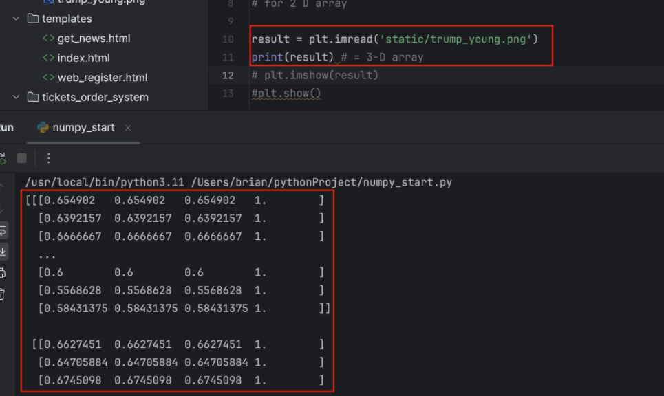

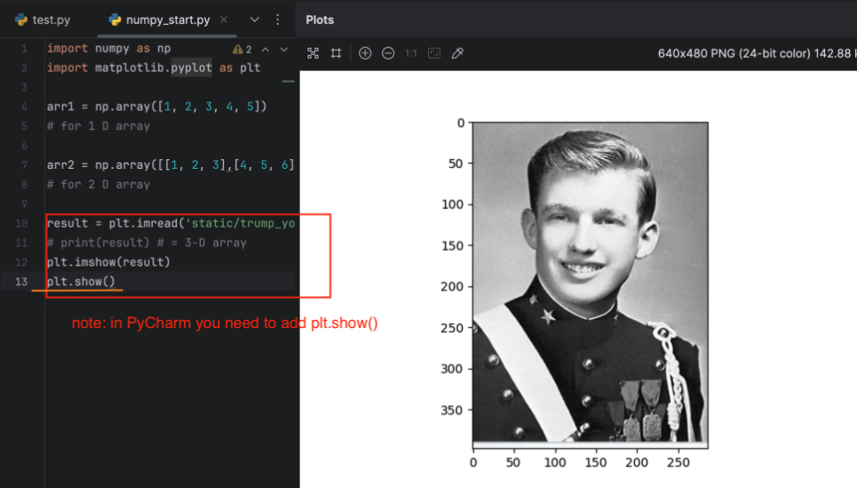

# 3. Pandas

```textile
in pandas, we will use "titanic.csv" as an example
```

## 3.1 data preprocessing

```textile
1. Dataframe
2. series
```

## 3.2 DataFrame

### 3.2.1 basic operations

```python
1. .head() / .tail()
2. .info() / .index() / .columns() / .dtpyes() / .values()
3. .replace() / .rename()
4. del
```

1. head / tail

```python
df = pd.read_csv('titanic.csv')
print(df.head()) # show the first 5 raws data
"""
   PassengerId  Survived  Pclass  ...     Fare Cabin  Embarked
0            1         0       3  ...   7.2500   NaN         S
1            2         1       1  ...  71.2833   C85         C
2            3         1       3  ...   7.9250   NaN         S
3            4         1       1  ...  53.1000  C123         S
4            5         0       3  ...   8.0500   NaN         S
"""
print(df.tail()) # show the last 5 raws data
"""
     PassengerId  Survived  Pclass  ...   Fare Cabin  Embarked
886          887         0       2  ...  13.00   NaN         S
887          888         1       1  ...  30.00   B42         S
888          889         0       3  ...  23.45   NaN         S
889          890         1       1  ...  30.00  C148         C
890          891         0       3  ...   7.75   NaN         Q
"""
```

2. info / index / column / dtypes / values

```python
df = pd.read_csv('titanic.csv')
df.info() # show the data's info (the info in titanic.csv file)
"""
Data columns (total 12 columns):
 #   Column       Non-Null Count  Dtype  
---  ------       --------------  -----  
 0   PassengerId  891 non-null    int64  
 1   Survived     891 non-null    int64  
 2   Pclass       891 non-null    int64  
 3   Name         891 non-null    object 
 4   Sex          891 non-null    object 
 5   Age          714 non-null    float64
 6   SibSp        891 non-null    int64  
 7   Parch        891 non-null    int64  
 8   Ticket       891 non-null    object 
 9   Fare         891 non-null    float64
 10  Cabin        204 non-null    object 
 11  Embarked     889 non-null    object 
dtypes: float64(2), int64(5), object(5)
memory usage: 83.7+ KB
"""
```

```python
df = pd.read_csv('titanic.csv')
print(df.index) # show the index
# RangeIndex(start=0, stop=891, step=1)
```

```python
df = pd.read_csv('titanic.csv')
print(df.columns) # show the columns names (title)
"""
Index(['PassengerId', 'Survived', 'Pclass', 'Name', 'Sex', 'Age', 'SibSp',
       'Parch', 'Ticket', 'Fare', 'Cabin', 'Embarked'],
      dtype='object')
"""
```

```python
df = pd.read_csv('titanic.csv')
print(df.dtypes) # show the types in each columns
"""
PassengerId      int64
Survived         int64
Pclass           int64
Name            object
Sex             object
Age            float64
SibSp            int64
Parch            int64
Ticket          object
Fare           float64
Cabin           object
Embarked        object
dtype: object
"""
note: object == string 
```

```python
df = pd.read_csv('titanic.csv')
print(df.values) # get the values in each raw
"""
[[1 0 3 ... 7.25 nan 'S']
 [2 1 1 ... 71.2833 'C85' 'C']
 [3 1 3 ... 7.925 nan 'S']
 ...
 [889 0 3 ... 23.45 nan 'S']
 [890 1 1 ... 30.0 'C148' 'C']
 [891 0 3 ... 7.75 nan 'Q']]
"""
```

3. replace / rename

```textile
replace is for changing values
rename is for changing titles(labels)
```

```python
df = pd.read_csv('titanic.csv')
print(df[:2])
df.rename(columns={'Survived':'ss'}, inplace=True)
print(df[:2])
"""
   PassengerId  Survived  Pclass  ...     Fare Cabin  Embarked
0            1         0       3  ...   7.2500   NaN         S
1            2         1       1  ...  71.2833   C85         C
2            3         1       3  ...   7.9250   NaN         S

   PassengerId  ss  Pclass  ...     Fare Cabin  Embarked
0            1   0       3  ...   7.2500   NaN         S
1            2   1       1  ...  71.2833   C85         C
2            3   1       3  ...   7.9250   NaN         S
"""
```

```python
df = pd.read_csv('titanic.csv')
print(df[:2])
df.replace(0,'yyy', inplace=True)
print(df[:2])
"""
   PassengerId  Survived  Pclass  ...     Fare Cabin  Embarked
0            1         0       3  ...   7.2500   NaN         S
1            2         1       1  ...  71.2833   C85         C

   PassengerId Survived  Pclass  ...     Fare Cabin  Embarked
0            1      yyy       3  ...     7.25   NaN         S
1            2        1       1  ...  71.2833   C85         C
"""
```

4. del

```python
df = pd.read_csv('titanic.csv')
print(df[:2])
del df['PassengerId']
print(df[:2])
"""
   PassengerId  Survived  Pclass  ...     Fare Cabin  Embarked
0            1         0       3  ...   7.2500   NaN         S
1            2         1       1  ...  71.2833   C85         C

   Survived  Pclass  ... Cabin Embarked
0         0       3  ...   NaN        S
1         1       1  ...   C85        C
"""
```

### 3.2.2 index

```python
.iloc() / .loc() 
bool calculation
```

```textile
1. 指定名字即可索引(df['col_name'])
```

```python
df = pd.read_csv('titanic.csv')
print(df["Age"][:5])
"""
0    22.0
1    38.0
2    26.0
3    35.0
4    35.0
Name: Age, dtype: float64
"""
df = pd.read_csv('titanic.csv')
print(df["Age"][:5].values[:5]) # [22. 38. 26. 35. 35.]

df = df[['Fare','Age']]
print(df)
"""
        Fare   Age
0     7.2500  22.0
1    71.2833  38.0
2     7.9250  26.0
3    53.1000  35.0
4     8.0500  35.0
"""
```

```textile
2. setting index 
```

```python
# for example: setting Name as indices
df = pd.read_csv('titanic.csv')
df = df.set_index('Name')
print(df.head())
"""
                                                    PassengerId  ...  Embarked
Name                                                             ...          
Braund, Mr. Owen Harris                                       1  ...         S
Cumings, Mrs. John Bradley (Florence Briggs Tha...            2  ...         C
Heikkinen, Miss. Laina                                        3  ...         S
Futrelle, Mrs. Jacques Heath (Lily May Peel)                  4  ...         S
Allen, Mr. William Henry                                      5  ...         S
"""
```

```python
# now you can use name to search age
df = pd.read_csv('titanic.csv')
df = df.set_index('Name')
age = df['Age']
print(age['Braund, Mr. Owen Harris']) # 22.0
```

```textile
3. show parts of data
```

```python
df = pd.read_csv('titanic.csv')
print(df[['Age','Fare']][:5]) # need to use ['Age','Fare'] in df[__][:5]
"""
    Age     Fare
0  22.0   7.2500
1  38.0  71.2833
2  26.0   7.9250
3  35.0  53.1000
4  35.0   8.0500
"""
```

- .iloc() 

```textile
using "Integer-based Indexing" to locate the data you want
**if labels have NOT special meaning, using .iloc()**
```

```python
# take the first one only

df = pd.read_csv('titanic.csv')
print(df.iloc[0])
"""
PassengerId                          1
Survived                             0
Pclass                               3
Name           Braund, Mr. Owen Harris
Sex                               male
Age                               22.0
SibSp                                1
Parch                                0
Ticket                       A/5 21171
Fare                              7.25
Cabin                              NaN
Embarked                             S
Name: 0, dtype: object
"""
```

```python
# using slice to take some raws # like .head() / .tail()

df = pd.read_csv('titanic.csv')
print(df.iloc[0:3])
"""
   PassengerId  Survived  Pclass  ...     Fare Cabin  Embarked
0            1         0       3  ...   7.2500   NaN         S
1            2         1       1  ...  71.2833   C85         C
2            3         1       3  ...   7.9250   NaN         S
"""
```

```python
# using slice to take a piece of data
df = pd.read_csv('titanic.csv')
print(df.iloc[0:3,1:3])
"""
   Survived  Pclass
0         0       3
1         1       1
2         1       3
"""
```

- .loc()

```textile
using "Label-based Indexing" to locate the data you want
**if labels have special meaning, using .loc()**
```

```python
# setting up special index ("Name") and using it to get the data
df = pd.read_csv('titanic.csv')
df = df.set_index("Name")
print(df.loc["Heikkinen, Miss. Laina"])
"""
PassengerId                   3
Survived                      1
Pclass                        3
Sex                      female
Age                        26.0
SibSp                         0
Parch                         0
Ticket         STON/O2. 3101282
Fare                      7.925
Cabin                       NaN
Embarked                      S
Name: Heikkinen, Miss. Laina, dtype: object
"""
# for more detail:
print(df.loc["Heikkinen, Miss. Laina", 'Fare']) # 7.925
```

```python
# using slice to take the raws
df = pd.read_csv('titanic.csv')
df = df.set_index("Name")
print(df.loc["Heikkinen, Miss. Laina":"Allen, Mr. William Henry"])
"""
                                              PassengerId  ...  Embarked
Name                                                       ...          
Heikkinen, Miss. Laina                                  3  ...         S
Futrelle, Mrs. Jacques Heath (Lily May Peel)            4  ...         S
Allen, Mr. William Henry                                5  ...         S
"""
```

```python
# using slice to take a piece of data
df = pd.read_csv('titanic.csv')
df = df.set_index("Name")
print(df.loc["Heikkinen, Miss. Laina":"Allen, Mr. William Henry",
      "PassengerId":"Survived"])
"""
                                              PassengerId  Survived
Name                                                               
Heikkinen, Miss. Laina                                  3         1
Futrelle, Mrs. Jacques Heath (Lily May Peel)            4         1
Allen, Mr. William Henry                                5         0
"""
```

- bool

```python
df = pd.read_csv('titanic.csv')
print(df['Fare'] > 40)
"""
0      False
1       True
2      False
3       True
4      False
       ...  
886    False
887    False
888    False
889    False
890    False
Name: Fare, Length: 891, dtype: bool
"""

print(df[df['Fare'] > 40][:5]) # show the first 5 raws about "fare > 40"
"""    PassengerId  Survived  Pclass  ...      Fare        Cabin  Embarked
1             2         1       1  ...   71.2833          C85         C
3             4         1       1  ...   53.1000         C123         S
6             7         0       1  ...   51.8625          E46         S
27           28         0       1  ...  263.0000  C23 C25 C27         S
31           32         1       1  ...  146.5208          B78         C
"""

print(df[df['Sex'] == 'male'][:3]) 
# show the first 3 raws about "sex == male"
"""
   PassengerId  Survived  Pclass  ...    Fare Cabin  Embarked
0            1         0       3  ...  7.2500   NaN         S
4            5         0       3  ...  8.0500   NaN         S
5            6         0       3  ...  8.4583   NaN         Q
"""
```

```python
# calculate the mean about "sex == male"
df = pd.read_csv('titanic.csv')
df = df.set_index("Name")
print(df.loc[df['Sex'] == 'male','Age'].mean()) # 30.72664459161148
```

```python
# calculate the sum about "age > 70"
df = pd.read_csv('titanic.csv')
df = df.set_index("Name")
print((df["Age"]>70).sum()) # 5
```

### 3.2.3 creating DF

```python
from pandas import DataFrame
import numpy as np

df1 = DataFrame(data=np.random.randint(0,100,size=(2,3)))
print(df1)
"""
    0   1   2
0  65  94  44
1  39  40  81
"""
```

```python
df1 = DataFrame({'country':["china","usa","canada"],
                 'population':[14,3,1]})
print(df1)
"""
  country  population
0   china          14
1     usa           3
2  canada           1
"""
```

```textile
note:  important
DataFrame only supports 2-D datatype 
so, if you write size =(5,6,7), it will report error
```

### 3.2.4 calculation

```python
basic statistics 
1. .sum() / .min() / .max() 
   .median() / .mean()
2. .describe()
3. .corr() / .cov()
4. .value_counts() / .cut()
```

1. sum / min / max

```python
df = pd.DataFrame([[1,2,3],[4,5,6]], index=['a','b'], 
                  columns=['A','B','C'])
print(df)
"""
   A  B  C
a  1  2  3
b  4  5  6
"""

print(df.sum()) # default axis=0 ## it can change to axis=1
"""
A    5
B    7
C    9
"""

print(df.min(axis=1))
"""
a    1
b    4
"""

print(df.max())
"""
A    4
B    5
C    6
"""
```

2. describe

```textile
"describe" will show several the statistics info after calculation
```

```python
df = pd.read_csv('titanic.csv')
print(df.describe())
"""
       PassengerId    Survived      Pclass  ...       SibSp       Parch        Fare
count   891.000000  891.000000  891.000000  ...  891.000000  891.000000  891.000000
mean    446.000000    0.383838    2.308642  ...    0.523008    0.381594   32.204208
std     257.353842    0.486592    0.836071  ...    1.102743    0.806057   49.693429
min       1.000000    0.000000    1.000000  ...    0.000000    0.000000    0.000000
25%     223.500000    0.000000    2.000000  ...    0.000000    0.000000    7.910400
50%     446.000000    0.000000    3.000000  ...    0.000000    0.000000   14.454200
75%     668.500000    1.000000    3.000000  ...    1.000000    0.000000   31.000000
max     891.000000    1.000000    3.000000  ...    8.000000    6.000000  512.329200
"""
```

3. corr / cov


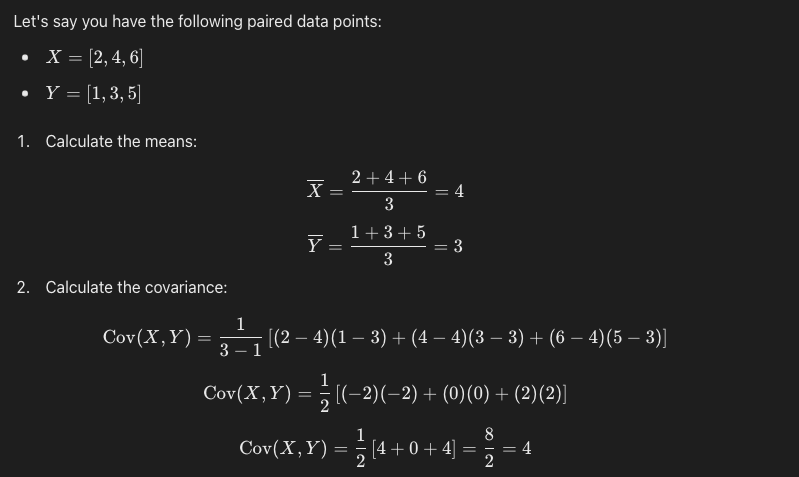

```python
df = pd.read_csv('titanic.csv')
df = df[['Fare','Age']]
print(df.cov())
"""
             Fare         Age
Fare  2469.436846   73.849030
Age     73.849030  211.019125
"""
print(df['Fare'].cov(df['Age'])) # 73.849030
```


```python
df = pd.read_csv('titanic.csv')
df = df[['Fare','Age']]
print(df.corr())
"""
          Fare       Age
Fare  1.000000  0.096067
Age   0.096067  1.000000
"""
print(df['Fare'].corr(df['Age'])) # 0.096067
```

4. value_count / cut

```python
df = pd.read_csv('titanic.csv')
print(df['Sex'].value_counts())
"""
Sex
male      577
female    314
Name: count, dtype: int64
"""

df = pd.read_csv('titanic.csv')
print(df['Age'].value_counts(bins=5)) # 劃分五組
"""
(16.336, 32.252]    346
(32.252, 48.168]    188
(0.339, 16.336]     100
(48.168, 64.084]     69
(64.084, 80.0]       11
Name: count, dtype: int64
"""
```

```python
ages = [15,18,20,21,22,34,41,52,63,79]
bins = [10,40,80]
cla = pd.cut(ages, bins,labels=['first','second'])
print(cla.value_counts())
"""
first     6
second    4
Name: count, dtype: int64
"""
```

### 3.2.5 pivot

```python
# we will use "ss" as an example in this part
ss = pd.DataFrame({
    'Month': ["January", "January", "January", "January", "February", "February", "February", "February", "March", "March", "March", "March"],
    'Category': ["Transportation", "Grocery", "Household", "Entertainment", "Transportation", "Grocery", "Household", "Entertainment", "Transportation", "Grocery", "Household", "Entertainment"],
    'Amount': [74., 235., 175., 100., 115., 240., 225., 125., 90., 260., 200., 120.]
})
print(ss)
"""
       Month        Category  Amount
0    January  Transportation    74.0
1    January         Grocery   235.0
2    January       Household   175.0
3    January   Entertainment   100.0
4   February  Transportation   115.0
5   February         Grocery   240.0
6   February       Household   225.0
7   February   Entertainment   125.0
8      March  Transportation    90.0
9      March         Grocery   260.0
10     March       Household   200.0
11     March   Entertainment   120.0
"""
```

```python
pivot = ss.pivot(index='Category', columns='Month', values='Amount')
print(pivot)
"""
Month           February  January  March
Category                                
Entertainment      125.0    100.0  120.0
Grocery            240.0    235.0  260.0
Household          225.0    175.0  200.0
Transportation     115.0     74.0   90.0
"""
```

```python
pivot = ss.pivot(index='Category', columns='Month', values='Amount')
print(pivot.sum(axis=1)) # sum total cost by category
"""
Category
Entertainment     345.0
Grocery           735.0
Household         600.0
Transportation    279.0
dtype: float64
"""
print(pivot.sum(axis=0)) # by month
"""
Month
February    705.0
January     584.0
March       670.0
dtype: float64
"""
```

----

```python
# now, we will use titanic.csv for pivot
df = pd.read_csv('titanic.csv')
df = df.pivot_table(index='Sex', columns='Pclass', values='Fare')
print(df) ## default average values
"""
Pclass           1          2          3
Sex                                     
female  106.125798  21.970121  16.118810
male     67.226127  19.741782  12.661633
"""
df = df.pivot_table(index='Sex', columns='Pclass', values='Fare',aggfunc='max')
print(df) ## using aggfunc to set the statistics you want
"""
Pclass         1     2      3
Sex                          
female  512.3292  65.0  69.55
male    512.3292  73.5  69.55
"""
```

### 3.2.6 groupby

```python
# now we will use ss as an example for groupby
ss = pd.DataFrame({
    'key': ['A', 'B', 'C', 'A', 'B', 'C', 'A', 'B', 'C'],
    'data': [0, 5, 10, 5, 10, 15, 10, 15, 20]
})
print(ss)
"""
  key  data
0   A     0
1   B     5
2   C    10
3   A     5
4   B    10
5   C    15
6   A    10
7   B    15
8   C    20
"""
```

```python
print(ss.groupby('key').sum()) # for sum the total by keys
"""
     data
key      
A      15
B      30
C      45
"""
```

---

```python
# now, we will use titanic.csv for pivot
df = pd.read_csv('titanic.csv')
print(df.groupby('Sex')['Age'].mean())
"""
Sex
female    27.915709
male      30.726645
Name: Age, dtype: float64
"""
```

```python
# we can use groupby for checking data easier
np.random.seed(0)
kk = pd.DataFrame({
    'A': ['foo', 'bar', 'foo', 'bar', 'foo', 'bar', 'foo', 'foo'],
    'B': ['one', 'one', 'two', 'three', 'two', 'three', 'two', 'one'],
    'C': np.random.randn(8),
    'D': np.random.randn(8)
})
print(kk)
"""
     A      B         C         D
0  foo    one  1.764052 -0.103219
1  bar    one  0.400157  0.410599
2  foo    two  0.978738  0.144044
3  bar  three  2.240893  1.454274
4  foo    two  1.867558  0.761038
5  bar  three -0.977278  0.121675
6  foo    two  0.950088  0.443863
7  foo    one -0.151357  0.333674
"""

kk = kk.groupby(['A', 'B'])
print(kk.count())
"""
           C  D
A   B          
bar one    1  1
    three  2  2
foo one    2  2
    two    3  3
"""

kk = kk.groupby(['A', 'B'])
print(kk.sum()) # it will add same labels items together 
## ex: bar three = 2.24 + -0.97 = 1.26
"""
                  C         D
A   B                        
bar one    0.400157  0.410599
    three  1.263615  1.575949
foo one    1.612695  0.230455
    two    3.796384  1.348945
"""
```

### 3.2.7 common operations

#### 1. merge

```python
df1 = pd.DataFrame({
    'key': ['A', 'B', 'C'],
    'value': [1, 2, 3]
})

df2 = pd.DataFrame({
    'key': ['B', 'C', 'D'],
    'value': [4, 5, 6]
})

result = pd.merge(df1, df2, on='key') # only take the same place to merge
print(result)
"""
0   B        2        4
1   C        3        5
"""

result = pd.merge(df1, df2, on='key', how='outer') 
# using how='outer' to merge all data
print(result)
"""
  key  value_x  value_y
0   A      1.0      NaN
1   B      2.0      4.0
2   C      3.0      5.0
3   D      NaN      6.0
"""

result = pd.merge(df1, df2, on='key', how='left')
# using 'left' to merge all data in "left DF". 
# also, 'left' can chage to 'right' 
print(result)
"""
  key  value_x  value_y
0   A        1      NaN
1   B        2      4.0
2   C        3      5.0
"""
```

#### 2. sort

```python
data = pd.DataFrame({'group':['a','a','b','b','c','c'],'data':[1,2,3,4,5,6]})
print(data)
"""
  group  data
0     c     1
1     c     2
2     b     3
3     b     4
4     a     5
5     a     6
"""
print(data.sort_values(by='group'))
# print(data.sort_values(by=['group','data'], ascending=[True,False]))
"""
  group  data
4     a     5
5     a     6
2     b     3
3     b     4
0     c     1
1     c     2
"""
```

#### 3. drop / assign / NaN(isnull)

1. drop 

```python
# now, we will use 'data' as an example for this part
data = pd.DataFrame({
    'k1': ['one'] * 3 + ['two'] * 4,
    'k2': [3, 2, 1, 3, 3, 4, 4]
})
print(data)
"""
    k1  k2
0  one   3
1  one   2
2  one   1
3  two   3
4  two   3
5  two   4
6  two   4
"""
```

```python
print(data.drop_duplicates()) # drop the same values and only keep one
"""
    k1  k2
0  one   3
1  one   2
2  one   1
3  two   3
5  two   4
"""
print(data.drop_duplicates(subset=['k1']))
# for drop the same values in k1
"""
    k1  k2
0  one   3
3  two   3
"""
```

2. assign

```python
# add a new column in DF
k = pd.DataFrame({'k3':[1,1,1,1,1,1,1]})
print(data.assign(k3=k))
"""
    k1  k2  k3
0  one   3   1
1  one   2   1
2  one   1   1
3  two   3   1
4  two   3   1
5  two   4   1
6  two   4   1
"""
```

3. isnull / notnull / fillna

```python
k = pd.DataFrame({'k3':[1,1,1]})
data = data.assign(k3=k)
print(data)
"""
    k1  k2   k3
0  one   3  1.0
1  one   2  1.0
2  one   1  1.0
3  two   3  NaN
4  two   4  NaN
"""

print(data.isnull()) # notnull just change F to T and T to F
"""
      k1     k2     k3
0  False  False  False
1  False  False  False
2  False  False  False
3  False  False   True
4  False  False   True
"""
```

```python
print(data.fillna(0)) # using fillna to fill the NaN value to 0
"""
    k1  k2   k3
0  one   3  1.0
1  one   2  1.0
2  one   1  1.0
3  two   3  0.0
4  two   4  0.0
"""
```

#### 4. apply function

```python
data = pd.DataFrame({
    'k1': ['one'] * 3 + ['two'] * 2,
    'k2': [3, 2, 1, 3, 4]
})
print(data)
"""
    k1  k2
0  one   3
1  one   2
2  one   1
3  two   3
4  two   4
"""

# create a def
def change_name(name): 
    if name['k1'] == 'one':
        return 'o'
    elif name['k1'] == 'two':
        return 't'
data['New Name'] = data.apply(change_name, axis='columns')
print(data)
"""
    k1  k2 New Name
0  one   3        o
1  one   2        o
2  one   1        o
3  two   3        t
4  two   4        t
"""

# or replace the same column
data['k1'] = data.apply(change_name, axis='columns')
print(data)
"""
  k1  k2
0  o   3
1  o   2
2  o   1
3  t   3
4  t   4
"""
```

#### 5. time

```python
# create a timestamp
ts = pd.Timestamp('20180101')
print(ts) # 2018-01-01 00:00:00
print(ts.month) # 1
print(ts.day) # 1

# add or sub time
print(ts + pd.Timedelta('5 days')) # 2018-01-06 00:00:00

# slice and index
np.random.seed(0)
ts = pd.DataFrame({'time': pd.date_range('20180101', periods=10, freq='12h'),
                   'populations':np.random.randint(0,10,10)})
print(ts.set_index('time')
"""
                    populations
time                            
2018-01-01 00:00:00            5
2018-01-01 12:00:00            0
2018-01-02 00:00:00            3
2018-01-02 12:00:00            3
2018-01-03 00:00:00            7
2018-01-03 12:00:00            9
2018-01-04 00:00:00            3
2018-01-04 12:00:00            5
2018-01-05 00:00:00            2
2018-01-05 12:00:00            4
"""

print(ts.loc['20180102'])  # 結合loc去使用
"""
                     populations
time                            
2018-01-02 00:00:00            3
2018-01-02 12:00:00            3
"""
print(ts.loc['20180102'].sum()) # populations    6
```

```python
# resample
np.random.seed(0)
ts = pd.DataFrame({
    'time': pd.date_range('20180101', periods=10, freq='12h'),
    'populations': np.random.randint(0, 10, 10)
})
ts = ts.set_index('time')

ts = ts.resample('1d').mean() 
# resample(x).__().  x is the time range for combine,
#.                   __ is for what you want to do.
print(ts)
"""
            populations
time                   
2018-01-01          2.5
2018-01-02          3.0
2018-01-03          8.0
2018-01-04          4.0
2018-01-05          3.0
"""
```

## 3.3 Series

### 3.3.1 creating Series

```python
impory numpy as np
from pandas import Series
s1 = Series([1, 2, 3])
print(s1)
"""
0    1
1    2
2    3
dtype: int64
"""
s2 = Series(np.random.randint(0,100,4))
print(s2)
"""
0    42
1    62
2    38
3     7
dtype: int64
"""
```

```python
s1 = Series({'city':'sf',
             'state':'ca',})
print(s1)
"""
city     sf
state    ca
dtype: object
"""
# key == index
```

```textile
note: important
Series only support 1D datatype
```

### 3.3.2 index

```python
.iloc() / .loc() 
# the same as DataFrame
```

```python
s1 = Series({'A':1,
             'B':2,
             'C':3,})
print(s1.iloc[0]) # 1
```

```python
s1 = Series({'A':1,
             'B':2,
             'C':3,})
print(s1.loc['B']) # 2
```

### 3.3.3 basic operations

```python
1. .replace() / .rename()
2. ._append()
3. del
```

1. replace / rename

```python
s1 = Series({'A':1,
             'B':2,
             'C':3,})

print(s1.replace(1,10))
"""
A    10
B     2
C     3
dtype: int64
"""
```

```python
s1 = Series({'A':1,
             'B':2,
             'C':3,})

print(s1.rename({'A':'a'}))
"""
a    1
B    2
C    3
dtype: int64
"""
```

2. _append

```python
s1 = Series({'A':1,
             'B':2,
             'C':3,})
s2 = s1._append(Series({'D': 4}))
print(s2)
```

```textile
note:
using "append" must have two "Series" datatype
```

3. del

```python
s1 = Series({'A':1,
             'B':2,
             'C':3,})
del s1["A"]
print(s1)
"""
B    2
C    3
dtype: int64
"""
```

## 3.4 Memory save

```textile
迪哥python 3.4 
```

```textile
for basic knowledge:
1. change int64 to int32, also, float64 to float32
2. object(str) uses most of the memory place(9 times than int and float)
3. the same "object type" can change to "cateogry type"
```

```python
# Load the CSV file
gl = pd.read_csv('game_log.csv')
print(gl.info(memory_usage='deep')) # 764MB

# Define the memory usage function
def mem_usage(pandas_obj):
    if isinstance(pandas_obj, pd.DataFrame):
        usage_b = pandas_obj.memory_usage(deep=True).sum()
    else:
        usage_b = pandas_obj.memory_usage(deep=True)
    usage_mb = usage_b / 1024 ** 2
    return '{:03.2f} MB'.format(usage_mb)

# Optimize integer columns
gl_int = gl.select_dtypes(include=['int64'])
converted_int = gl_int.apply(pd.to_numeric, downcast='integer')

# Optimize float columns
gl_float = gl.select_dtypes(include=['float64'])
converted_float = gl_float.apply(pd.to_numeric, downcast='float')

# Optimize object columns
gl_obj = gl.select_dtypes(include=['object']).copy()
converted_obj = pd.DataFrame()

for col in gl_obj.columns:
    num_unique_values = len(gl_obj[col].unique())
    num_total_values = len(gl_obj[col])
    if num_unique_values / num_total_values < 0.5:
        converted_obj.loc[:, col] = gl_obj[col].astype('category')
    else:
        converted_obj.loc[:, col] = gl_obj[col]

# Replace original columns with optimized ones
gl[converted_int.columns] = converted_int
gl[converted_float.columns] = converted_float
gl[converted_obj.columns] = converted_obj

# Save the optimized DataFrame to a new CSV file
gl.to_csv('game_log_optimized.csv', index=False)

# Print the memory usage information
print(gl.info(memory_usage='deep')) # 100MB
```

```textile
note: important
when you re-open file "game_log_optimized.csv", it is still 764MB memory 
usage.
so, you can just open a half(or the other size) of the csv file.
```

```python
# Read only the first 50% of rows
total_rows = sum(1 for _ in open('game_log.csv'))  
# Get total number of rows
num_rows = total_rows // 100  # Calculate 1% of the rows

df = pd.read_csv('game_log.csv', nrows=num_rows)
print(df.info(memory_usage='deep'))
"""
<class 'pandas.core.frame.DataFrame'>
RangeIndex: 1719 entries, 0 to 1718
Columns: 161 entries, date to acquisition_info
dtypes: float64(89), int64(6), object(66)
memory usage: 5.9 MB
None
"""
# only load 1719 raws / total 171907 raws
```

```python
# if you want random data

# Define the chunk size as 10,000 rows per chunk
chunksize = 10000 # you can change to 1000 or whatever you want

# Initialize a dictionary to store processed chunks by an index
processed_chunks = {} # using dict or list are almost the same speed

# Read the CSV file in chunks
for i, chunk in enumerate(pd.read_csv('game_log.csv', chunksize=chunksize)):
    # Process each chunk (e.g., sample 10% of the chunk)
    processed_chunk = chunk.sample(frac=0.1)

    # Store the processed chunk in the dictionary
    processed_chunks[i] = processed_chunk

# Optionally, you can concatenate the dictionary values
df_combined = pd.concat(processed_chunks.values())

# Work with the final DataFrame
print(df_combined.info())
print(df_combined.head())
```

# 4. Matplotlib

```textile
also can use "sklearn" for drawing plot
```

## 4.1 normal settings

```python
# draw a x-y image
import matplotlib.pyplot as plt

plt.plot([1,2,3,4,5],[6,7,8,9,10])
plt.xlabel("x",fontsize=14) # for the "x"(word) size
plt.ylabel("y")
print(plt.show())
```

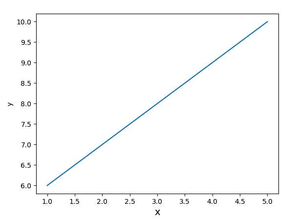

### 4.1.1 for plot() setting

```textile
1. for line or dot types setting
2. for color setting
3. for linewidth
4. for transparency
```

```python
plt.plot([1,2,3,4,5],[6,7,8,9,10],':',color='g')
# or you can write: plt.plot([1,2,3,4,5],[6,7,8,9,10], 'r--') 
                                     # red dashed line (color + line/dot)
plt.xlabel("x",fontsize=14)
plt.ylabel("y")
print(plt.show()) 
### note: ':' and 'g' are the places to change

# for multiple types together (linestyle & marker)
plt.plot([1,2,3,4,5],[6,7,8,9,10],color='red',
         linestyle='dashed',marker='o',markerfacecolor='g')
```

```python
 ## for line / dot types setting
 1. '-' = soild line (default)
 2. '-.' & '--' & ':' = dashed line

 3. '.' = dot
 4. ',' = pixel dot
 5. 'o' = circle dot
 6. 'v' = down triangle dot & '^' = up triangle dot
 7. '<' = left triangle dot & '>' = right triangle dot
 8. '1' = down fork dot & '2' = up fork dot
 9. '3' = left fork dot & '4' = right fork dot
10. 's' = square dot & 'p' = pentagon dot
11. '*' = star dot 
12. 'h' = hexagon dot & 'H' = hexagon dot
13. '+' = plus dot & 'x' = multiplication dot
14. 'D' = filled cross dot & 'd' = skinny dot
15. '_' = horizontal line dot
```

```python
## for color setting
1. 'b' = blue (default)
2. 'g' = green
3. 'r' = red
4. 'c' = cyan (青)
5. 'm' = magenta (red)
6. 'y' = yellow
7. 'k' = black
8. 'w' = white
```

```python
## for linewidth control
plt.plot([1,2,3,4,5],[6,7,8,9,10],'y-', linewidth=7)
```

```python
## for transparency # using alpha 
plt.plot([1,2,3,4,5],[6,7,8,9,10],'r--', alpha=0.5) # 50 %
```

### 4.1.2 subplot(子圖)

```python
import matplotlib.pyplot as plt
import numpy as np

x = np.linspace(-10,10)
y = np.sin(x)
plt.subplot(211)         # 2行1列 first 1 pict   
plt.plot(x,y,color='blue')
plt.subplot(212)         # 2行1列 sec 2 pict  
plt.plot(x,y,color='r')
print(plt.show())

# so, plt.subplot(121) / plt.subplot(122) == 1行2列 first one/two pict
```

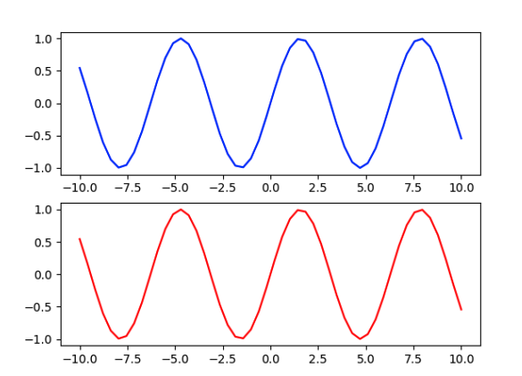

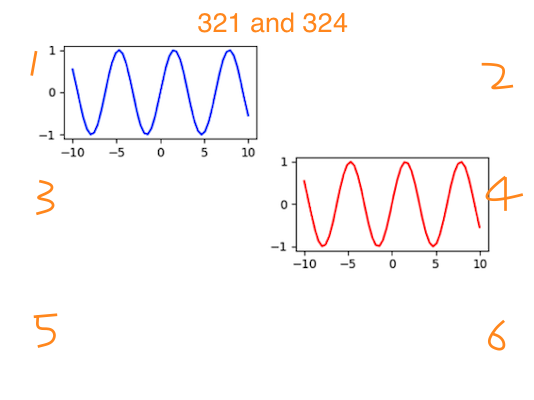

#### layout subplot

```python
# 3x3 的布局，第一个子图
ax1 = plt.subplot2grid((3, 3), (0, 0))

# 布局大小都是 3x3，各自位置不同
ax2 = plt.subplot2grid((3, 3), (1, 0))

# 可以都占用一些位置，一个顶三个
ax3 = plt.subplot2grid((3, 3), (0, 2), rowspan=3)

# 同上，一个顶两个
ax4 = plt.subplot2grid((3, 3), (2, 0), colspan=2)
ax5 = plt.subplot2grid((3, 3), (0, 1), rowspan=2)
print(plt.show())
```

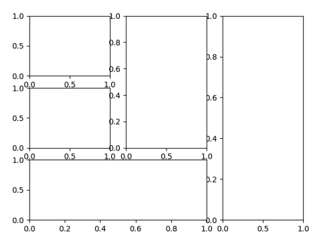

- embedded in plot

```python
# 随便创建些数据
x = np.linspace(0, 10, 1000)

# 因为要画两幅图，所以要有两份数据
y2 = np.sin(x ** 2)
y1 = x ** 2

fig, ax1 = plt.subplots()

# 设置嵌套图位置，其参数分别表示
# left: 绘图区左侧边缘线与 Figure 画布左侧边缘线的距离
# bottom: 绘图区底部边缘线与 Figure 画布底部边缘线的距离
# width: 绘图区的宽度
# height: 绘图区的高度
left, bottom, width, height = [0.22, 0.45, 0.3, 0.35]

# 加入嵌套图
ax2 = fig.add_axes([left, bottom, width, height])

# 分别绘制
ax1.plot(x, y1)
ax2.plot(x, y2)

print(plt.show())
```

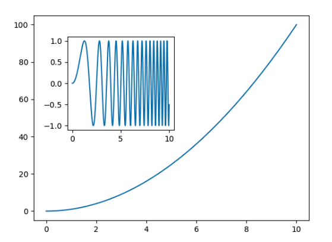

### 4.1.3 comment in plot

```textile
show comment and arrow
```

```python
import matplotlib.pyplot as plt

# Example data
x = [1, 2, 3, 4, 5]
y = [2, 3, 5, 7, 11]

plt.plot(x, y, color='b', linestyle=':', 
         marker='o', markerfacecolor='r', markersize=10)

# Adding labels to the axes
plt.xlabel('x: x is aaa')
plt.ylabel('y: y is bbb')

# Adding a title
plt.title('the title is zzz')

# Adding text at a specific location
plt.text(2, 2, 'comm in sp loc')

# Display grid
plt.grid(True)

# Adding an annotation with an arrow
plt.annotate('here is annot', xy=(4, 5), xytext=(4.5, 6),
             arrowprops=dict(facecolor='red', shrink=0.05, headlength=20, headwidth=20))

print(plt.show())
```

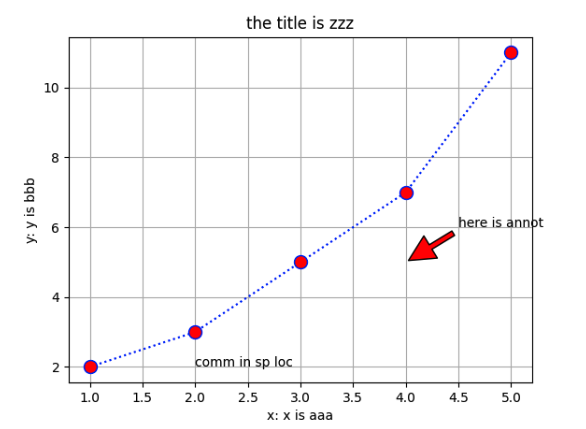

### 4.1.4 x_y labels

```python
x = range(10)
y = range(10)
labels = ['here' for i in range(10)]

fig, ax = plt.subplots()
plt.plot(x, y)
plt.title('the title zzz')

ax.set_xticklabels(labels, rotation=45, horizontalalignment='right')
ax.spines['top'].set_visible(False) # to remove top coordinate axis
ax.spines['right'].set_visible(False) # to remove right corrdinate axis

print(plt.show())
```

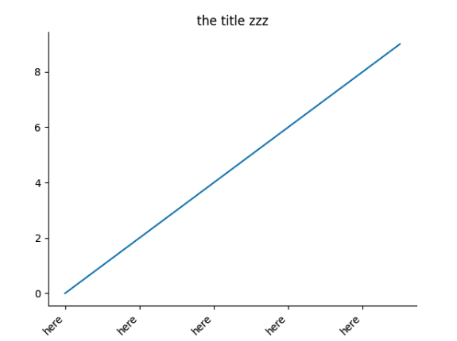

### 4.1.5 legend box

```python
x = np.arange(10)
for i in range(1,4):
    plt.plot(x,i*x**2, label=' Group %d' %i)
plt.legend(loc='best') # it will find the best place to put the legend

print(plt.show())
```

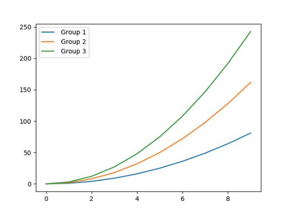

### 4.1.6 different styles

```python
print(plt.style.available)
"""
['Solarize_Light2', '_classic_test_patch', '_mpl-gallery', 
'_mpl-gallery-nogrid', 'bmh', 'classic', 'dark_background', 
'fast', 'fivethirtyeight', 'ggplot', 'grayscale', 'seaborn-v0_8', 
'seaborn-v0_8-bright', 'seaborn-v0_8-colorblind', 'seaborn-v0_8-dark', 
'seaborn-v0_8-dark-palette', 'seaborn-v0_8-darkgrid', 'seaborn-v0_8-deep',
'seaborn-v0_8-muted', 'seaborn-v0_8-notebook', 'seaborn-v0_8-paper', 
'seaborn-v0_8-pastel', 'seaborn-v0_8-poster', 'seaborn-v0_8-talk', 
'seaborn-v0_8-ticks', 'seaborn-v0_8-white', 'seaborn-v0_8-whitegrid', 
'tableau-colorblind10']
"""
note: just choose a style you like
```

```python
x = np.array([1, 2, 3, 4, 5])
y = np.array([3,6,2,4,5])
plt.style.use('dark_background')
plt.plot(x, y)
print(plt.show())
```

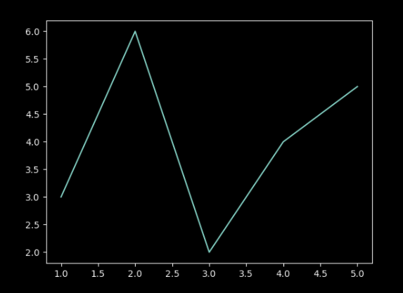

## 4.2 chart styles

### 4.2.1 bar plot

```python
np.random.seed(0)
x = np.arange(5)

# Generate some random data
y = np.random.randint(-5, 5, 5)
fig, axes = plt.subplots(ncols=2)

# Vertical bar plot
v_bars = axes[0].bar(x, y, color='red')

# Horizontal bar plot
h_bars = axes[1].barh(x, y, color='red')

# Adding custom details using the axis index
axes[0].axhline(0, color='grey', linewidth=2)
axes[1].axvline(0, color='grey', linewidth=2)

print(plt.show())
```

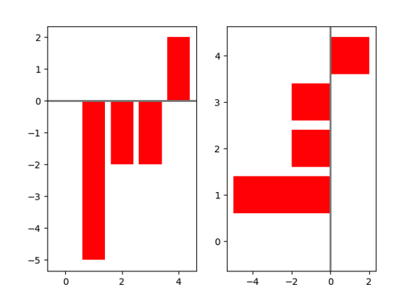

```textile
for error bar adding
```

```python
# Data
mean_values = [1, 2, 3]

# Error bars
variance = [0.2, 0.4, 0.5]

# Labels
bar_label = ['bar1', 'bar2', 'bar3']

# Specify positions
x_pos = list(range(len(bar_label)))

# Bar plot with error bars
plt.bar(x_pos, mean_values, yerr=variance, alpha=0.3)

# Set y-axis limit manually
max_y = max(zip(mean_values, variance))
plt.ylim([0, (max_y[0] + max_y[1]) * 1.2])

# Y-axis label
plt.ylabel('variable y')

# X-axis labels
plt.xticks(x_pos, bar_label)

print(plt.show())
```

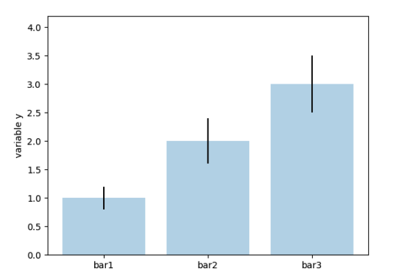

```textile
for adding more detail in plot
```

```python
# 数据
data = range(200, 225, 5)

# 要对比的类别名称
bar_labels = ['a', 'b', 'c', 'd', 'e']

# 指定画图区域大小
fig = plt.figure(figsize=(10, 8))

# 一会要横着画，所以 y 轴上找每个起始位置
y_pos = np.arange(len(data))

# 在 y 轴写上各个类别名称
plt.yticks(y_pos, bar_labels, fontsize=16)

# 绘制条形图，指定颜色和透明度
bars = plt.barh(y_pos, data, alpha=0.5, color='g')

# 画一条竖线，至少需要 3 个参数，即 x 轴位置（min(data)）、y 轴的起始位置和终止位置
plt.vlines(min(data), -1, len(data) + 0.5, linestyle='dashed')

# 在对条形图上注释，这里写了随意计算的结果
for b, d in zip(bars, data):
    plt.text(b.get_width() + b.get_width() * 0.05,
             b.get_y() + b.get_height() / 2,
             '{0:.2%}'.format(d / min(data)))

print(plt.show())
```

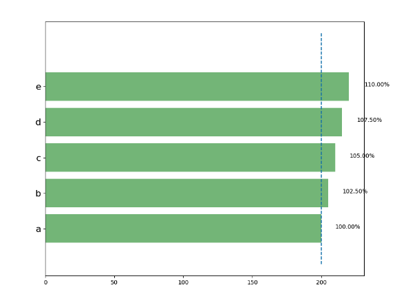

### 4.2.2 box plot

```python
tang_data = [np.random.normal(0, std, 100) for std in range(1, 4)]
fig = plt.figure(figsize=(8, 6))
plt.boxplot(tang_data, sym='s', vert=True)

plt.xticks([y + 1 for y in range(len(tang_data))], ['x1', 'x2', 'x3'])
plt.xlabel('x')
plt.title('box plot')

print(plt.show())
```

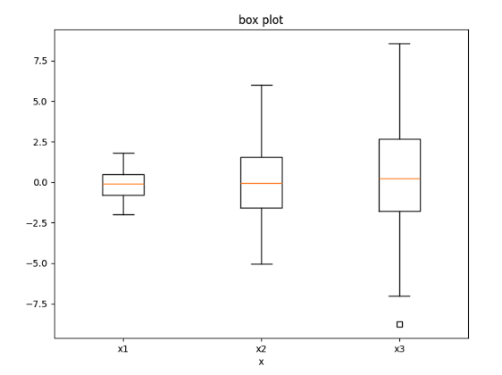

```textile
plt.boxplot()
x：            指定要绘制箱线图的数据。 
notch：        是否以凹口的形式展现箱线图，默认非凹口。 
sym：          指定异常点的形状，默认为+号显示。 
vert：         是否需要将箱线图垂直摆放，默认垂直摆放。 
positions：    指定箱线图的位置，默认为[0,1,2…]。 
widths：       指定箱线图的宽度，默认为0.5。 
patch_artist： 是否填充箱体的颜色。 
meanline：     是否用线的形式表示均值，默认用点来表示。 
showmeans：    是否显示均值，默认不显示。 
showcaps：     是否显示箱线图顶端和末端的两条线，默认显示。 
showbox：      是否显示箱线图的箱体，默认显示。 
showfliers：   是否显示异常值，默认显示。 
boxprops：     设置箱体的属性，如边框色、填充色等。 
labels：       为箱线图添加标签，类似于图例的作用。 
filerprops：   设置异常值的属性，如异常点的形状、大小、填充色等。 
medianprops：  设置中位数的属性，如线的类型、粗细等。 
meanprops：    设置均值的属性，如点的大小、颜色等。 
capprops：     设置箱线图顶端和末端线条的属性，如颜色、粗细等。
```

- violinplot (小提琴圖)

```python
# 横着画两个图来对比
fig, axes = plt.subplots(nrows=1, ncols=2, figsize=(12, 5))

# 随机创建一些数据
tang_data = [np.random.normal(0, std, 100) for std in range(6, 10)]

# 左边画小提琴图
axes[0].violinplot(tang_data, showmeans=False, showmedians=True)

# 设置图题
axes[0].set_title('violin plot')

# 右边画盒图
axes[1].boxplot(tang_data)
axes[1].set_title('box plot')

for ax in axes:
    # 为了对比更清晰一些，把网格画出来
    ax.yaxis.grid(True)

    # 指定 x 轴画的位置
    ax.set_xticks([y + 1 for y in range(len(tang_data))])

    # 设置 x 轴上指定的名字
    ax.set_xticklabels(['x1', 'x2', 'x3', 'x4'])

print(plt.show())
```

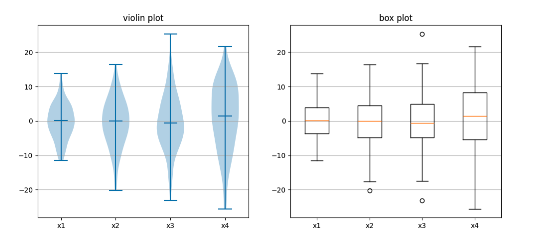

### 4.2.3 histogram

```python
data = np.random.normal(0, 20, 1000)
bins = np.arange(-100, 100, 5)
plt.hist(data, bins=bins, edgecolor='black')
plt.xlim([min(data) - 5, max(data) + 5]) # in -80 to -85 and 65 to 70
# set x-axis limits slight beyond
print(plt.show())
```

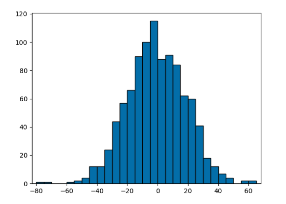

```python
import random # don't forget to import 
# 随机构造些数据
data1 = [random.gauss(15, 10) for i in range(500)]

# 两个类别来对比
data2 = [random.gauss(5, 5) for i in range(500)]

# 指定区间
bins = np.arange(-50, 50, 2.5)

# 分别绘制，透明一点
plt.hist(data1, bins=bins, label='class 1', alpha=0.3, edgecolor='black')
plt.hist(data2, bins=bins, label='class 2', alpha=0.3, edgecolor='black')

# 用不同颜色表示不同类别
plt.legend(loc='best')

print(plt.show())
```

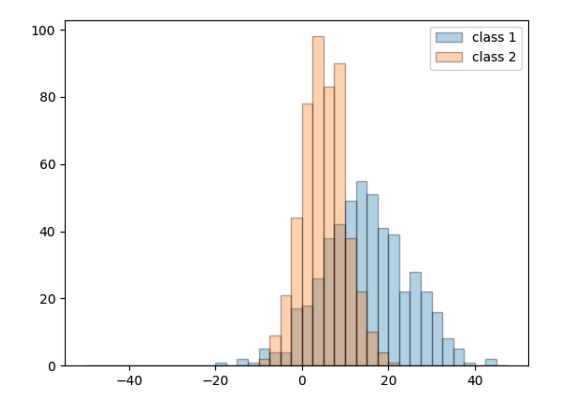

### 4.2.4 scatter plot

```python
N = 1000
x = np.random.randn(N)
y = np.random.randn(N)

plt.scatter(x, y, alpha=0.3)
plt.grid(True)

print(plt.show())
```

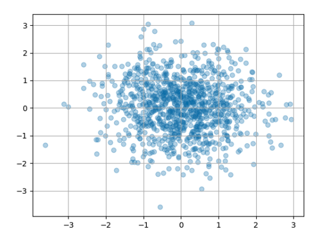

### 4.3.5 3D plot

```python
from mpl_toolkits.mplot3d import Axes3D # dont forget to import

# 设置随机种子，以让结果一致
np.random.seed(1)
# 随机创建数据方法
def randrange(n, vmin, vmax):
    return (vmax - vmin) * np.random.rand(n) + vmin


fig = plt.figure()

# 绘制 3D 图
ax = fig.add_subplot(111, projection='3d')
n = 100

# 颜色和标记以及取值范围
for c, m, zlow, zhigh in [('r', 'o', -50, -25), ('b', 'x', -30, -5)]:
    xs = randrange(n, 23, 32)
    ys = randrange(n, 0, 100)
    zs = randrange(n, int(zlow), int(zhigh))

    # 3 个轴数据都需要传入
    ax.scatter(xs, ys, zs, c=c, marker=m)

ax.view_init(elev=30, azim=30) # change 觀察角度 for plot
print(plt.show())
```

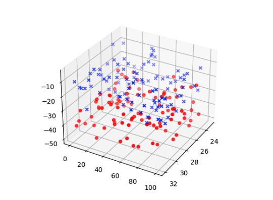

```python
fig = plt.figure()
ax = fig.add_subplot(111, projection='3d')

for c, z in zip(['r', 'g', 'b', 'y'], [30, 20, 10, 0]):
    xs = np.arange(20)
    ys = np.random.rand(20)
    cs = [c] * len(xs)
    ax.bar(xs, ys, zs=z, zdir='y', color=cs, alpha=0.5)


print(plt.show())
```

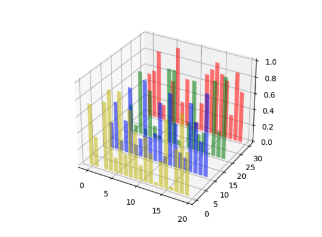
