```textile
SwiftUI => release 2019 (very new) (IOS Future)
```

# 1. setup

- create project
1. project name: the name of your app or project. This name is used in the project structure and as part of the **bundle identifier**. NOTE: better not use any special characters (- / +...). 

2. Team: this is for selecting an **Apple Developer Account**. NOTE: if you're planning to run your app on a physical device or distribute it on the App Store, you need to sign in with an Apple developer account. 

3. Organization Identifier: a reverse-domain style identifier (default: `com.yourcompany`)

4. Bundle Identifier: A unique identifier for your app in the format `com.yourcompany.yourprojectname` (default).  

5. Testing system: `XCTest for Unit and UI Testis` and `Swift Testing with XCTest UI Tests`. Which one should you choose? 
   
   1. If you need to test **both UI and backend logic**, go with "XCTest for Unit and UI Testis" 
   
   2. If you main focus is **UI interactions** (buttons, screens, animations), "Swift Testing with XCTest UI Tests" is enough

6. Storage: Determines how the app will manage storage (Core data, CloudKit). if `None`, meaning no storage system is configured. 
   
   1. None: The app doesn't include any built-in storage system and you must manually implement your own storage mechanism, such as `UserDefaults`, `File System`, `SQLite`...
   
   2. Core Data: A framework provided by Apple for object-oriented database management and for local storage. Example: Note-taking apps, To-do apps. 
   
   3. CloudKit: Allows data storage in iCloud, making it accessible across multiple devices. Features: Apple ID-linked storage, syncing between devices automatically. Example: multi-device syncing Note. 
   
   4. Combine Core Data and CloudKit: Benefits: data is stored locally and synced across devices automatically. Works offline and updates when online. (Note: user's iCloud)

7. Host in CloudKit: if enable, it allows the app to store data in Apple's **CloudKit**. 

## 1.1 GitHub

... 

# 2. Xcode basic knowledge

## 2.1 main folder structure:

 (selected `XCTest for Unit and UI Testis`)

```textile
projectname (root folder)
|
-- projectname (main app source code)
|    |
|    -- Preview content: stores resources for SwiftUI previews.(Assets)
|    -- ContentView.swift: The main swiftUI view of your app. 
|    -- projectnameAPP.swift: the entry point of the app
|
-- projectnameTests (Unit Tests): the folder contains unit tests for app
|
-- projectnameUITests (UI Tests): contain UI tests that simulate user interactions
```

modify `ContentView.swift` to design UI

Run `projectnameTests` and `projectnameUITests` to ensure app works correctly. 

## 2.2 double clicks root folder

root folder > General 

- identity :
  
  - display name: the name show in icon. If your project name is too long, you can write down shorter name for display in icon. 
  
  - version: start from 1.0. If adding new functions and push to users, version change to 1.1. If a "big" update, version change to 2.0. 
  
  - build: If you work with teammates and they discover bugs, you can create a new build to address those fixes. For example, **Build 2**: Fix bugs and send the updated build back to your teammates. 

- supported destinations: 
  
  - your app supports iPhone, iPad ... 

- minimum deployments: 
  
  - if user's iPhone or iPad less than minimum deployments, they cannot use this app. 
  
  - usually don't use the latest version because most people may not have updated their phones yet. 

- development info: 
  
  - iPhone orientation / iPad orientation: allow the iPhone or iPad to be used in different orientations or restrict it to a single orientation.

- App Icons and Launch Screen: 
  
  - creating app icon in the root folder > project name > Assets
    
    - in Assets, find AppIcon to create app's icon

# 3. UI design

**Note: It is easy to use the left toolbox to modify your app layout.**

## 3.0 comment / reformat

- comment in swift

```swift
// single line comment

/*
multi-line comment 
*/
```

- reformat code

`control + shift + i` 

## 3.1 text()

- example: 

```swift
Text("Hello, World this is the swiftful thinking bootcamp. i am really enjoying theis course and learning alot.".lowercased())
                .font(.body)
                .fontWeight(.bold)
                .foregroundColor(Color.red)
                .kerning(2)
                .baselineOffset(2)
                .multilineTextAlignment(.leading)
                .fontDesign(.default)
                .frame(width: 300, height: 100,alignment: .center)
                .minimumScaleFactor(0.2)
```

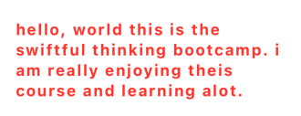

.font()

```swift
// automatically update size base on user selection
.font(.title)

// fixed font size
.font(.system(size:24))
```

.kerning()

```swift
// change distance between 2 words 
Text("Hello").kerning(10)
// H e l l o
```

.baselineOffset()

```swift
// change distance between 2 lines
Text("Hello world ....").baselineOffset(10)
/*
Hello 

world .... 
*/
```

.frame()

```swift
// create a frame for the text

// note: if you don't write a lot in the text but you want your word in the left place
Text("Hello").frame(alignment: .leading)
```

### swift

```swift
import SwiftUI

struct NewViewText: View {
    var body: some View {
        VStack{
            Text("Hello, World this is the swiftful thinking bootcamp. i am really enjoying theis course and learning alot.".lowercased())
                .font(.body)
                .fontWeight(.bold)
                .foregroundColor(Color.red)
                .kerning(2)
                .baselineOffset(2)
                .multilineTextAlignment(.leading)
                .fontDesign(.default)
                .frame(width: 300, height: 100,alignment: .center)
                .minimumScaleFactor(0.2)
        }
        .padding()
    }
}

#Preview {
    NewViewText()
}
```

## 3.2 shape

Go to top right place to find `+` (library)

now select circle as an example

- example: Circle()

```swift
Circle()
                .trim(from: 0.2, to: 1.0)
                .fill(Color.blue)
                //.foregroundStyle(.blue)
                .stroke(Color.red, style: StrokeStyle(lineWidth: 20, dash: [10]))
```

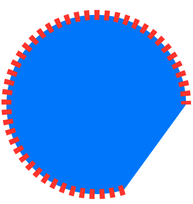

.trim()

```swift
// .trim modifies the shape's path, so mush before .fill and .stroke
Circle().trim().fill().stroke()
```

exercise: (loading circle)

```swift
// creating loading circle 
Circle()
                .trim(from:0.2, to: 1.0)
                .stroke(Color.orange, lineWidth: 20)
```

- example: Ellipse()

```swift
Ellipse().fill(Color.blue).frame(width: 100, height: 50)
```

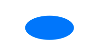

- example: Capsule()

```swift
Capsule(style: .circular).fill(Color.pink).stroke(Color.blue, lineWidth: 10).frame(width: 100,height: 50)
```

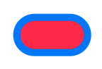

- example: RoundedRectangle()

```swift
RoundedRectangle(cornerRadius: 10)
                .frame(width: 50,height: 50)
```

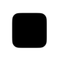

### swift

```swift
import SwiftUI

struct NewViewShape: View {
    var body: some View {
        VStack {
            /*Circle()
                .trim(from: 0.2, to: 1.0)
                .fill(Color.blue)
                //.foregroundStyle(.blue)
                .stroke(
                    Color.red, style: StrokeStyle(lineWidth: 20, dash: [10]))*/

            //Ellipse().fill(Color.blue).frame(width: 100, height: 50)

            /*Capsule(style: .circular).fill(Color.pink).stroke(Color.blue, lineWidth: 10).frame(width: 100,height: 50) */

            RoundedRectangle(cornerRadius: 30)

        }
        .padding()
    }
}

#Preview {
    NewViewShape()
}
```

## 3.3 color

- example: 

```swift
RoundedRectangle(cornerRadius: 30)
                .fill(Color(hue: 0.61, saturation: 0.981, brightness: 0.852))
                .frame(width: 300, height: 200)
                .shadow(color: Color.black, radius: 17, x: -20, y: -20)
```

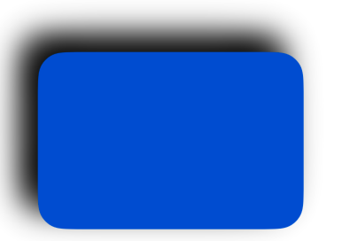

```swift
Color.primary // black

Color.red // red

Color(UIColor.green) // from UIColor (may have more solution)

Color(.displayP3, red: 0.9, green: 0.5, blue: 0, opacity: 0.5))
// customize color (oriange) between 1 and 0

Color(hue: 0.294, saturation: 0.776, brightness: 0.886)
// customize color, using left toolbox to modify
```

.shadow()

```swift
// create shadow 
.shadow(color: Color.black) // select shadow's color

.shadow(radius: 17, x: 20, y: -20) // where is the shadow
```

### swift

```swift
import SwiftUI

struct NewViewColor: View {
    var body: some View {
        VStack {
            /* RoundedRectangle(cornerRadius: 30)
                .fill(Color.primary)
                .frame(width: 300, height: 200)
            /* RoundedRectangle(cornerRadius: 30) */
                .fill(Color(.displayP3, red: 0.9, green: 0.5, blue: 0, opacity: 0.5)) // between 1 and 0
                .frame(width: 300, height: 200) */
            RoundedRectangle(cornerRadius: 30)
                .fill(Color(hue: 0.61, saturation: 0.981, brightness: 0.852))
                .frame(width: 300, height: 200)
                .shadow(color: Color.black, radius: 17, x: -20, y: -20)

        }
        .padding()
    }
}

#Preview {
    NewViewColor()
}
```

## 3.4 gradients

- example: LinearGradient

```swift
RoundedRectangle(cornerRadius: 10)
             .fill(
                 LinearGradient(
                     gradient: Gradient(colors: [Color.red, Color.blue]),
                     startPoint: .topLeading,
                     endPoint: .bottomTrailing)
             )
             .frame(width: 200, height: 100)
```

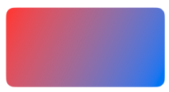

- example: RadialGradient

```swift
RoundedRectangle(cornerRadius: 10)
                .fill(
                    RadialGradient(
                        colors: [Color.orange, Color.green],
                        center: .center,
                        startRadius: 5,
                        endRadius: 80)
                )
                .frame(width: 200, height: 100)
```

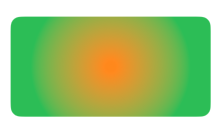

- example: AngularGradient

```swift
RoundedRectangle(cornerRadius: 10)
                .fill(
                    AngularGradient(
                        gradient: Gradient(colors: [Color.purple, Color.yellow]),
                        center: .topLeading,
                        angle: .degrees(180 + 20)
                    )
                )
                .frame(width: 200, height: 100)
```


### swift

```swift
import SwiftUI

struct NewViewGradient: View {
    var body: some View {
        VStack {
            /* RoundedRectangle(cornerRadius: 10)
             .fill(
                 LinearGradient(
                     gradient: Gradient(colors: [Color.red, Color.blue]),
                     startPoint: .topLeading,
                     endPoint: .bottomTrailing)
             )
             .frame(width: 200, height: 100) */
            /* RoundedRectangle(cornerRadius: 10)
                .fill(
                    RadialGradient(
                        colors: [Color.orange, Color.green],
                        center: .center,
                        startRadius: 5,
                        endRadius: 80)
                )
                .frame(width: 200, height: 100) */
            RoundedRectangle(cornerRadius: 10)
                .fill(
                    AngularGradient(
                        gradient: Gradient(colors: [Color.purple, Color.yellow]),
                        center: .topLeading,
                        angle: .degrees(180 + 20)
                    )
                )
                .frame(width: 200, height: 100)

        }
        .padding()
    }
}

#Preview {
    NewViewGradient()
}
```

## 3.5 system icons

SF symbols web to check all icons: [SF Symbols - Apple Developer](https://developer.apple.com/sf-symbols/)

- example:  heart

```swift
Image(systemName: "heart.fill") // google: SF symbols to see more details
                .resizable()
                //.font(Font.title)
                .foregroundColor(Color.red)
                .scaledToFill()
                .frame(width: 100, height: 100)
                .clipped()
```

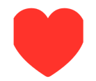

- example: clear (multi-color icon)

```swift
Image(systemName: "clear")
                .font(.title)
                .symbolRenderingMode(.palette) 
                .foregroundStyle(.black, .blue)
                //.foregroundColor(.blue)
                //.padding()
                //.background(Color.white)
```


### swift

```swift
import SwiftUI

struct NewViewSystemIcon: View {
    var body: some View {
        VStack{
            /* Image(systemName: "heart.fill") // google: SF symbols to see more details
             .resizable()
             //.font(Font.title)
             .foregroundColor(Color.red)
             .scaledToFill()
             .frame(width: 100, height: 100)
             .clipped() */
            /* Image(systemName: "person.fill.badge.plus")
             .renderingMode(.original)
             .font(.largeTitle) */
            Image(systemName: "clear")
                .font(.title)
                .symbolRenderingMode(.palette)
                .foregroundStyle(.black, .blue)
                //.foregroundColor(.blue)
                //.padding()
                //.background(Color.white)

        }
        .padding()
    }
}

#Preview {
    NewViewSystemIcon()
}
```

## 3.6 image

store images inside **Assets**

using rocky mountain images as an example

```swift
 Image("rocky_mountain0")
                .resizable()
                //.scaledToFit()
                .frame(width: 200, height: 200)
                //.cornerRadius(30) // have corner
                //.cornerRadius(150) // circle
                .clipShape(
                    //Circle()
                    Ellipse()
                )
```


### swift

```swift
import SwiftUI

struct NewViewImage: View {
    var body: some View {
        VStack {
            Image("rocky_mountain0") // note: store in Assets
                .resizable()
                //.scaledToFit()
                .frame(width: 200, height: 200)
                //.cornerRadius(30) // have corner
                //.cornerRadius(150) // circle
                .clipShape(
                    //Circle()
                    Ellipse()
                )
        }
        .padding()
    }
}

#Preview {
    NewViewImage()
}
```

## 3.7 frame()

- example: text + 2 backgrounds

```swift
Text("Frame!")
                .background(Color.red) // for words
                .frame(width: 100, height: 100, alignment: .center)
                .background(Color.blue) // all backgound except words
```


```swift
Text("Frame!!!")
                .background(Color.blue)
                .frame(minWidth: 10, idealWidth: 30, maxWidth: 100, maxHeight: .infinity, alignment: .top)
                .background(Color.orange)
```

- example: text + multi-frames + multi-backgrounds

```swift
Text("Frame!!!!!!")
                .background(Color.red)
                .frame(height: 100)
                .background(Color.blue)
                .frame(maxWidth: .infinity, alignment: .center)
                .background(Color.orange)
                .frame(height: 400)
                .background(Color.green)
                .frame(maxHeight: .infinity)
                .background(Color.yellow)
```

note: can use frame and background to visualize UI design

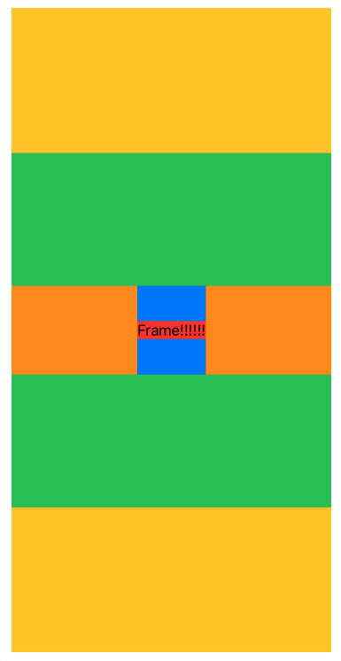

### swift

```swift
import SwiftUI

struct NewViewFrame: View {
    var body: some View {
        VStack {
            /* Text("Frame!")
                .background(Color.red) // for words
                .frame(width: 100, height: 100, alignment: .center)
                .background(Color.blue) // all backgound except words */
            /* Text("Frame!!!")
                .background(Color.blue)
                .frame(minWidth: 10, idealWidth: 30, maxWidth: 100, maxHeight: .infinity, alignment: .top)
                .background(Color.orange) */
            Text("Frame!!!!!!")
                .background(Color.red)
                .frame(height: 100)
                .background(Color.blue)
                .frame(maxWidth: .infinity, alignment: .center)
                .background(Color.orange)
                .frame(height: 400)
                .background(Color.green)
                .frame(maxHeight: .infinity)
                .background(Color.yellow)
        }
        .padding()
    }
}

#Preview {
    NewViewFrame()
}
```

## 3.8 background() / overlay()

key differences: 

| Feature             | .overlay()                 | .background()              |
| ------------------- | -------------------------- | -------------------------- |
| Position            | above the view (on Top)    | behind the view (behind)   |
| Layering            | topmost layer              | bottom layer               |
| Affects view sizes? | NO                         | YES (if no fixed frame)    |
| Use Case            | Add icons, badges, shadows | Background colors, effects |

- example: background color

```swift
.background(
    Color.red
)
```

- example: background LinearGradient

```swift
.background(
    LinearGradient(
    colors:[.red, .blue],
    startPoint: .leading, 
    endPoint: .bottom
    )
)
```

- example: 2 circles + Text (outer circle without gradient, inner circle with gradient)

```swift
Text("background")
                .frame(width: 100, height: 100)
                .background(

                    Circle()
                        .fill(LinearGradient(gradient: Gradient(colors: [.orange, .blue]), startPoint: .leading, endPoint: .trailing))
                )
                .background(
                    Circle()
                        .fill(.red)
                        .frame(width: 120, height: 120)
                )
```

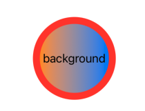

- example: overlay + background

```swift
Rectangle()
                .frame(width: 100, height: 100)
                .overlay(
                    Rectangle()
                        .fill(.blue)
                        .frame(width: 50, height: 50)
                    , alignment: .topLeading)
                .background(
                    Rectangle()
                        .fill(.red)
                        .frame(width: 150, height: 150), alignment: .bottomTrailing
                )
```


- example: system icon (heart) + background

```swift
Image(systemName: "heart.fill")
                .font(.title2)
                .foregroundColor(.white)
                .background(
                    Circle()
                        .fill(LinearGradient(
                            gradient: Gradient(colors: [.blue,.purple]),
                            startPoint: .top,
                            endPoint: .bottom
                        ))
                        .frame(width: 60,height: 60)
                        .shadow(color: Color(hue: 0.614, saturation: 0.607, brightness: 0.76), radius: 4, x: 0, y: 4)
                        .overlay(
                            Circle()
                                .fill(.red)
                                .frame(width: 20,height: 20)
                                .overlay(
                                    Text("5")
                                        .font(.headline)
                                        .foregroundStyle(.white)
                                )
                                .shadow(color: Color(hue: 0.614, saturation: 0.607, brightness: 0.76), radius: 4,x: 0,y: 4)
                            , alignment: .bottomTrailing

                        )
                )
```

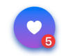

### swift

```swift
import SwiftUI

struct NewViewBgOa: View {
    var body: some View {
        VStack {
            /* Text("background")
                .frame(width: 100, height: 100)
                .background(
                    //Color.red

                    //LinearGradient(colors: [.red, .blue], startPoint: .leading, endPoint: .bottom)

                    Circle()
                        .fill(LinearGradient(gradient: Gradient(colors: [.orange, .blue]), startPoint: .leading, endPoint: .trailing))
                )
                .background(
                    Circle()
                        .fill(.red)
                        .frame(width: 120, height: 120)
                )
             */
            /* Rectangle()
                .frame(width: 100, height: 100)
                .overlay(
                    Rectangle()
                        .fill(.blue)
                        .frame(width: 50, height: 50)
                    , alignment: .topLeading)
                .background(
                    Rectangle()
                        .fill(.red)
                        .frame(width: 150, height: 150), alignment: .bottomTrailing
                )
            */
            Image(systemName: "heart.fill")
                .font(.title2)
                .foregroundColor(.white)
                .background(
                    Circle()
                        .fill(LinearGradient(
                            gradient: Gradient(colors: [.blue,.purple]),
                            startPoint: .top,
                            endPoint: .bottom
                        ))
                        .frame(width: 60,height: 60)
                        .shadow(color: Color(hue: 0.614, saturation: 0.607, brightness: 0.76), radius: 4, x: 0, y: 4)
                        .overlay(
                            Circle()
                                .fill(.red)
                                .frame(width: 20,height: 20)
                                .overlay(
                                    Text("5")
                                        .font(.headline)
                                        .foregroundStyle(.white)
                                )
                                .shadow(color: Color(hue: 0.614, saturation: 0.607, brightness: 0.76), radius: 4,x: 0,y: 4)
                            , alignment: .bottomTrailing

                        )
                )
        }
        .padding()
    }
}

#Preview {
    NewViewBgOa()
}
```

## 3.9 `VStack()` / `HStack()` / `ZStack()`

`VStacks` -> Vertical

`HStacks` -> Horizontal

`ZStacks` -> zIndex (back to front)

- example: `VStack`

```swift
VStack {
            // VStacks -> Vertical
            Rectangle()
                .fill(.red)
                .frame(width: 100, height: 100)

            Rectangle()
                .fill(.blue)
                .frame(width: 100, height: 100)

            Rectangle()
                .fill(.yellow)
                .frame(width: 100, height: 100)
        }
```

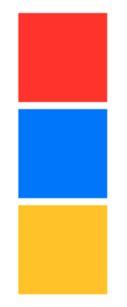

- example: `HStack`

```swift
HStack {
            // HStacks -> Horizontal
            Rectangle()
                .fill(.red)
                .frame(width: 100, height: 100)

            Rectangle()
                .fill(.blue)
                .frame(width: 100, height: 100)

            Rectangle()
                .fill(.yellow)
                .frame(width: 100, height: 100)
        }
```

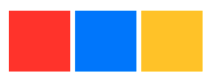

- example:  `ZStack` 

```swift
ZStack {
            // ZStacks -> zIndex (back to front)
            Rectangle()
                .fill(.red)
                .frame(width: 100, height: 100)

            Rectangle()
                .fill(.blue)
                .frame(width: 90, height: 90)

            Rectangle()
                .fill(.yellow)
                .frame(width: 80, height: 80)
        }
```

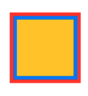

- example: remove white spaces between different contents

```swift
HStack(alignment: .center, spacing: 0, content:{

            Rectangle()
                .fill(.red)
                .frame(width: 100, height: 100)

            Rectangle()
                .fill(.blue)
                .frame(width: 100, height: 100)

            Rectangle()
                .fill(.yellow)
                .frame(width: 100, height: 100)
        })
```

note: `ZStack` no spacing

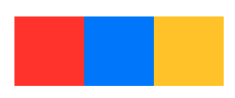

- example: mix `ZStack`, `HStack`, and `VStack`

```swift
ZStack (alignment: .top){
            Rectangle()
                .fill(.yellow)
                .frame(width: 300, height: 200)
            VStack(alignment: .center, spacing: 0){
                Rectangle()
                    .fill(.blue)
                    .frame(width: 80, height: 60)
                Rectangle()
                    .fill(.purple)
                    .frame(width: 40, height: 50)
                HStack{
                    Rectangle()
                        .fill(.green)
                        .frame(width: 40, height: 40)
                    Rectangle()
                        .fill(.pink)
                        .frame(width: 50, height: 40)
                }

            }
            .background(.black)

        }
```

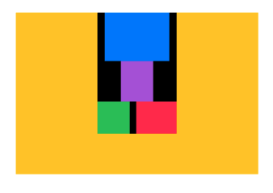

- example: `ZStack` + Text 

```swift
ZStack{
            Circle()
                .frame(width: 100, height: 100)
            Text("1")
                .font(.largeTitle)
                .foregroundColor(.white)
        }
```

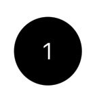

### swift

```swift
import SwiftUI

struct NewViewStack: View {
    var body: some View {
        /* HStack(alignment: .bottom, spacing: 0, content:{
            // alignment to bottom -> align with bottom
            Rectangle()
                .fill(.red)
                .frame(width: 120, height: 120)

            Rectangle()
                .fill(.blue)
                .frame(width: 100, height: 100)

            Rectangle()
                .fill(.yellow)
                .frame(width: 80, height: 80)
        })
         */
        /*ZStack(alignment: .top, content:{
            // alignment to bottom -> align with bottom
            Rectangle()
                .fill(.red)
                .frame(width: 120, height: 120)

            Rectangle()
                .fill(.blue)
                .frame(width: 100, height: 100)

            Rectangle()
                .fill(.yellow)
                .frame(width: 80, height: 80)
        })
        */
        /*ZStack (alignment: .top){
            Rectangle()
                .fill(.yellow)
                .frame(width: 300, height: 200)
            VStack(alignment: .center, spacing: 0){
                Rectangle()
                    .fill(.blue)
                    .frame(width: 80, height: 60)
                Rectangle()
                    .fill(.purple)
                    .frame(width: 40, height: 50)
                HStack{
                    Rectangle()
                        .fill(.green)
                        .frame(width: 40, height: 40)
                    Rectangle()
                        .fill(.pink)
                        .frame(width: 50, height: 40)
                }

            }
            .background(.black)

        }
         */
        ZStack{
            Circle()
                .frame(width: 100, height: 100)
            Text("1")
                .font(.largeTitle)
                .foregroundColor(.white)
        }

        .padding()
    }
}

#Preview {
    NewViewStack()
}
```

## 3.10 padding() / spacer()

| Feature      | .padding()                             | Spacer()                                       |
| ------------ | -------------------------------------- | ---------------------------------------------- |
| Effect       | Adds space around a view               | Expands to push views apart                    |
| Scope        | Affects only the view it is applied to | Affects layout by distributing available space |
| Works inside | any parent container                   | `HStack`, `VStack`, `ZStack`                   |
| Adjustable?  | YES(.padding(20))                      | NO, it takes up all available space            |

When to use padding and spacer? 

1. Use `.padding()` when you need space around a single view.

2. Use `Spacer()` when you need to push views apart inside a stack. 
- example: padding 

```swift
Text("Padding and Spacer")
                .background(.yellow)
                //.padding() // blue area
                .padding(.all, 10) // adjustable padding
                .padding(.leading, 10)
                .background(.blue)
```

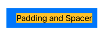

- example: padding with card

```swift
VStack(alignment: .leading){
            Text("Your Name")
                .font(.largeTitle)
                .fontWeight(.bold)
                .padding(.bottom, 10)
            Text("hello, my name is ... my favorite food is ... my favoirte car is ...")
        }
        .padding()
        .background(
            Color.white
                .shadow(color: .black.opacity(0.3),
                        radius: 10,
                        x: 0,
                        y: 10)
        )
    }
```

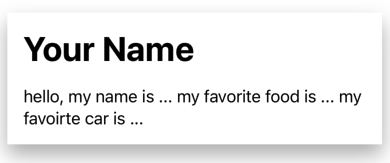

- example: Space

```swift
HStack (spacing: nil){
            Rectangle()
                .frame(width: 100, height: 100)

            Spacer() // push whole width (HStack)
                .frame(height: 10)
                .background(.orange)
            Rectangle()
                .fill(.red)
                .frame(width: 100, height: 100)
        }
        .background(.blue)
    }
```

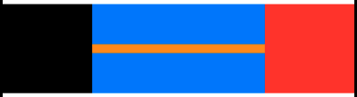

- example: tools in left and right top corners

```swift
VStack{
            HStack{
                Image(systemName: "xmark")
                Spacer()
                Image(systemName: "gear")
            }
            .font(.title)
            .padding(.horizontal)
            Spacer()

        }
```

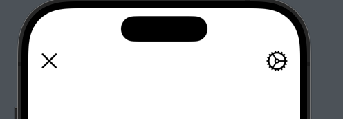

### swift

```swift
import SwiftUI

struct NewViewPadding: View {
    var body: some View {
        VStack(alignment: .leading){
            /* Text("Padding and Spacer")
                .background(.yellow)
                //.padding() // blue area
                .padding(.all, 10) // adjustable padding
                .padding(.leading, 10)
                .background(.blue)
             */
            Text("Your Name")
                .font(.largeTitle)
                .fontWeight(.bold)
                .padding(.bottom, 10)
            Text("hello, my name is ... my favorite food is ... my favoirte car is ...")
        }
        .padding()
        .background(
            Color.white
                .shadow(color: .black.opacity(0.3),
                        radius: 10,
                        x: 0,
                        y: 10)
        )
    }
}

#Preview {
    NewViewPadding()
}
```

```swift
import SwiftUI

struct NewViewSpacer: View {
    var body: some View {
        /*HStack (spacing: nil){
         Rectangle()
         .frame(width: 100, height: 100)

         Spacer() // push whole width (HStack)
         .frame(height: 10)
         .background(.orange)
         Rectangle()
         .fill(.red)
         .frame(width: 100, height: 100)
         }
         .background(.blue)*/

        VStack{
            HStack{
                Image(systemName: "xmark")
                Spacer()
                Image(systemName: "gear")
            }
            .font(.title)
            .padding(.horizontal)
            Spacer()

        }
    }
}

#Preview {
    NewViewSpacer()
}
```

# 4. Operations

## 4.1 let / var

| feature             | let           | var        |
| ------------------- | ------------- | ---------- |
| constant / variable | constant      | variable   |
| Structs             | cannot change | can change |
| Collections         | cannot change | can change |
| Closures            | cannot change | can change |

- let
1. **Immutable**: once assigned, the value cannot be changed

2. **Safer**: prevent accidental modification

3. **Recommend**: using for value that should **Never** change
- var
1. **Mutable**: the value can be changed after assignment

2. **Recommend**: using for value is expected to change

```swift
// example let
let name = "brian"
name = "amy" // error: cannot assign to 'amy' because it is a 'let' constant

// example var
let age = 25
age = 30 // allowed: var can be assigned
```

```swift
// in structs
struct Person {
    let name: String
    var age: Int
}
var person = Person(name: "Alice", age: 40)
person.age = 30 // allow
person.name = "Tom" // error
```

```swift
// collections
var numbers = [1,2,3]
numbers.append(4) // allow

let fixnumbers = [1,2,3]
fixnumbers.append(4) // error 
```

```swift
// closures
var x = 10
let closure = {x += 5}
closure()
print(x) // allow, output 15
```

## 4.2 init() / enums

`init` is needed because `let` properties without default values. 

n Swift, all properties **must be initialized before use**, and since `let` constants **cannot be modified after initialization**, they **must be set during initialization**.

- example: `init`. / change different colors based on `title` variable

```swift
import SwiftUI

struct NewViewInit: View {

    let backgroundColor: Color // variable color
    let count: Int // variable int
    let title: String // variable string

    // init part (like python class)
    init(count: Int, title: String) {
        self.count = count
        self.title = title
        if title == "Apples" {
            self.backgroundColor = .red
        } else {
            self.backgroundColor = .orange
        }
    }

    var body: some View {
        VStack{
            Text("\(count)")
                .font(.largeTitle)
                .foregroundColor(.white)
                .underline()
            Text(title)
                .font(.headline)
                .foregroundColor(.white)

        }
        .frame(width: 150, height: 150)
        .background(backgroundColor)
        .cornerRadius(10)

    }
}

#Preview {
    NewViewInit(count: 20, title: "apples") // give variables
}
```

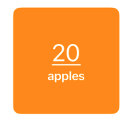

An **`enum`** (short for "enumeration") in Swift is a **type** that defines a group of related values. You use it when you have a set of possible options that are logically related.

When to use `enum`?

1. when you have a **fixed** set of possible values. (day of the weeks, compass directions)

2. when you want type **safety** (instead of using strings "North", "South", you can use `enum`)

3. when using **switch statements** for better readability

4. when you need **associated values** (`case coffee(sugar: Int)`)

```swift
// base example for enum
enum Direction {
    case North
    case South
    case East
    case West
}
let direction = Direction.North

// associated values
enum Beverage {
    case coffee(sugar: Int)
    case tea(milk: Bool)
    case juice(flavor: String)
}

let myDrink = Beverage.coffee(sugar: 2)

// raw values (.rawValue)
enum Rank: Int {
    case bronze = 1
    case silver = 2
    case gold = 3
    case platinum = 4
}

let playerRank = Rank.gold
print(playerRank.rawValue)  // Output: 3
```

- example: fruits in different background colors

```swift
import SwiftUI

struct NewViewInit: View {

    let backgroundColor: Color // variable color
    let count: Int // variable int
    let title: String // variable string

    // init part (like python class)
    init(count: Int, fruit: Fruit) {
        self.count = count
        if fruit == .apple {
            self.title = "Apples"
            self.backgroundColor = .red
        } else {
            self.title = "Oranges"
            self.backgroundColor = .orange
        }
    }

    enum Fruit {
        case apple
        case oriange
    }

    var body: some View {
        VStack{
            Text("\(count)")
                .font(.largeTitle)
                .foregroundColor(.white)
                .underline()
            Text(title)
                .font(.headline)
                .foregroundColor(.white)

        }
        .frame(width: 150, height: 150)
        .background(backgroundColor)
        .cornerRadius(10)

    }
}

#Preview {
    HStack {
        NewViewInit(count: 20, fruit: .apple)
        NewViewInit(count: 7, fruit: .oriange)
    }
}
```

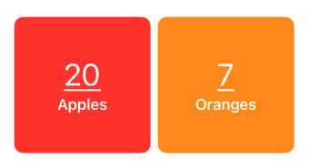
