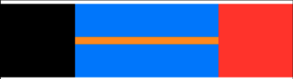
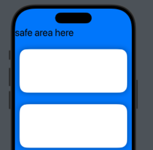

```textile
SwiftUI => release 2019 (very new) (IOS Future)
```

# 1. Setup

- create project
1. project name: the name of your app or project. This name is used in the project structure and as part of the **bundle identifier**. NOTE: better not use any special characters (- / +...).

2. Team: this is for selecting an **Apple Developer Account**. NOTE: if you're planning to run your app on a physical device or distribute it on the App Store, you need to sign in with an Apple developer account.

3. Organization Identifier: a reverse-domain style identifier (default: `com.yourcompany`)

4. Bundle Identifier: A unique identifier for your app in the format `com.yourcompany.yourprojectname` (default).

5. Testing system: `XCTest for Unit and UI Testis` and `Swift Testing with XCTest UI Tests`. Which one should you choose?
   
   1. If you need to test **both UI and backend logic**, go with "XCTest for Unit and UI Testis"
   
   2. If you main focus is **UI interactions** (buttons, screens, animations), "Swift Testing with XCTest UI Tests" is enough

6. Storage: Determines how the app will manage storage (Core data, CloudKit). if `None`, meaning no storage system is configured.
   
   1. None: The app doesn't include any built-in storage system and you must manually implement your own storage mechanism, such as `UserDefaults`, `File System`, `SQLite`...
   
   2. Core Data: A framework provided by Apple for object-oriented database management and for local storage. Example: Note-taking apps, To-do apps.
   
   3. CloudKit: Allows data storage in iCloud, making it accessible across multiple devices. Features: Apple ID-linked storage, syncing between devices automatically. Example: multi-device syncing Note.
   
   4. Combine Core Data and CloudKit: Benefits: data is stored locally and synced across devices automatically. Works offline and updates when online. (Note: user's iCloud)

7. Host in CloudKit: if enable, it allows the app to store data in Apple's **CloudKit**.

## 1.1 GitHub NOT finished yet

...

# 2. Xcode Basic Knowledge

## 2.1 main folder structure:

(selected `XCTest for Unit and UI Testis`)

```textile
projectname (root folder)
|
-- projectname (main app source code)
|    |
|    -- Preview content: stores resources for SwiftUI previews.(Assets)
|    -- ContentView.swift: The main swiftUI view of your app. 
|    -- projectnameAPP.swift: the entry point of the app
|
-- projectnameTests (Unit Tests): the folder contains unit tests for app
|
-- projectnameUITests (UI Tests): contain UI tests that simulate user interactions
```

modify `ContentView.swift` to design UI

Run `projectnameTests` and `projectnameUITests` to ensure app works correctly.

## 2.2 double clicks root folder

root folder > General

- identity :
  
  - display name: the name show in icon. If your project name is too long, you can write down shorter name for display in icon.
  
  - version: start from 1.0. If adding new functions and push to users, version change to 1.1. If a "big" update, version change to 2.0.
  
  - build: If you work with teammates and they discover bugs, you can create a new build to address those fixes. For example, **Build 2**: Fix bugs and send the updated build back to your teammates.

- supported destinations:
  
  - your app supports iPhone, iPad ...

- minimum deployments:
  
  - if user's iPhone or iPad less than minimum deployments, they cannot use this app.
  
  - usually don't use the latest version because most people may not have updated their phones yet.

- development info:
  
  - iPhone orientation / iPad orientation: allow the iPhone or iPad to be used in different orientations or restrict it to a single orientation.

- App Icons and Launch Screen:
  
  - creating app icon in the root folder > project name > Assets
    
    - in Assets, find AppIcon to create app's icon

## 2.3 markups and documentation

- **comment in swift**

```swift
// single line comment

// multi-line comments
// multi-line commments
// shortcut: mouse select multi-lines in xcode, command + / 
// uncomment: do it again

/*
multi-line comments
*/
```

**Note:** **fold** multi-line comment / code with `{}`: `option` + `command` + `left arrow key`

- **reformat code**

`control + shift + i`

- **markup and documentation**
1. Using `///` before a function or variable provides a **short description**.

```swift
/// this function adds two numbers and returns the result
func add(_ a: Int, _ b: Int) -> Int {
    return a + b
}
```

**Note:** Xcode automatically displays this comment as a tooltip when using `add()`.

2. For **detailed explanations**, use `/** ... */`.

```swift
/**
 This function calculates the area of a rectangle.
 - Parameters:
   - width: The width of the rectangle.
   - height: The height of the rectangle.
 - Returns: The calculated area.
*/
func calculateArea(width: Double, height: Double) -> Double {
    return width * height
}
```

**Note:** Xcode shows this when option-clicking the function name.

| Markup            | Description                        |
| ----------------- | ---------------------------------- |
| `- Parameters:`   | Describes function parameters      |
| `- Returns:`      | Explains what the function returns |
| `- Throws:`       | Describes possible errors          |
| `- Note:`         | Adds an additional important note  |
| `- Warning:`      | Highlights a warning               |
| `- Important:`    | Marks crucial information          |
| `- SeeAlso:`      | Links related topics               |
| `- Precondition:` | Notes necessary conditions         |

3. `// MARK`: for code organization

```swift
// MARK: - User Authentication
func login() { ... }

func logout() { ... }

// MARK: - Data Handling
func fetchData() { ... }
```

**Note:** MARK information shows in the **`Minimap`** (easy to find Mark when code is very long)

4. Using `#` for Inline Documentation

Swift allows `#` directives for better code organization.

`#warning` and `#error`:

```swift
#warning("This feature is incomplete.")
// Stops compilation with an error message
//#error("This must be implemented before release")
```

`#if DEBUG` for Debugging:

```swift
#if DEBUG
print("Debug mode is active.")
#endif
```

## 2.4 extract functions & views

make sure body is always nice and clean

- example: call `bottonPress` function

```swift
import SwiftUI

struct NewViewExtractFunc: View {

    @State private var backgroundColor: Color = .blue

        var body: some View {
            ZStack {
                backgroundColor
                    .ignoresSafeArea()
                VStack{
                    Text("Title")
                        .font(.largeTitle)

                    Button(action:{
                        bottonPress() // call function
                    }, label: {
                        Text("change color")
                        .padding()
                        .background(Color.green)
                        .foregroundColor(.white)
                        .cornerRadius(10)
                    })
                }

            }
        }
    func bottonPress(){ // put function behind body View{}
        backgroundColor = .yellow
    }
}
#Preview {
    NewViewExtractFunc()
}
```

- example: create contentLayer to store content

```swift
import SwiftUI

struct NewViewExtractFunc: View {

    @State private var backgroundColor: Color = .blue

        var body: some View {
            ZStack {
                backgroundColor
                    .ignoresSafeArea()

                // content
                contentLayer

            }
        }
    // contentlayer
    var contentLayer: some View{
        VStack{
            Text("Title")
                .font(.largeTitle)

            Button(action:{
                bottonPress()
            }, label: {
                Text("change color")
                .padding()
                .background(Color.green)
                .foregroundColor(.white)
                .cornerRadius(10)
            })
        }
    }

    // function
    func bottonPress(){
        backgroundColor = .yellow
    }
}
#Preview {
    NewViewExtractFunc()
}
```

## 2.5 extract subviews

make sure body is always nice and clean

subviews should under the main view

- example:

```swift
import SwiftUI

struct NewViewExtractSubview: View {

    @State private var backgroundColor: Color = .blue

    var body: some View {
        ZStack {
            backgroundColor
                .ignoresSafeArea()

            // content layer
            contentLayer

        }
    }
    var contentLayer: some View {
        HStack{
            // subviews
            MyItem(title: "Apples", count: 2, color: .red)
            MyItem(title: "bananas", count: 7, color: .yellow)
            MyItem(title: "orange", count: 15, color: .orange)
        }
    }

}
#Preview {
    NewViewExtractSubview()
}

// subviews
struct MyItem: View {

    let title: String
    let count: Int
    let color: Color

    var body: some View {
        VStack {
            Text("\(title)")
            Text("\(count)")

        }
        .padding()
        .background(color)
        .cornerRadius(10)
    }
}
```

# 3. Foundational UI Components

## 3.1 Text()

- example: 

```swift
Text("Hello, World this is the swiftful thinking bootcamp. i am really enjoying theis course and learning alot.".lowercased())
                .font(.body)
                .fontWeight(.bold)
                .foregroundColor(Color.red)
                .kerning(2)
                .baselineOffset(2)
                .multilineTextAlignment(.leading)
                .fontDesign(.default)
                .frame(width: 300, height: 100,alignment: .center)
                .minimumScaleFactor(0.2)
```


`.font()`

```swift
// automatically update size base on user selection
.font(.title)

// fixed font size
.font(.system(size:24))
```

`.kerning()`

```swift
// change distance between 2 words 
Text("Hello").kerning(10)
// H e l l o
```

`.baselineOffest()` 

```swift
// change distance between 2 lines
Text("Hello world ....").baselineOffset(10)
/*
Hello 

world .... 
*/
```

`.frame()` 

```swift
// create a frame for the text

// note: if you don't write a lot in the text but you want your word in the left place
Text("Hello").frame(alignment: .leading)
```

- **swift**

```swift
import SwiftUI

struct NewViewText: View {
    var body: some View {
        VStack{
            Text("Hello, World this is the swiftful thinking bootcamp. i am really enjoying theis course and learning alot.".lowercased())
                .font(.body)
                .fontWeight(.bold)
                .foregroundColor(Color.red)
                .kerning(2)
                .baselineOffset(2)
                .multilineTextAlignment(.leading)
                .fontDesign(.default)
                .frame(width: 300, height: 100,alignment: .center)
                .minimumScaleFactor(0.2)
        }
        .padding()
    }
}

#Preview {
    NewViewText()
}
```

## 3.2 shapes

Go to top right place to find `+` (library)

now select circle as an example

- example: `Circle()`

```swift
Circle()
                .trim(from: 0.2, to: 1.0)
                .fill(Color.blue)
                //.foregroundStyle(.blue)
                .stroke(Color.red, style: StrokeStyle(lineWidth: 20, dash: [10]))
```


`.trim()`

```swift
// .trim modifies the shape's path, so mush before .fill and .stroke
Circle()
    .trim()
    .fill()
    .stroke()
```

exercise: (loading circle)

```swift
// creating loading circle 
Circle()
                .trim(from:0.2, to: 1.0)
                .stroke(Color.orange, lineWidth: 20)
```

- example: Ellipse()

```swift
Ellipse()
    .fill(Color.blue)
    .frame(width: 100, height: 50)
```


- example: `Capsule()`

```swift
Capsule(style: .circular)
    .fill(Color.pink)
    .stroke(Color.blue, lineWidth: 10)
    .frame(width: 100,height: 50)
```


- example: `RoundedRectangle()`

```swift
RoundedRectangle(cornerRadius: 10)
                .frame(width: 50,height: 50)
```


- **swift**

```swift
import SwiftUI

struct NewViewShape: View {
    var body: some View {
        VStack {
            /*Circle()
                .trim(from: 0.2, to: 1.0)
                .fill(Color.blue)
                //.foregroundStyle(.blue)
                .stroke(
                    Color.red, style: StrokeStyle(lineWidth: 20, dash: [10]))*/

            //Ellipse().fill(Color.blue).frame(width: 100, height: 50)

            /*Capsule(style: .circular).fill(Color.pink).stroke(Color.blue, lineWidth: 10).frame(width: 100,height: 50) */

            RoundedRectangle(cornerRadius: 30)

        }
        .padding()
    }
}

#Preview {
    NewViewShape()
}
```

## 3.3 color

- example:

```swift
RoundedRectangle(cornerRadius: 30)
                .fill(Color(hue: 0.61, saturation: 0.981, brightness: 0.852))
                .frame(width: 300, height: 200)
                .shadow(color: Color.black, radius: 17, x: -20, y: -20)
```


```swift
Color.primary // black

Color.red // red

Color(UIColor.green) // from UIColor (may have more solution)

Color(.displayP3, red: 0.9, green: 0.5, blue: 0, opacity: 0.5))
// customize color (oriange) between 1 and 0

Color(hue: 0.294, saturation: 0.776, brightness: 0.886)
// customize color, using left toolbox to modify
```

`.shadow()`

```swift
// create shadow 
.shadow(color: Color.black) // select shadow's color

.shadow(radius: 17, x: 20, y: -20) // where is the shadow
```

- **swift**

```swift
import SwiftUI

struct NewViewColor: View {
    var body: some View {
        VStack {
            /* RoundedRectangle(cornerRadius: 30)
                .fill(Color.primary)
                .frame(width: 300, height: 200)
            /* RoundedRectangle(cornerRadius: 30) */
                .fill(Color(.displayP3, red: 0.9, green: 0.5, blue: 0, opacity: 0.5)) // between 1 and 0
                .frame(width: 300, height: 200) */
            RoundedRectangle(cornerRadius: 30)
                .fill(Color(hue: 0.61, saturation: 0.981, brightness: 0.852))
                .frame(width: 300, height: 200)
                .shadow(color: Color.black, radius: 17, x: -20, y: -20)

        }
        .padding()
    }
}

#Preview {
    NewViewColor()
}
```

## 3.4 gradient

- example: LinearGradient

```swift
RoundedRectangle(cornerRadius: 10)
             .fill(
                 LinearGradient(
                     gradient: Gradient(colors: [Color.red, Color.blue]),
                     startPoint: .topLeading,
                     endPoint: .bottomTrailing)
             )
             .frame(width: 200, height: 100)
```


```


- example: AngularGradient

```swift
RoundedRectangle(cornerRadius: 10)
                .fill(
                    AngularGradient(
                        gradient: Gradient(colors: [Color.purple, Color.yellow]),
                        center: .topLeading,
                        angle: .degrees(180 + 20)
                    )
                )
                .frame(width: 200, height: 100)
```


- **swift**

```swift
import SwiftUI

struct NewViewGradient: View {
    var body: some View {
        VStack {
            /* RoundedRectangle(cornerRadius: 10)
             .fill(
                 LinearGradient(
                     gradient: Gradient(colors: [Color.red, Color.blue]),
                     startPoint: .topLeading,
                     endPoint: .bottomTrailing)
             )
             .frame(width: 200, height: 100) */
            /* RoundedRectangle(cornerRadius: 10)
                .fill(
                    RadialGradient(
                        colors: [Color.orange, Color.green],
                        center: .center,
                        startRadius: 5,
                        endRadius: 80)
                )
                .frame(width: 200, height: 100) */
            RoundedRectangle(cornerRadius: 10)
                .fill(
                    AngularGradient(
                        gradient: Gradient(colors: [Color.purple, Color.yellow]),
                        center: .topLeading,
                        angle: .degrees(180 + 20)
                    )
                )
                .frame(width: 200, height: 100)

        }
        .padding()
    }
}

#Preview {
    NewViewGradient()
}
```

## 3.5 system icons

SF symbols web to check all icons: [SF Symbols - Apple Developer](https://developer.apple.com/sf-symbols/)

- example: heart

```swift
Image(systemName: "heart.fill") // google: SF symbols to see more details
                .resizable()
                //.font(Font.title)
                .foregroundColor(Color.red)
                .scaledToFill()
                .frame(width: 100, height: 100)
                .clipped()
```


- example: clear (multi-color icon)

```swift
Image(systemName: "clear")
                .font(.title)
                .symbolRenderingMode(.palette) 
                .foregroundStyle(.black, .blue)
                //.foregroundColor(.blue)
                //.padding()
                //.background(Color.white)
```


- **swift**

```swift
import SwiftUI

struct NewViewSystemIcon: View {
    var body: some View {
        VStack{
            /* Image(systemName: "heart.fill") // google: SF symbols to see more details
             .resizable()
             //.font(Font.title)
             .foregroundColor(Color.red)
             .scaledToFill()
             .frame(width: 100, height: 100)
             .clipped() */
            /* Image(systemName: "person.fill.badge.plus")
             .renderingMode(.original)
             .font(.largeTitle) */
            Image(systemName: "clear")
                .font(.title)
                .symbolRenderingMode(.palette)
                .foregroundStyle(.black, .blue)
                //.foregroundColor(.blue)
                //.padding()
                //.background(Color.white)

        }
        .padding()
    }
}

#Preview {
    NewViewSystemIcon()
}
```

## 3.6 image

store images inside **Assets**

using rocky mountain images as an example

```swift
 Image("rocky_mountain0")
                .resizable()
                //.scaledToFit()
                .frame(width: 200, height: 200)
                //.cornerRadius(30) // have corner
                //.cornerRadius(150) // circle
                .clipShape(
                    //Circle()
                    Ellipse()
                )
```


- **swift**

```swift
import SwiftUI

struct NewViewImage: View {
    var body: some View {
        VStack {
            Image("rocky_mountain0") // note: store in Assets
                .resizable()
                //.scaledToFit()
                .frame(width: 200, height: 200)
                //.cornerRadius(30) // have corner
                //.cornerRadius(150) // circle
                .clipShape(
                    //Circle()
                    Ellipse()
                )
        }
        .padding()
    }
}

#Preview {
    NewViewImage()
}
```

## 3.7 Async Image (IOS 15+)

`AsyncImage` is a built-in SwiftUI view introduced in **iOS 15** that loads and displays images **from the web asynchronously**, handling **loading states** and **error handling** automatically.

- example: loading image from internet

```swift
import SwiftUI

struct NewViewAsyncImage: View {
    // url (where we want to download)
    let url = URL(string: "https://picsum.photos/200")

    var body: some View {
            AsyncImage(url: url)
        }
}

#Preview {
    NewViewAsyncImage()
}
```

- example: caching images for performance

```swift
import SwiftUI

struct NewViewAsyncImage: View {

    let url = URL(string: "https://picsum.photos/200")

    var body: some View {
        AsyncImage(url: url) {
            phase in
            switch phase {
            case .empty:
                ProgressView() // if empty show loading animation
            case .success(let returnedImage): 
                returnedImage // success loading image
                    .frame(width: 50, height: 50)
                    .cornerRadius(10)
            case .failure: 
                Image(systemName: "quesionmark") // if fail, load questionmark 
                    .font(.headline)
            }
        }

        }
}

#Preview {
    NewViewAsyncImage()
}
```

## 3.8 background materials (IOS 15+)

In **iOS 15+**, SwiftUI introduced **background materials**, which provide a **blurred, frosted glass effect** for UI elements. This is similar to what Apple uses in Control Center and Notification Center.

| Material Type         | Appearance       | Use Case                             |
| --------------------- | ---------------- | ------------------------------------ |
| `.ultraThinMaterial`  | very light blur  | best for subtle overlays             |
| `.ultraThinMaterial`  | light blur       | good for backgrounds                 |
| `.regularMaterial`    | medium blur      | balanced transparency                |
| `.thickMaterial`      | strong blur      | when more opacity is needed          |
| `.ultraThickMaterial` | very strong blur | best for blocking background details |

- example: `.ultraTinMaterial`

```swift
import SwiftUI

struct NewViewBM: View {
    var body: some View{
        VStack{
            Spacer()

            VStack{
                RoundedRectangle(cornerRadius: 4)
                    .frame(width: 50, height: 4)
                    .padding()
                Spacer()
            }
            .frame(height: 350)
            .frame(maxWidth: .infinity)
            .background(.ultraThinMaterial) // IOS 15+
            .cornerRadius(30)
        }
        .ignoresSafeArea()
        .background(
            Image("rocky_mountain1")
        )
    }

}

#Preview {
    NewViewBM()
}
```


## 3.9 TextSelection() (IOS 15+)

SwiftUI introduced `.textSelection(_:)` in **iOS 15**, allowing users to **select and copy text** from a `Text` view.

Note: by default, **`Text` in SwiftUI is not selectable**. Adding `.textSelection(.enabled)` makes it **copyable**.

- example: copy and paste text

```swift
import SwiftUI

struct NewViewTextSelection: View {
    var body: some View{
        Text("Copy and paste the text")
            .textSelection(.enabled)
    }

}

#Preview {
    NewViewTextSelection()
}
```


note: long-press gesture on the text to show the copy/share menu. 

# 4. Layout Basics

## 4.1 frame()

- example: text + 2 backgrounds

```swift
Text("Frame!")
                .background(Color.red) // for words
                .frame(width: 100, height: 100, alignment: .center)
                .background(Color.blue) // all backgound except words
```


```swift
Text("Frame!!!")
                .background(Color.blue)
                .frame(minWidth: 10, idealWidth: 30, maxWidth: 100, maxHeight: .infinity, alignment: .top)
                .background(Color.orange)
```

- example: text + multi-frames + multi-backgrounds

```swift
Text("Frame!!!!!!")
                .background(Color.red)
                .frame(height: 100)
                .background(Color.blue)
                .frame(maxWidth: .infinity, alignment: .center)
                .background(Color.orange)
                .frame(height: 400)
                .background(Color.green)
                .frame(maxHeight: .infinity)
                .background(Color.yellow)
```

note: can use frame and background to visualize UI design


- **swift**

```swift
import SwiftUI

struct NewViewFrame: View {
    var body: some View {
        VStack {
            /* Text("Frame!")
                .background(Color.red) // for words
                .frame(width: 100, height: 100, alignment: .center)
                .background(Color.blue) // all backgound except words */
            /* Text("Frame!!!")
                .background(Color.blue)
                .frame(minWidth: 10, idealWidth: 30, maxWidth: 100, maxHeight: .infinity, alignment: .top)
                .background(Color.orange) */
            Text("Frame!!!!!!")
                .background(Color.red)
                .frame(height: 100)
                .background(Color.blue)
                .frame(maxWidth: .infinity, alignment: .center)
                .background(Color.orange)
                .frame(height: 400)
                .background(Color.green)
                .frame(maxHeight: .infinity)
                .background(Color.yellow)
        }
        .padding()
    }
}

#Preview {
    NewViewFrame()
}
```

## 4.2 background() / overlay()

key differences:

| Feature             | .overlay()                 | .background()              |
| ------------------- | -------------------------- | -------------------------- |
| Position            | above the view (on Top)    | behind the view (behind)   |
| Layering            | topmost layer              | bottom layer               |
| Affects view sizes? | NO                         | YES (if no fixed frame)    |
| Use Case            | Add icons, badges, shadows | Background colors, effects |

- example: background color

```swift
.background(
    Color.red
)
```

- example: background LinearGradient

```swift
.background(
    LinearGradient(
    colors:[.red, .blue],
    startPoint: .leading, 
    endPoint: .bottom
    )
)
```

- example: 2 circles + Text (outer circle without gradient, inner circle with gradient)

```swift
Text("background")
                .frame(width: 100, height: 100)
                .background(

                    Circle()
                        .fill(LinearGradient(gradient: Gradient(colors: [.orange, .blue]), startPoint: .leading, endPoint: .trailing))
                )
                .background(
                    Circle()
                        .fill(.red)
                        .frame(width: 120, height: 120)
                )
```


- example: overlay + background

```swift
Rectangle()
                .frame(width: 100, height: 100)
                .overlay(
                    Rectangle()
                        .fill(.blue)
                        .frame(width: 50, height: 50)
                    , alignment: .topLeading)
                .background(
                    Rectangle()
                        .fill(.red)
                        .frame(width: 150, height: 150), alignment: .bottomTrailing
                )
```


- example: system icon (heart) + background

```swift
Image(systemName: "heart.fill")
                .font(.title2)
                .foregroundColor(.white)
                .background(
                    Circle()
                        .fill(LinearGradient(
                            gradient: Gradient(colors: [.blue,.purple]),
                            startPoint: .top,
                            endPoint: .bottom
                        ))
                        .frame(width: 60,height: 60)
                        .shadow(color: Color(hue: 0.614, saturation: 0.607, brightness: 0.76), radius: 4, x: 0, y: 4)
                        .overlay(
                            Circle()
                                .fill(.red)
                                .frame(width: 20,height: 20)
                                .overlay(
                                    Text("5")
                                        .font(.headline)
                                        .foregroundStyle(.white)
                                )
                                .shadow(color: Color(hue: 0.614, saturation: 0.607, brightness: 0.76), radius: 4,x: 0,y: 4)
                            , alignment: .bottomTrailing

                        )
                )
```


- **swift**

```swift
import SwiftUI

struct NewViewBgOa: View {
    var body: some View {
        VStack {
            /* Text("background")
                .frame(width: 100, height: 100)
                .background(
                    //Color.red

                    //LinearGradient(colors: [.red, .blue], startPoint: .leading, endPoint: .bottom)

                    Circle()
                        .fill(LinearGradient(gradient: Gradient(colors: [.orange, .blue]), startPoint: .leading, endPoint: .trailing))
                )
                .background(
                    Circle()
                        .fill(.red)
                        .frame(width: 120, height: 120)
                )
             */
            /* Rectangle()
                .frame(width: 100, height: 100)
                .overlay(
                    Rectangle()
                        .fill(.blue)
                        .frame(width: 50, height: 50)
                    , alignment: .topLeading)
                .background(
                    Rectangle()
                        .fill(.red)
                        .frame(width: 150, height: 150), alignment: .bottomTrailing
                )
            */
            Image(systemName: "heart.fill")
                .font(.title2)
                .foregroundColor(.white)
                .background(
                    Circle()
                        .fill(LinearGradient(
                            gradient: Gradient(colors: [.blue,.purple]),
                            startPoint: .top,
                            endPoint: .bottom
                        ))
                        .frame(width: 60,height: 60)
                        .shadow(color: Color(hue: 0.614, saturation: 0.607, brightness: 0.76), radius: 4, x: 0, y: 4)
                        .overlay(
                            Circle()
                                .fill(.red)
                                .frame(width: 20,height: 20)
                                .overlay(
                                    Text("5")
                                        .font(.headline)
                                        .foregroundStyle(.white)
                                )
                                .shadow(color: Color(hue: 0.614, saturation: 0.607, brightness: 0.76), radius: 4,x: 0,y: 4)
                            , alignment: .bottomTrailing

                        )
                )
        }
        .padding()
    }
}

#Preview {
    NewViewBgOa()
}
```

## 4.3 `VStack()` / `HStack()` / `ZStack()`

`VStacks` -> Vertical

`HStacks` -> Horizontal

`ZStacks` -> zIndex (back to front)

- example: `VStack`

```swift
VStack {
            // VStacks -> Vertical
            Rectangle()
                .fill(.red)
                .frame(width: 100, height: 100)

            Rectangle()
                .fill(.blue)
                .frame(width: 100, height: 100)

            Rectangle()
                .fill(.yellow)
                .frame(width: 100, height: 100)
        }
```


- example: `HStack`

```swift
HStack {
            // HStacks -> Horizontal
            Rectangle()
                .fill(.red)
                .frame(width: 100, height: 100)

            Rectangle()
                .fill(.blue)
                .frame(width: 100, height: 100)

            Rectangle()
                .fill(.yellow)
                .frame(width: 100, height: 100)
        }
```


- example: `ZStack`

```swift
ZStack {
            // ZStacks -> zIndex (back to front)
            Rectangle()
                .fill(.red)
                .frame(width: 100, height: 100)

            Rectangle()
                .fill(.blue)
                .frame(width: 90, height: 90)

            Rectangle()
                .fill(.yellow)
                .frame(width: 80, height: 80)
        }
```


- example: remove white spaces between different contents

```swift
HStack(alignment: .center, spacing: 0, content:{

            Rectangle()
                .fill(.red)
                .frame(width: 100, height: 100)

            Rectangle()
                .fill(.blue)
                .frame(width: 100, height: 100)

            Rectangle()
                .fill(.yellow)
                .frame(width: 100, height: 100)
        })
```

note: `ZStack` no spacing


- example: mix `ZStack`, `HStack`, and `VStack`

```swift
ZStack (alignment: .top){
            Rectangle()
                .fill(.yellow)
                .frame(width: 300, height: 200)
            VStack(alignment: .center, spacing: 0){
                Rectangle()
                    .fill(.blue)
                    .frame(width: 80, height: 60)
                Rectangle()
                    .fill(.purple)
                    .frame(width: 40, height: 50)
                HStack{
                    Rectangle()
                        .fill(.green)
                        .frame(width: 40, height: 40)
                    Rectangle()
                        .fill(.pink)
                        .frame(width: 50, height: 40)
                }

            }
            .background(.black)

        }
```


- example: `ZStack` + Text

```swift
ZStack{
            Circle()
                .frame(width: 100, height: 100)
            Text("1")
                .font(.largeTitle)
                .foregroundColor(.white)
        }
```


- **swift**

```swift
import SwiftUI

struct NewViewStack: View {
    var body: some View {
        /* HStack(alignment: .bottom, spacing: 0, content:{
            // alignment to bottom -> align with bottom
            Rectangle()
                .fill(.red)
                .frame(width: 120, height: 120)

            Rectangle()
                .fill(.blue)
                .frame(width: 100, height: 100)

            Rectangle()
                .fill(.yellow)
                .frame(width: 80, height: 80)
        })
         */
        /*ZStack(alignment: .top, content:{
            // alignment to bottom -> align with bottom
            Rectangle()
                .fill(.red)
                .frame(width: 120, height: 120)

            Rectangle()
                .fill(.blue)
                .frame(width: 100, height: 100)

            Rectangle()
                .fill(.yellow)
                .frame(width: 80, height: 80)
        })
        */
        /*ZStack (alignment: .top){
            Rectangle()
                .fill(.yellow)
                .frame(width: 300, height: 200)
            VStack(alignment: .center, spacing: 0){
                Rectangle()
                    .fill(.blue)
                    .frame(width: 80, height: 60)
                Rectangle()
                    .fill(.purple)
                    .frame(width: 40, height: 50)
                HStack{
                    Rectangle()
                        .fill(.green)
                        .frame(width: 40, height: 40)
                    Rectangle()
                        .fill(.pink)
                        .frame(width: 50, height: 40)
                }

            }
            .background(.black)

        }
         */
        ZStack{
            Circle()
                .frame(width: 100, height: 100)
            Text("1")
                .font(.largeTitle)
                .foregroundColor(.white)
        }

        .padding()
    }
}

#Preview {
    NewViewStack()
}
```

## 4.4 padding() / Spacer()

| Feature      | .padding()                             | Spacer()                                       |
| ------------ | -------------------------------------- | ---------------------------------------------- |
| Effect       | Adds space around a view               | Expands to push views apart                    |
| Scope        | Affects only the view it is applied to | Affects layout by distributing available space |
| Works inside | any parent container                   | `HStack`, `VStack`, `ZStack`                   |
| Adjustable?  | YES(.padding(20))                      | NO, it takes up all available space            |

When to use padding and spacer?

1. Use `.padding()` when you need space around a single view.

2. Use `Spacer()` when you need to push views apart inside a stack.
- example: padding

```swift
Text("Padding and Spacer")
                .background(.yellow)
                //.padding() // blue area
                .padding(.all, 10) // adjustable padding
                .padding(.leading, 10)
                .background(.blue)
```


- example: padding with card

```swift
VStack(alignment: .leading){
            Text("Your Name")
                .font(.largeTitle)
                .fontWeight(.bold)
                .padding(.bottom, 10)
            Text("hello, my name is ... my favorite food is ... my favoirte car is ...")
        }
        .padding()
        .background(
            Color.white
                .shadow(color: .black.opacity(0.3),
                        radius: 10,
                        x: 0,
                        y: 10)
        )
    }
```


- example: Space

```swift
HStack (spacing: nil){
            Rectangle()
                .frame(width: 100, height: 100)

            Spacer() // push whole width (HStack)
                .frame(height: 10)
                .background(.orange)
            Rectangle()
                .fill(.red)
                .frame(width: 100, height: 100)
        }
        .background(.blue)
    }
```



- example: tools in left and right top corners

```swift
VStack{
            HStack{
                Image(systemName: "xmark")
                Spacer()
                Image(systemName: "gear")
            }
            .font(.title)
            .padding(.horizontal)
            Spacer()

        }
```


- **swift**

```swift
import SwiftUI

struct NewViewPadding: View {
    var body: some View {
        VStack(alignment: .leading){
            /* Text("Padding and Spacer")
                .background(.yellow)
                //.padding() // blue area
                .padding(.all, 10) // adjustable padding
                .padding(.leading, 10)
                .background(.blue)
             */
            Text("Your Name")
                .font(.largeTitle)
                .fontWeight(.bold)
                .padding(.bottom, 10)
            Text("hello, my name is ... my favorite food is ... my favoirte car is ...")
        }
        .padding()
        .background(
            Color.white
                .shadow(color: .black.opacity(0.3),
                        radius: 10,
                        x: 0,
                        y: 10)
        )
    }
}

#Preview {
    NewViewPadding()
}
```

```swift
import SwiftUI

struct NewViewSpacer: View {
    var body: some View {
        /*HStack (spacing: nil){
         Rectangle()
         .frame(width: 100, height: 100)

         Spacer() // push whole width (HStack)
         .frame(height: 10)
         .background(.orange)
         Rectangle()
         .fill(.red)
         .frame(width: 100, height: 100)
         }
         .background(.blue)*/

        VStack{
            HStack{
                Image(systemName: "xmark")
                Spacer()
                Image(systemName: "gear")
            }
            .font(.title)
            .padding(.horizontal)
            Spacer()

        }
    }
}

#Preview {
    NewViewSpacer()
}
```

## 4.5 .ignoreSafeArea

.edgesIgnoringSafeArea()` was used in earlier SwiftUI versions.

after IOS 14+ `.ignoresSafeArea()` is the recommended method.

**`.ignoresSafeArea()`** allows a view to extend **beyond the safe area** (such as the status bar, home indicator, and notch on iPhones).

when to use `.ignoresSafeArea()` ?

1. Full-screen backgrounds

2. custom status bar styles

3. hiding home indicator padding

4. creating immersive UIs
- example:

```swift
import SwiftUI

struct NewViewSafeArea: View {
    var body: some View {
        Color.blue
        .ignoresSafeArea() // (.all, edge: .bottom)
    }
}
#Preview {
    NewViewSafeArea()
}
```


- example: new version: `.background()` will fill all places

```swift
import SwiftUI

struct NewViewSafeArea: View {
    var body: some View {
        ZStack{
            VStack{
                Text("Safe Area")
                Spacer()
            }
            .frame(maxWidth: .infinity, maxHeight: .infinity)
            .background(.red)
        }
    }
}
#Preview {
    NewViewSafeArea()
}
```


- example: ScrollView + background

```swift
import SwiftUI

struct NewViewSafeArea: View {
    var body: some View {

        ScrollView{
            VStack{
                Text("safe area here")
                    .font(.largeTitle)
                    .frame(maxWidth: .infinity, alignment: .leading)
                ForEach(0..<10){index in
                    RoundedRectangle(cornerRadius: 25)
                        .fill(.white)
                        .frame(height: 150)
                        .shadow(radius: 10)
                        .padding()
                }
            }
        }
        .background(.blue)
    }
}
#Preview {
    NewViewSafeArea()
}
```



note: `.ignoreSaveArea` auto apply

## 4.6 SafeAreaInsets

 n SwiftUI, `safeAreaInsets` refers to the **padding around the edges of the screen that ensures content is not covered by system UI elements** like:

- **Notch (on iPhones with Face ID)**
- **Home Indicator (on modern iPhones)**
- **Status Bar**
- **Navigation Bar or Toolbar**
- **Tab Bar**

By default, SwiftUI **does not** apply padding for the safe area, meaning content can be placed underneath these UI elements. However, you can **control whether views respect or ignore the safe area**.

When to use `safeAreaInsets`?

| Use Case                       | Solution                                       |
| ------------------------------ | ---------------------------------------------- |
| extend background under notch  | `.ignoresSafeArea()`                           |
| ensure text doesn't overlap UI | `.safeAreaPadding()`                           |
| adjust padding dynamically     | `GeometryReader { geo in geo.safeAreaInsets }` |

- example: checking safe area insets

```swift
import SwiftUI

struct NewViewFrame: View {
    var body: some View {
        Text("Hello, Safe Area!")
            .safeAreaPadding(.bottom, 20) // Adds padding only at the bottom
            .background(Color.blue)

    }
}

#Preview {
    NewViewFrame()
}
```

- example: hover button

```swift
import SwiftUI

struct NewViewSA: View {
    var body: some View {
        NavigationStack {
            List(0..<10) { _ in
                Rectangle()
                    .frame(height: 300)
            }
            .navigationTitle("Safe Area Insets")
        }
        .safeAreaInset(edge: .bottom, alignment: .trailing){
            Text("hov")
                .padding()
                .background(.yellow)
                .clipShape(Circle())
                .padding()
        }

    }
}

#Preview {
    NewViewSA()
}
```


## 4.7 Group

In SwiftUI, **`Group`** is a **container view** that groups multiple views together **without affecting the layout**. It **does not** introduce new layout behavior, but it **helps organize and manage multiple views inside one container**.

| Feature                                 | Group | `VStack`/`HStack`/`ZStack` |
| --------------------------------------- | ----- | -------------------------- |
| affect layout?                          | NO    | YES                        |
| groups multiple views?                  | YES   | YES                        |
| change how views are positioned?        | NO    | YES                        |
| can be used inside `if` conditions?     | YES   | NO                         |
| Applies a modifier to all views inside? | YES   | NO                         |

- example: 

```swift
import SwiftUI

struct NewViewGroup: View {
    var body: some View {
        VStack{
            Text("Hello Gruop!")
            Group{
                Text("Hello Gruop!")
                Text("Hello Gruop!")
            }
            .font(.title)
            .foregroundStyle(.red)
        }
        .font(.largeTitle)
        .foregroundStyle(.blue)

    }
}

#Preview {
    NewViewGroup()
}
```


## 4.8 AnyLayout

`AnyLayout` is a powerful feature in **SwiftUI** (introduced in iOS 16+) that allows you to **dynamically switch between different layout types** (`VStack`, `HStack`, `ZStack`, etc.) at runtime.

note: not necessary to use 

- example: 

```swift
import SwiftUI

struct NewViewAnyLayout: View {

    @Environment(\.horizontalSizeClass) private var horizontalSizeClass
    @Environment(\.verticalSizeClass) private var verticalSizeClass

    var body: some View {

        VStack(spacing: 10){
            Text("Horizontal: \(horizontalSizeClass.debugDescription)")
            Text("Vertical: \(verticalSizeClass.debugDescription)")
            let layout: AnyLayout = horizontalSizeClass == .compact ? AnyLayout(VStackLayout()) : AnyLayout(HStackLayout())

            layout {
                Text("A")
                Text("B")
                Text("C")
            }
        }

    }
}

#Preview {
    NewViewAnyLayout()
}
```


## 4.9 ViewThatFits

`ViewThatFits` is a **container view** in SwiftUI (introduced in **iOS 16+**) that **automatically selects the best-fitting view** from multiple options based on the available space.

- example: 

```swift
import SwiftUI

struct NewViewVTF: View {

    var body: some View{
        ZStack{
            Color.red.ignoresSafeArea()

            ViewThatFits{
                Text("This is some text i would like to display to the user")
                Text("This is some text to display to the user") // fit this one (only desplay this line)
                Text("This is some text")

            }

        }
        .frame(height: 300)
        .padding(16)
        .font(.headline)
    }

}

#Preview {
    NewViewVTF()
}
```


# 5. State Management & Interactivity

## 5.1 let / var

| feature             | let           | var        |
| ------------------- | ------------- | ---------- |
| constant / variable | constant      | variable   |
| Structs             | cannot change | can change |
| Collections         | cannot change | can change |
| Closures            | cannot change | can change |

- let
1. **Immutable**: once assigned, the value cannot be changed

2. **Safer**: prevent accidental modification

3. **Recommend**: using for value that should **Never** change
- var
1. **Mutable**: the value can be changed after assignment

2. **Recommend**: using for value is expected to change

```swift
// example let
let name = "brian"
name = "amy" // error: cannot assign to 'amy' because it is a 'let' constant

// example var
let age = 25
age = 30 // allowed: var can be assigned
```

```swift
// in structs
struct Person {
    let name: String
    var age: Int
}
var person = Person(name: "Alice", age: 40)
person.age = 30 // allow
person.name = "Tom" // error
```

```swift
// collections
var numbers = [1,2,3]
numbers.append(4) // allow

let fixnumbers = [1,2,3]
fixnumbers.append(4) // error 
```

```swift
// closures
var x = 10
let closure = {x += 5}
closure()
print(x) // allow, output 15
```

## 5.2 init() / enums

`init` is needed because `let` properties without default values.

n Swift, all properties **must be initialized before use**, and since `let` constants **cannot be modified after initialization**, they **must be set during initialization**.

- example: `init`. / change different colors based on `title` variable

```swift
import SwiftUI

struct NewViewInit: View {

    let backgroundColor: Color // variable color
    let count: Int // variable int
    let title: String // variable string

    // init part (like python class)
    init(count: Int, title: String) {
        self.count = count
        self.title = title
        if title == "Apples" {
            self.backgroundColor = .red
        } else {
            self.backgroundColor = .orange
        }
    }

    var body: some View {
        VStack{
            Text("\(count)")
                .font(.largeTitle)
                .foregroundColor(.white)
                .underline()
            Text(title)
                .font(.headline)
                .foregroundColor(.white)

        }
        .frame(width: 150, height: 150)
        .background(backgroundColor)
        .cornerRadius(10)

    }
}

#Preview {
    NewViewInit(count: 20, title: "apples") // give variables
}
```


An **`enum`** (short for "enumeration") in Swift is a **type** that defines a group of related values. You use it when you have a set of possible options that are logically related.

When to use `enum`?

1. when you have a **fixed** set of possible values. (day of the weeks, compass directions)

2. when you want type **safety** (instead of using strings "North", "South", you can use `enum`)

3. when using **switch statements** for better readability

4. when you need **associated values** (`case coffee(sugar: Int)`)

```swift
// base example for enum
enum Direction {
    case North
    case South
    case East
    case West
}
let direction = Direction.North

// associated values
enum Beverage {
    case coffee(sugar: Int)
    case tea(milk: Bool)
    case juice(flavor: String)
}

let myDrink = Beverage.coffee(sugar: 2)

// raw values (.rawValue)
enum Rank: Int {
    case bronze = 1
    case silver = 2
    case gold = 3
    case platinum = 4
}

let playerRank = Rank.gold
print(playerRank.rawValue)  // Output: 3
```

- example: fruits in different background colors

```swift
import SwiftUI

struct NewViewInit: View {

    let backgroundColor: Color // variable color
    let count: Int // variable int
    let title: String // variable string

    // init part (like python class)
    init(count: Int, fruit: Fruit) {
        self.count = count
        if fruit == .apple {
            self.title = "Apples"
            self.backgroundColor = .red
        } else {
            self.title = "Oranges"
            self.backgroundColor = .orange
        }
    }

    enum Fruit {
        case apple
        case oriange
    }

    var body: some View {
        VStack{
            Text("\(count)")
                .font(.largeTitle)
                .foregroundColor(.white)
                .underline()
            Text(title)
                .font(.headline)
                .foregroundColor(.white)

        }
        .frame(width: 150, height: 150)
        .background(backgroundColor)
        .cornerRadius(10)

    }
}

#Preview {
    HStack {
        NewViewInit(count: 20, fruit: .apple)
        NewViewInit(count: 7, fruit: .oriange)
    }
}
```


## 5.3 button()

A `Button` in SwiftUI is a tappable UI element that **triggers an action** when pressed. It can be **styled, customized, and animated** to fit your app's design.

- example: press button to change title

```swift
import SwiftUI

struct NewViewButton: View {

    @State var title: String = "This is button"
    var body: some View {
        Text(title)

        Button("Press me!"){
            self.title = "you pressed button"
        }
    }
}
#Preview {
    NewViewButton()
}
```

- example: customize button

```swift
import SwiftUI

struct NewViewButton: View {

    @State var title: String = "This is button"
    var body: some View {
        Text(title)

        // first button
        Button(action: {
            self.title = "press the button"
        }, label: {
            Text("Save".uppercased())
                .font(.headline)
                .foregroundColor(.white)
                .padding()
                .background(
                    Color.blue
                        .cornerRadius(10)
                        .shadow(radius: 10)
                )
        })
        .padding()
        // second button
        Button(action: {
            self.title = "press second button"
        }, label: {
            Circle()
                .fill(.white)
                .frame(width: 50, height: 50)
                .shadow(radius: 10)
                .overlay(
                    Image(systemName: "heart.fill")
                        .font(.title)
                        .foregroundColor(.red)
                )
        })
        .padding()
        // third button
        Button(action:{
            self.title = "press third button"
        }, label: {
            Text("finish")
                .font(.caption)
                .bold()
                .foregroundStyle(.gray)
                .padding()
                .padding(.horizontal, 10)
                .shadow(radius: 10)
                .background(
                    Capsule()
                        .stroke(Color.gray, lineWidth: 2.0)
                )
        })
    }
}
#Preview {
    NewViewButton()
}
```


## 5.4 @State

In **SwiftUI**, `@State` is a property wrapper that allows a **view to store and modify local state variables**. When a `@State` variable changes, SwiftUI **automatically updates the UI**.

**Note:** Adding `private` to `@State` properties is a **best practice** in SwiftUI because it **prevents external access** and **ensures encapsulation**.

Why use `@State`?

1. keeps data inside the view (local state)

2. triggers UI updates when changed

3. works only inside `struck` views (not `class`)

| property wrapper  | scope                        | when to use                                     |
| ----------------- | ---------------------------- | ----------------------------------------------- |
| `@State`          | local to a single view       | simple UI state(counters, toggles, text fields) |
| `@Binding`        | passed from a parent view    | when a parent controls the child's state        |
| `@ObservedObject` | shared across multiple views | when state needs to be shared and persisted     |

- example: press x times of the button

```swift
import SwiftUI

struct NewViewState: View {

    @State private var count = 0  // State variable

        var body: some View {
            VStack {
                Text("Count: \(count)")
                    .font(.largeTitle)

                Button("Increase") {
                    count += 1
                }
                .padding()
                .background(Color.blue)
                .foregroundColor(.white)
                .cornerRadius(10)
            }
        }
}
#Preview {
    NewViewState()
}
```


note: press 5 times

- example: change background color (blue to red)

```swift
import SwiftUI

struct NewViewState: View {

    @State private var backgroundColor: Color = .blue

        var body: some View {
            ZStack {
                backgroundColor
                    .ignoresSafeArea()
                VStack{
                    Button("Change color") {
                        backgroundColor = .red
                    }
                    .padding()
                    .background(Color.green)
                    .foregroundColor(.white)
                    .cornerRadius(10)
                }

            }
        }
}
#Preview {
    NewViewState()
}
```


## 5.5 @Binding

**SwiftUI `@Binding` – Connecting State Between Views**

In SwiftUI, `@Binding` is a property wrapper used to **pass and modify a state (`@State`) from a parent view to a child view**. It allows the child view to **change the state of the parent view without owning the data itself**.

| property wrapper  | scope                        | when to use                                     |
| ----------------- | ---------------------------- | ----------------------------------------------- |
| `@State`          | local to a single view       | simple UI state(counters, toggles, text fields) |
| `@Binding`        | passed from a parent view    | when a parent controls the child's state        |
| `@ObservedObject` | shared across multiple views | when state needs to be shared and persisted     |

Why use `@Binding`?

1. allows a child view to modify a parent view's state

2. prevents duplicate state management

3. keep SwiftUI's data flow unidirectional (top-down state management)

**`@state`vs `@binding`**

| Feature                | @State | @Binding                      |
| ---------------------- | ------ | ----------------------------- |
| local to a view        | YES    | NO                            |
| used in multiple views | NO     | YES                           |
| Owned by the parent    | YES    | YES (child uses it)           |
| can modify the value   | YES    | YES (modified parent's state) |

- example: counter

```swift
import SwiftUI

struct NewViewState: View {

    @State private var count = 0

    var body: some View {
        VStack{
            Text("Parent count: \(count)")

            CounterView(count: $count)
        }
    }


}
#Preview {
    NewViewState()
}


struct CounterView: View {

    @Binding var count: Int 

    var body: some View {
        Button(action: {
            count += 1
        }, label: {
            Text("Increase")
            .padding()
            .background(.blue)
            .foregroundStyle(Color.white)
            .cornerRadius(10)
        })
    }
}
```


- example: change background color

```swift
// when press button -> @binding change var -> @State var change
import SwiftUI

struct NewViewState: View {

    @State private var background: Color = .green

    var body: some View {
        ZStack {
            background
                .ignoresSafeArea(.all)
            ButtonView(background: $background)
        }
    }
}

struct ButtonView: View {

    @Binding var background: Color

    var body: some View {
        Button(
            action: {
                background = Color.orange
            },
            label: {
                Text("Button")
                    .foregroundStyle(.white)
                    .padding()
                    .padding(.horizontal)
                    .background(.red)
                    .cornerRadius(10)
            }
        )
    }
}

#Preview {
    NewViewState()
}
```

## 5.6 conditional statements

1. `if` statement (simple conditional):
   
   - The most common conditional in SwiftUI

2. `if` `let` (optional Unwrapping):
   
   - used when working with optional values.

3. `guard` statement (early exit):
   
   - used inside functions or computed properties **to exist early** if a condition fails.

4. `switch` statement (multiple cases)
   
   - used for handling multiple conditions.

5. `ternary operator` (short `if-else`)
   
   - a compact way to write if-else

6. `@ViewBuilder` for conditional views
   
   - used inside computed properties or functions to conditionally return views

| condition type     | example                                     | base use case               |
| ------------------ | ------------------------------------------- | --------------------------- |
| `if` Statement     | `if isLoggedIn {}`                          | Simple UI conditions        |
| `if let`           | `if let name = username {}`                 | Unwrapping optionals        |
| `guard` Statement  | `guard let user = username else { return }` | Early exit from functions   |
| `switch` Statement | `switch status { case .success: ... }`      | Handling multiple cases     |
| Ternary Operator   | `isDarkMode ? .black : .white`              | Short, simple conditions    |
| `@ViewBuilder`     | `var premiumView: some View {}`             | Returning conditional views |

---

- example: `if let`

```swift
import SwiftUI

struct NewViewOnAppear: View {

    @State var displayText: String? = nil

    var body: some View{
        VStack{
            if let text = displayText { // only available after 3s
                Text(text)
                    .font(.title)
            }

        }
        .onAppear{
            loadData()
        }


    }
    func loadData(){
        DispatchQueue.main.asyncAfter(deadline: .now() + 3){
            displayText = "this is the new message"
        } // displayText will be created after 3s.
    }


}

#Preview {
    NewViewOnAppear()
}
```

- example: `guard`

```swift
import SwiftUI

struct NewViewState: View {

    @State private var username: String? = nil

        var body: some View {
            Text(greetUser())
        }

        func greetUser() -> String {
            guard let name = username else {
                return "No user found" // run this because nil
            }
            return "Hello, \(name)" // if not nil
        }
}

#Preview {
    NewViewState()
}
```

- example: `switch`

```swift
import SwiftUI

struct NewViewState: View {

    enum Status {
            case success, error, loading
        }

        @State private var status: Status = .loading

        var body: some View {
            VStack {
                switch status { // three cases can select
                case .success:
                    Text("✅ Success!")
                case .error:
                    Text("❌ Error occurred")
                case .loading:
                    Text("⏳ Loading...")
                }

                Button("Change Status") {
                    status = .success
                }
            }
        }
}

#Preview {
    NewViewState()
}
```

- example: ternary operator

```swift
import SwiftUI

struct NewViewState: View {

    @State private var isDarkMode = true // true = white, false = black

        var body: some View {
            Text("Hello")
                .foregroundColor(isDarkMode ? .white : .black)
        }
}

#Preview {
    NewViewState()
}
```

- example: `@ViewBuilder`

```swift
import SwiftUI

struct NewViewState: View {

    @State private var isPremium = true // true = premium, false == free

        var body: some View {
            premiumView
        }

        @ViewBuilder
        var premiumView: some View {
            if isPremium {
                Text("🌟 Premium User")
            } else {
                Text("🔓 Free User")
            }
        }
}

#Preview {
    NewViewState()
}
```

**`Toggle:`**

A `Toggle` in SwiftUI is a **switch-like UI component** used to enable or disable a setting. It is commonly bound to a **`@State` property** to dynamically change UI behavior.

- example: show / hide circle

```swift
struct NewViewState: View {
    @State private var isPresented: Bool = false
    var body: some View {
        VStack {
            Button(
                action: {
                    isPresented.toggle()  // use toggle to switch T/F
                },
                label: {
                    Text("button")
                        .foregroundStyle(.white)
                        .padding()
                        .padding(.horizontal)
                        .background(.blue)
                        .cornerRadius(10)
                })
            if !isPresented {  // if not isPresented (not true or not false)
                Circle() // show circle() or not
                    .fill(.red)
                    .frame(width: 30, height: 30)
            }
            // or if isPresented == true (note: true / false are all lowercase) (error: True / False)
        }
    }
}
#Preview {
    NewViewState()
}
```

- example: `ProgressView()`. It will show loading animation

```swift
import SwiftUI

struct NewViewState: View {

    @State private var isLoading: Bool = false

    var body: some View {
        VStack{
            Button("IS Loading: \(isLoading.description)"){
                isLoading.toggle()
            }
            if isLoading{
                ProgressView() 
            }
        }
    }
}

#Preview {
    NewViewState()
}
```


**Logical AND (`&&`) and OR (`||`) in SwiftUI Conditional Statements**

In SwiftUI, **logical operators** `&&` (AND) and `||` (OR) are used to combine conditions inside `if`, `guard`, `switch`, or ternary statements.

when to use `&&` and `||`?

1. Use `&&` when both conditions must be true.

2. Use `||` when at least one condition should be true.
- example:

```swift
import SwiftUI

struct NewViewState: View {

    @State private var isLoggedIn = true
    @State private var hasSubscription = false
    @State private var isAdmin = true

    var body: some View {
        VStack {
            if (isLoggedIn && hasSubscription) || isAdmin {
                Text("Welcome to the VIP section")
            } else {
                Text("Access Denied")
            }
        }
    }
}

#Preview {
    NewViewState()
}
```

## 5.7 .onAppear & .onDisappear

`onAppear` and `onDisappear` are **SwiftUI view lifecycle modifiers** that allow you to **perform actions when a view appears or disappears** on the screen.

**`onAppear` runs when a view is shown** → **Great for fetching data, starting animations, tracking logs.**

**`onDisappear` runs when a view is removed** → **Great for stopping background tasks, cleaning up state, logging events.**

| Use Case                     | Use `onAppear` | Use `onDisappear` |
| ---------------------------- | -------------- | ----------------- |
| fetch data from API          | YES            | NO                |
| start an animation           | YES            | NO                |
| log when the view is shown   | YES            | YES               |
| stop background tasks        | NO             | YES               |
| track when a view is removed | NO             | YES               |

- example: show different 5s later

```swift
import SwiftUI

struct NewViewOnAppear: View {

    @State var myText: String = "Start text."

    var body: some View{
        NavigationView{
            ScrollView{
                Text(myText)
            }
            .onAppear(perform: {
                DispatchQueue.main.asyncAfter(deadline: .now() + 5) {
                    myText = "This is the new text" // show this message after 5s
                }
            })
            .navigationTitle("OnAppeaer title")
        }
    }

}

#Preview {
    NewViewOnAppear()
}
```

- example: 

```swift
import SwiftUI

struct NewViewOnAppear: View {

    @State var count: Int = 0

    var body: some View{
        NavigationView{
            ScrollView{
                LazyVStack{
                    ForEach(0..<50){ _ in
                        RoundedRectangle(cornerRadius: 25)
                            .frame(height: 200)
                            .padding()
                            .onAppear{
                                count += 1
                            }
                            .onDisappear{
                                count -= 1
                            }
                        // note: because of LazyVStack, the max count is 11 
                    }
                }
            }
            .navigationTitle("OnAppeaer title: \(count)")
        }
    }

}

#Preview {
    NewViewOnAppear()
}
```

## 5.8 .onTapGesture

In Swift and SwiftUI, `onTapGesture` is a modifier that detects tap gestures on a view. It allows you to trigger an action when the user taps on the view.

`Button` vs `.onTapGesture`

| Feature              | `Button`                                                                          | `.onTapGesture`                                                            |
| -------------------- | --------------------------------------------------------------------------------- | -------------------------------------------------------------------------- |
| purpose              | A UI element for performing actions when tapped(ex, submitting forms, navigation) | A general-purpose tap recognizer for any view                              |
| Default Styling      | comes with built-in styles                                                        | No default styling; just detects taps.                                     |
| Interaction Behavior | provides visual feedback (highlight state)                                        | No built-in feedback, but you can add custom effects. (on highlight state) |
| priority             | High priority—blocks underlying gestures if tapped.                               | Low priority—can be overridden by `Button` or higher-priority gestures.    |
| Accessibility        | Automatically adapts to accessibility settings.                                   | Does not have built-in accessibility support.                              |
| Nested Taps          | Works well inside other gestures.                                                 | Can conflict with other gestures (e.g., `Button` inside `.onTapGesture`).  |

When to Use Which? 

| Use Case                                                 | Button | onTapGesture |
| -------------------------------------------------------- | ------ | ------------ |
| Triggering an action                                     | YES    | NO           |
| Adding tap recognition to images, text, or custom views  | NO     | YES          |
| Handling double taps or gestures alongside other gesture | NO     | `YES`        |
| Needing accessibility support and built-in UI effects    | YES    | NO           |

- example: different between button and Tap Gesture

```swift
import SwiftUI

struct NewViewTapGesture: View {

    @State private var isSelected: Bool = false

    var body: some View {
        VStack(spacing: 40) {

            RoundedRectangle(cornerRadius: 25)
                .frame(height: 200)
                .foregroundStyle(isSelected ? .green: .red)

            Button(action: {

                isSelected.toggle()

            }, label: {
                Text("button")
                    .font(.headline)
                    .foregroundStyle(.white)
                    .frame(height: 55)
                    .frame(maxWidth: .infinity)
                    .background(.blue)
                    .cornerRadius(25)

            })

            Text("Tap Gesture")
                .font(.headline)
                .foregroundStyle(.white)
                .frame(height: 55)
                .frame(maxWidth: .infinity)
                .background(.blue)
                .cornerRadius(25)
//                .onTapGesture {
//                    isSelected.toggle()
//                }
            // tap 2 times to change color (like IG love)
                .onTapGesture(count: 2, perform: {
                    isSelected.toggle()
                })

            Spacer()

        }
        .padding(40)

    }
}

#Preview {
    NewViewTapGesture()
}
```


## 5.9 @FocusState

`FocusState` is a property wrapper introduced in SwiftUI (iOS 15+) that allows you to control and track focus on text fields or other focusable views.

`@FocusState` vs `@State`

| Feature                        | `@FocusState` | `@State` |
| ------------------------------ | ------------- | -------- |
| Tracks focus of a `TextField`  | YES           | NO       |
| Supports multiple focus fields | YES           | NO       |
| Dismiss keyboard dynamically   | YES           | NO       |

When to use `@FocusState`?

1. programmatically focus a `TextField`

2. Automatically focus a field on appear

3. Move focus between multiple input fields

4. Dismiss keyboard on tap

5. Make a button request focus for an input field
- example: username and password login

```swift
import SwiftUI

struct NewViewFocusState: View {

    @FocusState private var usernameInput: Bool
    @State private var username: String = ""
    @FocusState private var passwordInput: Bool
    @State private var password: String = ""
    @State private var loginInfo: String = ""

    var body: some View {
        VStack(spacing: 20){
            Text("\(loginInfo)")
                .font(.title)
                .foregroundStyle(.black)

            TextField("Add your name here...", text: $username)
                .focused($usernameInput)
                .padding(.leading)
                .frame(height: 55)
                .frame(maxWidth: .infinity)
                .background(Color.gray.brightness(0.3))
                .cornerRadius(15)

            TextField("Add your password here...", text: $password)
                .focused($passwordInput)
                .padding(.leading)
                .frame(height: 55)
                .frame(maxWidth: .infinity)
                .background(Color.gray.brightness(0.3))
                .cornerRadius(15)

            Button("login"){
                let usernameIsValid = !username.isEmpty // username not empty
                let passwordIsValid = !password.isEmpty
                if usernameIsValid && passwordIsValid {
                    loginInfo = "LOGIN success!"
                } else if usernameIsValid {
                    usernameInput = false
                    passwordInput = true
                } else {
                    usernameInput = true
                    passwordInput = false
                }
            }

        }
        .padding(30)
        .onAppear{ // auto tell user to text username
            DispatchQueue.main.asyncAfter(deadline: .now() + 0.5){
                self.usernameInput = true
            }
        }
    }
}

#Preview {
    NewViewFocusState()
}
```


- example: more advance

```swift
import SwiftUI

struct NewViewFocusState: View {

    enum OnboardingField: Hashable{
        case username
        case password
    }

    @State private var username: String = ""
    @State private var password: String = ""
    @State private var loginInfo: String = ""
    @FocusState private var fieldInFocus: OnboardingField?

    var body: some View {
        VStack(spacing: 20){
            Text("\(loginInfo)")
                .font(.title)
                .foregroundStyle(.black)

            TextField("Add your name here...", text: $username)
                .focused($fieldInFocus, equals: .username)
                .padding(.leading)
                .frame(height: 55)
                .frame(maxWidth: .infinity)
                .background(Color.gray.brightness(0.3))
                .cornerRadius(15)

            SecureField("Add your password here...", text: $password)
                .focused($fieldInFocus, equals: .password)
                .padding(.leading)
                .frame(height: 55)
                .frame(maxWidth: .infinity)
                .background(Color.gray.brightness(0.3))
                .cornerRadius(15)

            Button("login"){
                let usernameIsValid = !username.isEmpty // username not empty
                let passwordIsValid = !password.isEmpty
                if usernameIsValid && passwordIsValid {
                    loginInfo = "LOGIN success!"
                } else if usernameIsValid {
                    fieldInFocus = .password
                } else {
                    fieldInFocus = .username
                }
            }

        }
        .padding(30)
        .onAppear{ // auto tell user to text username
            DispatchQueue.main.asyncAfter(deadline: .now() + 0.5){
                fieldInFocus = .username
            }
        }
    }
}

#Preview {
    NewViewFocusState()
}
```


# 6. List, Grids, and Scrolls

## 6.1 ForEach()

The `ForEach` loop in Swift is used to iterate over a collection, such as an array, range, or dictionary.

- example: loop text and shape

```swift
import SwiftUI

struct NewViewForEach: View {
    var body: some View {
        VStack {
            ForEach(0..<5){ // from 0 to 5 total 5
                index in
                HStack{
                    Circle()
                        .frame(width: 20, height: 20)
                    Text("Hi: \(index)")
                }

            }

        }
        .padding()
    }

}

#Preview {
    HStack {
        NewViewForEach()
    }
}
```


- example: loop items in list

```swift
import SwiftUI

struct NewViewForEach: View {
    let data: [String] = ["Hi", "hello", "hey"]
    let myString: String = "Hello"

    var body: some View{
        VStack {
            ForEach(data.indices, id: \.self){
                index in
                Text("\(data[index])")
            }
        }
    }

}

#Preview {
    HStack {
        NewViewForEach()
    }
}
```


## 6.2 ScrollView()

`ScrollView` in SwiftUI allows users to scroll through content when it exceeds the screen size. It supports **vertical and horizontal scrolling**

- example : vertical scrolling

```swift
import SwiftUI

struct NewViewScrollView: View {

    var body: some View{
        ScrollView {
            VStack{
                ForEach(0..<30){
                    index in
                    Rectangle()
                        .fill(.orange)
                        .frame(height: 200)
                }
            }
        }
    }

}

#Preview {
        NewViewScrollView()
}
```


- example: horizontal scrolling

```swift
import SwiftUI

struct NewViewScrollView: View {

    var body: some View{
        ScrollView(.horizontal) {
            HStack{
                ForEach(0..<30){
                    index in
                    Rectangle()
                        .fill(.orange)
                        .frame(height: 200)
                }
            }
        }
    }

}

#Preview {
        NewViewScrollView()
}
```


- example: mix vertical and horizontal scrolling

```swift
import SwiftUI

struct NewViewScrollView: View {

    var body: some View{
        ScrollView{
            VStack{
                ForEach(0..<10){
                    index in
                    ScrollView(.horizontal){
                        HStack{
                            ForEach(0..<10){
                                index in
                                RoundedRectangle(cornerRadius: 25.0)
                                    .fill(.white)
                                    .frame(width: 200, height: 150)
                                    .shadow(radius: 10)
                                    .padding()
                        }
                        }
                    }

                }
            }
        }
    }

}

#Preview {
        NewViewScrollView()
}
```


## 6.3 `LazyVGrid()` / `LazyHGrid()`

`LazyVGrid` in SwiftUI is used to create a **lazy-loading, vertically scrolling grid** layout. It arranges views in a flexible grid where rows expand dynamically based on available space. (`LazyHGrid` is **horizontal scrolling gird**)

**"Lazy"** means it only loads items as needed, improving performance for large datasets.

Each column in `LazyVGrid` is defined by a `GridItem`, which determines its size and behavior.

1. A column with a fixed width `.fixed(_:)`

```swift
GridItem(.fixed(100))  // Always 100 points wide
```

2. A column that expands to fill available space `.flexible(_:)`

```swift
GridItem(.flexible())  // Adjusts size dynamically
```

3. creates columns that dynamically adjust between a min and max size `.adaptive(minimum:, maximum:)`

```swift
GridItem(.adaptive(minimum: 80, maximum: 150))
```

note: Automatically fills the row with as many columns as possible.

- example: `.fixed(_:)`

```swift
import SwiftUI

struct NewViewLazyGrid: View {
    let items = Array(1...10)  // Sample data

        let columns = [
            GridItem(.fixed(100)),  // Fixed-width column
            GridItem(.fixed(100))   // Two columns, each 100pt wide
        ]

        var body: some View {
            ScrollView {
                LazyVGrid(columns: columns, spacing: 20) {
                    ForEach(items, id: \.self) { item in
                        Text("Item \(item)")
                            .frame(width: 100, height: 100)
                            .background(Color.blue)
                            .cornerRadius(10)
                            .foregroundColor(.white)
                    }
                }
            }
        }
}

#Preview {
    NewViewLazyGrid()
}
```


- example: `.flexible(_:)`

```swift
import SwiftUI

struct NewViewLazyGrid: View {
    var body : some View{
        let columns = [
            GridItem(.flexible(), spacing: nil),
            GridItem(.flexible(), spacing: nil),
            GridItem(.flexible(), spacing: nil),
        ]

        LazyVGrid(columns: columns, spacing: nil) {
            ForEach(1..<20) { item in
                Rectangle()
                    .frame(height: 50)
            }
        }

    }

}

#Preview {
    NewViewLazyGrid()
}
```


- example: `.adaptive(minimum: , maximum: )`

```swift
import SwiftUI

struct NewViewLazyGrid: View {
    var body : some View{
        let columns = [
            GridItem(.adaptive(minimum: 70, maximum: 200))
        ]

        LazyVGrid(columns: columns, spacing: nil) {
            ForEach(1...20, id: \.self) { item in
                Text("Item \(item)")
                    .frame(height: 100)
                    .background(Color.green)
                    .cornerRadius(10)
            }
        }

    }

}

#Preview {
    NewViewLazyGrid()
}
```


- example: `LazyVGrid` + `Section`

```swift
import SwiftUI

struct NewViewLazyGrid: View {
    let columns: [GridItem] = [
        GridItem(.flexible(), spacing: nil),
        GridItem(.flexible(), spacing: nil),
        GridItem(.flexible(), spacing: nil),
    ]
    var body : some View{
        ScrollView{
            LazyVGrid(columns: columns,
                      spacing: 6,
                      pinnedViews: [.sectionHeaders]) // pinned the hearders
            {
                Section(
                    header:
                        Text("Section 1")
                        .foregroundColor(.white)
                        .font(.title)
                        .frame(maxWidth: .infinity, alignment: .leading)
                        .background(.blue)
                        .padding()
                ){
                    ForEach(0..<20){
                        index in Rectangle()
                            .frame(height: 150)
                    }
                }
            }
            LazyVGrid(columns: columns, spacing: 6, pinnedViews: [.sectionHeaders]) {
                Section(
                    header:
                        Text("Section 2")
                        .foregroundColor(.white)
                        .font(.title)
                        .frame(maxWidth: .infinity, alignment: .leading)
                        .background(.blue)
                        .padding()
                ){
                    ForEach(0..<20){
                        index in Rectangle()
                            .fill(.green)
                            .frame(height: 150)

                    }
                }
            }
        }

    }

}

#Preview {
    NewViewLazyGrid()
}
```


## 6.4 List()

`List` is a powerful SwiftUI container that displays a vertically scrolling collection of items. It automatically provides a **scrollable, lazy-loaded, and efficient** interface for displaying dynamic or static content.

- example: show a list

```swift
import SwiftUI

struct NewViewList: View {

    @State private var fruits: [String] = [ // create a list
        "apple", "banana", "orange", "grapes"
    ]
    var body: some View {
        List { // loop fruits list in List
            Section(header: Text("Fruits")){
                ForEach(fruits, id: \.self) { fruit in
                    Text(fruit.capitalized)
                }
            }
        }
    }
}

#Preview {
    NewViewList()
}
```


- example: delete items in the list

```swift
import SwiftUI

struct NewViewList: View {

    @State private var fruits: [String] = [ // create a list
        "apple", "banana", "orange", "grapes"
    ]
    var body: some View {
        List { // loop fruits list in List
            Section(header: Text("Fruits")){
                ForEach(fruits, id: \.self) { fruit in
                    Text(fruit.capitalized)
                }
                .onDelete(perform: deletItem)
            }
        }
    }

    // create delete function
    func deletItem(indexSet: IndexSet){
        fruits.remove(atOffsets: indexSet)
    }
}

#Preview {
    NewViewList()
}
```


- example: move items in the list (preview simulator is not work for it)

```swift
import SwiftUI

struct NewViewList: View {

    @State private var fruits: [String] = [ // create a list
        "apple", "banana", "orange", "grapes"
    ]

    var body: some View {
        NavigationView{
            List { // loop fruits list in List
                Section(header: Text("Fruits")){
                    ForEach(fruits, id: \.self) { fruit in
                        Text(fruit.capitalized)
                    }
                    .onDelete(perform: deletItem)
                    .onMove(perform: moveItem)
                }

            }
            .navigationTitle("Market")
            .navigationBarItems(leading: EditButton()) // no fold list
        }

    }

    // create delete function
    func deletItem(indexSet: IndexSet){
        fruits.remove(atOffsets: indexSet)
    }

    // move function
    func moveItem(indexSet: IndexSet, newOffset: Int){
        fruits.move(fromOffsets: indexSet, toOffset: newOffset)
    }
}

#Preview {
    NewViewList()
}
```

- example: more advance

```swift
import SwiftUI

struct NewViewSWAction: View {

    @State private var fruits: [String] = [
        "apple", "banana", "orange", "grapes",
    ]

    @State private var drinks: [String] = [
        "coco", "water", "coffee",
    ]

    var body: some View {
        NavigationView {
            List {
                Section(
                    header:
                        HStack {
                            Text("Fruits")
                            Image(systemName: "flame.fill")
                        }
                        .foregroundStyle(.orange)
                ) {
                    ForEach(fruits, id: \.self) {
                        Text($0.capitalized) // New in IOS 15+ 
                    }
                    .onDelete { indexSet in
                        deleteItem(at: indexSet, from: &fruits)
                    }
                    .onMove { indexSet, newOffset in
                        moveItem(from: indexSet, to: newOffset, in: &fruits)
                    }
                }

                Section(header: Text("Drinks").foregroundStyle(.purple)) {
                    ForEach(drinks, id: \.self) { drink in
                        Text(drink.capitalized)
                    }
                    .onDelete { indexSet in
                        deleteItem(at: indexSet, from: &drinks)
                    }
                    .onMove { indexSet, newOffset in
                        moveItem(from: indexSet, to: newOffset, in: &drinks)
                    }
                    .listRowBackground(Color(hue: 0.54, saturation: 0.572, brightness: 0.972)) // bg in list
                }
            }
            .navigationTitle("Market")
            .navigationBarItems(
                leading: EditButton(),
                trailing: addButton
            )
        }
        .accentColor(.green)  // Change navigation color
    }

    var addButton: some View {
        Button(
            "Add",
            action: {
                addItem()
            })
    }

    // Generic delete function for any list
    func deleteItem(at indexSet: IndexSet, from list: inout [String]) {
        list.remove(atOffsets: indexSet)
    }

    // Generic move function for any list
    func moveItem(
        from indexSet: IndexSet, to newOffset: Int, in list: inout [String]
    ) {
        list.move(fromOffsets: indexSet, toOffset: newOffset)
    }

    // Add function (adds a fruit for now)
    func addItem() {
        fruits.append("watermelon")
    }
}

#Preview {
    NewViewSWAction()
}
```


## 6.5 .swipeActions()

`swipeActions` is a SwiftUI modifier that allows you to add **swipe gestures** to list items. It enables users to perform quick actions like **delete, edit, or mark favorite** by swiping left or right on a list row.

| Feature                         | `swipeActions` |
| ------------------------------- | -------------- |
| Adds swipe gestures             | YES            |
| Works with multiple buttons     | YES            |
| Supports destructive actions    | YES            |
| Allow leading                   | YES            |
| Works inside sections           | YES            |
| Can be combined with Navigation | YES            |

- example: customize buttons in list

```swift
import SwiftUI

struct NewViewSWAction: View {

    @State private var fruits: [String] = [
        "apple", "banana", "orange", "grapes"
    ]

    var body: some View {
        List{
            ForEach(fruits, id: \.self) {
                Text($0.capitalized)
            }
            // swipe from right to left
            .swipeActions(edge: .trailing, allowsFullSwipe: true) {
                Button("Archive"){

                }
                    .tint(.green)
                Button("delete"){

                }
                .tint(.blue)
            }
            // swipe from left to right
            .swipeActions(edge: .leading, allowsFullSwipe: false){
                Button("share") {

                }
                .tint(.yellow)
            }
        }
    }
}

#Preview {
    NewViewSWAction()
}
```


- example: works with `Navigation`

```swift
import SwiftUI

struct NewViewSWAction: View {

    @State private var items = ["Apple", "Banana", "Orange"]

    var body: some View {
        NavigationView {
            List {
                ForEach(items, id: \.self) { item in
                    NavigationLink(destination: EditView(item: item)) {
                        Text(item)
                    }
                    .swipeActions {
                        Button("Edit") {
                            print("Editing \(item)")
                        }
                        .tint(.blue)

                        Button("Delete", role: .destructive) {
                            deleteItem(item)
                        }
                    }
                }
            }
            .navigationTitle("Market")
        }
    }

    func deleteItem(_ item: String) {
        items.removeAll { $0 == item }
    }
}

struct EditView: View {
    let item: String

    var body: some View {
        Text("Editing \(item)")
            .font(.largeTitle)
    }
}

#Preview {
    NewViewSWAction()
}
```

- example: works with `Sections`

```swift
import SwiftUI

struct NewViewSWAction: View {

    @State private var fruits = ["Apple", "Banana", "Orange"]
    @State private var drinks = ["Water", "Coffee", "Tea"]

    var body: some View {
        NavigationView {
            List {
                Section(header: Text("Fruits")) {
                    ForEach(fruits, id: \.self) { fruit in
                        Text(fruit)
                            .swipeActions {
                                Button("Delete", role: .destructive) {
                                    deleteItem(fruit, from: &fruits)
                                }
                            }
                    }
                }

                Section(header: Text("Drinks")) {
                    ForEach(drinks, id: \.self) { drink in
                        Text(drink)
                            .swipeActions {
                                Button("Delete", role: .destructive) {
                                    deleteItem(drink, from: &drinks)
                                }
                            }
                    }
                }
            }
            .navigationTitle("Market")
        }
    }

    func deleteItem(_ item: String, from list: inout [String]) {
        list.removeAll { $0 == item }
    }
}

#Preview {
    NewViewSWAction()
}
```

## 6.6 .badge()

The `.badge(_:)` modifier in SwiftUI is used to display a **small label** (badge) next to a tab item or list item. It is often used to **show counts, notifications, or statuses**.

Note: **NO** custom styling

- example: badge in `TabView`

```swift
import SwiftUI

struct NewViewBadge: View {

    var body: some View {
        TabView {
            Color.red
                .tabItem {
                    Image(systemName: "heart.fill")
                    Text("Heart")
                }
                .badge(5)
            Color.red
                .tabItem {
                    Image(systemName: "heart.fill")
                    Text("Heart")
                }
                .badge("New")
            Color.red
                .tabItem {
                    Image(systemName: "heart.fill")
                    Text("Heart")
                }

        }

    }
}

#Preview {
    NewViewBadge()
}
```


- example: badge in `List`

```swift
import SwiftUI

struct NewViewBadge: View {

    var body: some View {
        List {
            Text("apple")
                .badge(5)
            Text("banana")
                .badge("Sell")
            Text("orange")
                .badge(0) // won't show any thing
        }

    }
}

#Preview {
    NewViewBadge()
}
```


## 6.7 P73 Grid (IOS 15/16+)

SwiftUI introduced **grids** (`LazyVGrid` and `LazyHGrid`) in **iOS 14**, but in **iOS 16**, a new `Grid` API was introduced, making grids more intuitive and flexible.

`Grid` vs. `LazyVGrid` / `LazyHGrid`

| Feature                      | `Grid` | `LazyVGrid` / `LazyHGrid` |
| ---------------------------- | ------ | ------------------------- |
| Row-based structure          | YES    | NO                        |
| Lazy loading for performance | NO     | YES                       |
| Dynamic layout               | YES    | YES                       |
| Best for small UI layouts    | YES    | NO                        |
| Best for large data sets     | NO     | YES                       |

When to use `Grid`?

1. best for UI-based layouts like forms, settings, small tables.

2. works well for structured, row-based content

When to use `LazyVGrid` / `LazyHGrid`?

1. best for **scrollable**, **large grids** like image galleries, data-heavy views. 
- example: basic 

```swift
import SwiftUI

struct NewViewGrid: View {

    var body: some View {
        Grid {
            GridRow {
                Color.red.frame(width: 50, height: 50)
                Color.green.frame(width: 50, height: 50)
            }
            GridRow {
                Color.blue.frame(width: 50, height: 50)
                Color.yellow.frame(width: 50, height: 50)
            }
        }
    }
}

#Preview {
    NewViewGrid()
}
```


- example: multiple columns

```swift
import SwiftUI

struct NewViewGrid: View {

    var body: some View {
        Grid {
            GridRow {
                Color.red
                    .gridCellColumns(3)
            }
            GridRow {
                Color.blue
                Color.yellow
                    .gridCellColumns(2)
            }
            GridRow {
                Color.blue
                Color.yellow
                Color.green
            }
            GridRow {
                Color.blue
                    .gridCellColumns(2)
                Color.green
            }
        }
    }
}

#Preview {
    NewViewGrid()
}
```


- example: customizing grid alignment

```swift
import SwiftUI

struct NewViewGrid: View {

    var body: some View {
        Grid(alignment: .leading) {
            GridRow {
                Text("Product")
                Text("Price")
                    .bold()
            }
            Divider()
                .gridCellUnsizedAxes([.horizontal, .vertical])
            GridRow {
                Text("🍎 Apple")
                Text("$2.00")
            }
            GridRow {
                Text("🍌 Banana")
                Text("$1.50")
            }
        }
        .font(.title3)
        .padding()
    }
}

#Preview {
    NewViewGrid()
}
```


