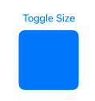
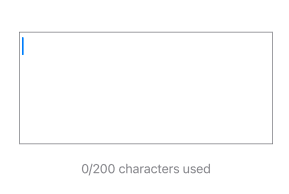
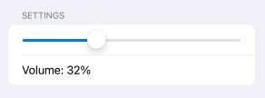

# 7. navigation & presentation

## 7.1 .sheet() & .fullScreenCover()

The `.sheet` modifier presents a modal view that slides up from the bottom of the screen. It does not take up the full screen and allows users to interact with the underlying view (when swiped down or dismissed programmatically).

Key Features of `.sheet`:

- Appears as a modal overlay from the bottom.
- Can be dismissed by swiping down (by default).
- Does **not** cover the entire screen.
- The underlying view remains visible.
- Can be dismissed programmatically by setting the binding to `false`.

**Note:** Don't add conditional logic for `.sheet`

ex: 

```swift
// Error example: 
.sheet(
    isPresented: $showsheet,
    content: {
        if xxx {
            sheet1
        } else {
            sheet2
        }
    })
```

- example: 

```swift
import SwiftUI

struct NewViewSheet: View {
    @State private var showSheet = false

    var body: some View {
        ZStack {
            Color.green
                .ignoresSafeArea()
            Button("Show Sheet") {
                showSheet = true
            }
        }
        .sheet(isPresented: $showSheet) {
            SheetView()
        }
    }
}

struct SheetView: View {

    @Environment(\.presentationMode) var presentationMode

    var body: some View {
        ZStack {
            Color.yellow
                .edgesIgnoringSafeArea(.all)

            VStack {
                Text("This is a sheet")
                    .font(.largeTitle)
                Button("Dismiss") {
                    // Dismiss the sheet by setting the binding to false
                    presentationMode.wrappedValue.dismiss()
                }
            }

        }

    }
}

#Preview {
    NewViewSheet()
}
```


---

The `.fullScreenCover` modifier presents a view that takes up the **entire screen**, preventing interaction with the underlying view.

Key Features of `.fullScreenCover`:

- Covers the entire screen.
- The user **cannot** see or interact with the underlying view.
- Does **not** allow swipe-to-dismiss by default.
- Must be dismissed programmatically using `@Environment(\.dismiss)`.

**Note:** Don't add conditional logic for `.fullScreenCover`

- example: 

```swift
import SwiftUI

struct NewViewSheet: View {
    @State private var showFullScreen = false

    var body: some View {
        ZStack {
            Color.green
                .ignoresSafeArea()
            Button("Show Full Screen Cover") {
                showFullScreen = true
            }
        }
        .fullScreenCover(isPresented: $showFullScreen) {
            FullScreenView()
        }
    }
}

struct FullScreenView: View {
    @Environment(\.dismiss) var dismiss

    var body: some View {
        VStack {
            Text("This is a full-screen cover")
                .font(.largeTitle)
            Button("Dismiss") {
                dismiss()
            }
        }
        .padding()
    }
}

#Preview {
    NewViewSheet()
}
```


## 7.2 .sheet() & .transition() & .animation()

Each of these modifiers serves a different purpose in SwiftUI:

- **`.sheet()`**: Presents a modal view.
- **`.transition()`**: Defines how a view appears and disappears.
- **`.animation()`**: Specifies the animation for a state change.

For `.sheet()`: 

1. Displays a modal **from the bottom**.

2. Can be dismissed by **swiping down** or programmatically.

3. The parent view is still **visible behind** the sheet.

For `.transition()`: 

1. Works **only** when a view is added/removed (`if` condition).

2. Does **not** animate changes to existing views.

3. Common transitions:
   
   - `.slide` → Slides in/out.
   - `.opacity` → Fades in/out.
   - `.scale` → Grows/shrinks.
   - `.move(edge:)` → Moves in/out from a specified edge.

For `.animation()`:

1. Works for **state changes** (e.g., changing a variable).

2. Applies to changes **within the same view** (not appearance/disappearance).

3. Common animations:
   
   - `.easeInOut(duration: 0.5)` → Smooth in/out effect.
   - `.spring(response:dampingFraction:blendDuration:)` → Spring-like movement.
   - `.linear(duration:)` → Constant speed.

When to use what?

- **Use `.sheet()`** when you need to show a modal **on top of the current view**.
- **Use `.transition()`** when you are adding/removing views dynamically. (can customize what you want)
- **Use `.animation()`** when you are modifying a property that **affects layout or appearance**.

---

- example: `.transition()`

```swift
import SwiftUI

struct NewViewSTA: View {
    @State private var showText = false

        var body: some View {
            VStack {
                Button("Toggle Text") {
                    withAnimation {
                        showText.toggle()
                    }
                }

                if showText {
                    Text("Hello, SwiftUI!")
                        .padding()
                        .background(Color.blue)
                        .cornerRadius(10)
                        .foregroundColor(.white)
                        .transition(.slide) // Applies a sliding transition
                }
            }
        }
}

#Preview {
    NewViewSTA()
}
```


- example: `.animation()`

```swift
import SwiftUI

struct NewViewSTA: View {
    @State private var isExpanded = false

        var body: some View {
            VStack {
                Button("Animate Size") {
                    isExpanded.toggle()
                }

                Rectangle()
                    .frame(width: isExpanded ? 200 : 100, height: 100)
                    .foregroundColor(.blue)
                    .cornerRadius(10)
                    .animation(.easeInOut(duration: 0.5), value: isExpanded) // Animates size change
            }
        }
}

#Preview {
    NewViewSTA()
}
```


## 7.3 p31 <u>NavigationView() (old)</u> & NavigationLink() & <u>NavigationStack() (IOS 16+)</u>

In SwiftUI, `NavigationView` and `NavigationLink` are used to **create navigation-based interfaces** where users can move between different views.

`NavigationLink` is used inside `NavigationView` (or `NavigationStack` in iOS 16+) to **navigate to a new screen** when tapped.

In iOS 16 and later, **`NavigationStack`** replaces `NavigationView` for better performance and backstack management.

Comparison of `NavigationView`, `NavigationStack`, and `NavigationLink` in SwiftUI: 

| Feature                           | `NavigationView` (IOS 13-15)      | `NavigationStack` (IOS 16+)                       | `NavigationLink`                       |
| --------------------------------- | --------------------------------- | ------------------------------------------------- | -------------------------------------- |
| purpose                           | provides a navigation container   | modern replacement for `NavigationView`           | used to navigate between views         |
| navigation type                   | stack-based navigation            | improved stack-based navigation                   | pushes a new view onto the stack       |
| back button                       | automatically provided            | automatically provided                            | works inside a navigation container    |
| supports programmatic navigation? | NO                                | YES, with `.path`                                 | No, but can be conditionally triggered |
| state persistence                 | Doesn't retain navigation history | Retains navigation state when app is backgrounded | N/A                                    |
| performance                       | basic navigation stack            | more optimized and scalable                       | N/A                                    |
| multi-paths                       | NO                                | Can track multi-path dynamic                      | N/A                                    |
| use inside lists                  | Work but limited                  | More flexible with `.path`                        | commonly used inside List              |
| deprecation?                      | Deprecated in IOS 16              | For IOS 16+                                       | still valid                            |

- example: `NavigationStack` + `NavigationLink`

```swift
// the first view in number1.swift
import SwiftUI

struct NewViewFirstView: View {
    var body: some View {
            NavigationStack {
                NavigationLink("Go to SecondView", destination: SecondView()) // jump to DetailView() // it can in the other .swift file
                    .navigationTitle("Home")
            }
        }
}

#Preview {
    NewViewFirstView()
}
```

```swift
// the second view in number2.swift
import SwiftUI

struct SecondView: View {
    var body: some View {
        VStack {
            Text("This is the second view")
                .font(.title)
                .padding()
        }
        .navigationTitle("Second View")
    }
}

// Preview
struct SecondView_Previews: PreviewProvider {
    static var previews: some View {
        SecondView()
    }
}
```


- example: ForEach lazy loop for `navigationState` + `navigationDestination`

```swift
import SwiftUI

struct NewViewNVS: View {
    var body: some View {
        NavigationStack {
            ScrollView {
                VStack(spacing: 30) {
                    ForEach(1..<11) { x in

                        NavigationLink(value: x) {
                            Text("go to number \(x)")
                        }

                    }
                }
            }
            .navigationTitle("Select view")
            .navigationDestination(for: Int.self) { value in
                MySecondScreen(value: value)
            }
        }
    }
}

struct MySecondScreen: View {

    let value: Int

    init(value: Int) {
        self.value = value
    }

    var body: some View {
        Text("Screen \(value)")
    }
}

#Preview {
    NewViewNVS()
}
```

Note: In the backend, it does not load all the screens at the beginning, but loads them when the user clicks

- example: customize `navigationStack` (with `ToolbarItemGroup`)

```swift
import SwiftUI

struct NewViewFirstView: View {
    var body: some View {
            NavigationStack {
                Text("Dashboard")
                    .navigationTitle("Dashboard")
                    .toolbar {
                        ToolbarItemGroup(placement: .topBarTrailing) {
                            Button(action: { print("Search tapped") }) {
                                Image(systemName: "magnifyingglass")
                            }
                            Button(action: { print("Profile tapped") }) {
                                Image(systemName: "person.crop.circle")
                            }
                        }
                    }
            }
        }
}

#Preview {
    NewViewFirstView()
}
```


- example: customize `navigationStack` (with `ToolbarItem`)

```swift
import SwiftUI

struct NewViewFirstView: View {
    var body: some View {
            NavigationStack {
                Text("Dashboard")
                    .navigationTitle("Dashboard")
                    .toolbar {
                        ToolbarItem(placement: .topBarLeading){
                            Button(action: {
                                // your action
                            }, label: {
                                Image(systemName: "gear")
                            })
                        }
                        ToolbarItem(placement: .topBarTrailing){
                            Button(action: {
                                // your action
                            }, label: {
                                Image(systemName: "person.fill")
                            })
                        }
                    }
            }
        }
}

#Preview {
    NewViewFirstView()
}
```


## 7.4 .alert()

The `.alert()` modifier in SwiftUI is used to present a pop-up alert dialog to the user. It supports:

- A **title**
- A **message**
- One or multiple **buttons (actions)**
- A **dismiss action** (optional)

Comparison of Alert Methods: 

| Method                                    | Use Case                    | Pros                    | Cons                     |
| ----------------------------------------- | --------------------------- | ----------------------- | ------------------------ |
| `.alert("Title", isPresented:, actions:)` | simple alerts               | easy to use             | no text fields           |
| `.alert("Title", isPresented:, message:)` | alerts with messages        | clean syntax            | limited UI customization |
| `.alert(_:isPresented:presenting:)`       | alerts with dynamic content | flexible                | slightly more complex    |
| custom `.sheet()` workaround              | text input in alert         | allows forms and fields | requires additional UI   |

- example: show warning message 

```swift
import SwiftUI

struct NewViewAlert: View {
    @State private var showAlert = false

        var body: some View {
            VStack {
                Button("Show Alert") {
                    showAlert = true
                }
            }
            .alert("Warning", isPresented: $showAlert, actions: {
                Button("OK", role: .cancel) { }
            }, message: {
                Text("This is a simple alert with a message.")
            })
        }
}

#Preview {
    NewViewAlert()
}
```


- example: with multiple buttons in alert message

```swift
import SwiftUI

struct NewViewAlert: View {
    @State private var showAlert = false

        var body: some View {
            VStack {
                Button("Show Alert") {
                    showAlert = true
                }
            }
            .alert("Delete Item?", isPresented: $showAlert, actions: {
                        Button("Cancel", role: .cancel) { }
                        Button("Delete", role: .destructive) {
                            print("Item deleted")
                        }
                    }, message: {
                        Text("Are you sure you want to delete this item?")
                    })
        }
}

#Preview {
    NewViewAlert()
}
```


Note: if you want to change Delete to Add: 

```swift
import SwiftUI

struct NewViewAlert: View {
    @State private var showAlert = false

        var body: some View {
            VStack {
                Button("Show Alert") {
                    showAlert = true
                }
            }
            .alert("Delete Item?", isPresented: $showAlert, actions: {
                        Button("Cancel", role: .cancel) { }
                        Button("add") { // no role
                            print("Item added")
                        }
                    }, message: {
                        Text("Are you sure you want to delete this item?")
                    })
        }
}

#Preview {
    NewViewAlert()
}
```

- example: customize implementation

```swift
import SwiftUI

struct NewViewAlert: View {
    @State private var showAlert = false
    @State private var name = ""

    var body: some View {
        VStack {
            Button("Enter Name") {
                showAlert = true
            }
            Text("Your name: \(name)")
        }
        .alert("Enter your name", isPresented: $showAlert) {
            TextField("Name", text: $name)
            Button("OK") {}
        }
    }
}

#Preview {
    NewViewAlert()
}
```

**Note:** Text fields inside alerts are **not natively supported** in SwiftUI. Instead, use a `.sheet()` with a custom modal view. (just an sample)


- example: dynamic alert `.alert(_:isPresented:presenting:)`

```swift
import SwiftUI

struct NewViewAlert: View {
    @State private var showAlert = false
    @State private var selectedItem: String? = nil

    var body: some View {
        VStack {
            Button("Show Alert for Item 1") {
                selectedItem = "Item 1"
                showAlert = true
            }
            Button("Show Alert for Item 2") {
                selectedItem = "Item 2"
                showAlert = true
            }
        }
        .alert(
            "Selected Item", isPresented: $showAlert, presenting: selectedItem
        ) { item in
            Button("OK", role: .cancel) {}
        } message: { item in
            Text("You selected \(item).")
        }
    }
}

#Preview {
    NewViewAlert()
}
```


- example: more advance (multi-alert selection)

```swift
import SwiftUI

struct NewViewAlert: View {
    @State private var showAlert = false
    @State private var alertType: MyAlert? = nil

    enum MyAlert { // 4 styles can select
        case success, error, add, archive
    }

    var body: some View {
        VStack {
            Button("Upload Success") {
                alertType = .success
                showAlert = true
            }

            Button("Archive Upload") {
                alertType = .archive
                showAlert = true
            }
        }
        .alert("Notification", isPresented: $showAlert, presenting: alertType) { type in
            getAlertActions(for: type) //  Actions inside a function
        } message: { type in
            getAlertMessage(for: type) //  Message inside a function
        }
    }

    /// func  that returns alert actions
    @ViewBuilder
    func getAlertActions(for type: MyAlert) -> some View {
        switch type {
        case .success:
            Button("OK", role: .cancel) { }
        case .archive:
            Button("OK", role: .cancel) { }
        case .error:
            Button("Try Again") { print("Retrying upload...") }
            Button("Cancel", role: .cancel) { }
        case .add:
            Button("Confirm") { print("Adding item...") }
            Button("Cancel", role: .cancel) { }
        }
    }

    /// func that returns alert message
    func getAlertMessage(for type: MyAlert) -> Text {
        switch type {
        case .success:
            return Text("Your video was uploaded successfully.")
        case .archive:
            return Text("Your video has been archived successfully.")
        case .error:
            return Text("An error occurred while uploading.")
        case .add:
            return Text("Are you sure you want to add this video?")
        }
    }
}

#Preview {
    NewViewAlert()
}
```


extend: 

difference between `.cancel` and `.destructive` roles in alerts

| Role           | Effect                                                    | Use Case                                                                     |
| -------------- | --------------------------------------------------------- | ---------------------------------------------------------------------------- |
| `.cancel`      | styled as a neutral button (default system style)         | use for **dismissal actions** where the user doesn't take a critical action. |
| `.destructive` | styled as a **red button**, indicating a dangerous action | use for actions that `delete, reset, or cause loss of data`                  |

## 7.5 .confirmationDialog()

`.confirmationDialog()` is the **modern replacement for `.actionSheet()`**, introduced in **iOS 15+**. It allows you to present a **set of options** to the user in a bottom sheet (on iPhone) or a popover (on iPad/Mac).

`.confirmationDialog()` vs. `.alert()`

| Feature                   | `.confirmationDialog()`               | `.alert()`                     |
| ------------------------- | ------------------------------------- | ------------------------------ |
| Purpose                   | Displays multiple options             | shows one message with actions |
| UI style                  | bottom sheet (iPhone), popover (iPad) | Classic alert box              |
| Supports multiple buttons | YES                                   | YES                            |
| Can add destructive role  | YES                                   | YES                            |
| Can add a cancel button   | YES                                   | YES                            |
| Customization             | more flexible for multiple choices    | best for critical warnings     |

when to use `.confirmationDialog()` ?

1. when offering multiple choices to the user

2. when showing a menu-like interface

3. when you iPad/Mac, where it appears as a popover. 
- example: 

```swift
import SwiftUI

struct NewViewAlert: View {
    @State private var showDialog = false

        var body: some View {
            VStack {
                Button("Show Add Confirmation") {
                    showDialog = true
                }
            }
            .confirmationDialog("Add Item?", isPresented: $showDialog, titleVisibility: .visible) {
                Button("Cancel", role: .cancel) { }
                Button("Add") { print("Item Added") }
            }
        }
}

#Preview {
    NewViewAlert()
}
```


- example:  multi-buttons 

```swift
import SwiftUI

struct NewViewAlert: View {
    @State private var showDialog = false
    @State private var dialogType: DialogType? = nil

    enum DialogType {
        case delete, share, edit
    }

    var body: some View {
        VStack {
            Button("Delete Item") {
                dialogType = .delete
                showDialog = true
            }

            Button("Share Item") {
                dialogType = .share
                showDialog = true
            }
            Button("Edit Item"){
                dialogType = .edit
                showDialog = true
            }
        }
        .confirmationDialog(
            "What would you like to do?", isPresented: $showDialog,
            presenting: dialogType
        ) { type in
            switch type {
            case .delete:
                Button("Confirm Delete", role: .destructive) {
                    // your delete action
                }
                Button("Cancel", role: .cancel) {}
            case .share:
                Button("Copy Link") {
                    // your copy action
                }
                Button("Share via Email") {
                    // your share action
                }
                Button("Cancel", role: .cancel) {}
            case .edit:
                Button("Edit Name") {
                    // your edit action
                }
                Button("Cancel", role: .cancel) {}
            }
        } message: { type in
            switch type {
            case .delete:
                Text("Are you sure you want to delete this item?")
            case .share:
                Text("Choose how you want to share this item.")
            case .edit:
                Text("Modify your item details.")
            }
        }
    }
}

#Preview {
    NewViewAlert()
}
```


## 7.6 .contextMenu()

`.contextMenu()` allows you to add a **long-press menu** to a view, providing additional actions. It's useful for offering **quick actions** without cluttering the main UI.

| best for                                    | Avoid for                                         |
| ------------------------------------------- | ------------------------------------------------- |
| File management (copy, delete, rename)      | actions needing instant response                  |
| editing options (mark as favorite, archive) | navigation actions (use `NavigationLink` instead) |
| quick actions in lists or grids             | if the feature must be always visible             |

**Note:** sometimes user may not find this function 

- example: long press

```swift
import SwiftUI

struct NewViewContextMenu: View {
    var body: some View {
        VStack {
            Text("Long-press me 👇")
                .padding()
                .background(Color.blue)
                .foregroundColor(.white)
                .cornerRadius(10)
                .contextMenu {
                    Button("Copy") {
                        print("Copy action")
                    }
                    Button("Delete", role: .destructive) {
                        print("Delete action")
                    }
                }
        }
    }
}

#Preview {
    NewViewContextMenu()
}
```


- example: in list

```swift
import SwiftUI

struct NewViewContextMenu: View {
    let items = ["Item 1", "Item 2", "Item 3"]

        var body: some View {
            List(items, id: \.self) { item in
                Text(item)
                    .contextMenu {
                        Button(action: {
                            // share function
                        }, label: {
                            Text("Share")
                            Image(systemName: "heart.fill")
                                .symbolRenderingMode(.palette)
                        })
                        Button("Delete", role: .destructive) {
                            print("\(item) deleted")
                        }
                    }
            }
        }
}

#Preview {
    NewViewContextMenu()
}
```


## 7.7 .toolbar

The `.toolbar` modifier in **SwiftUI** allows you to **customize the navigation bar** by adding buttons, titles, or custom views in various positions.

Features of `.toolbar`:

- Adds **buttons, icons, and views** to the navigation bar.

- Supports **multiple placements** (`leading`, `trailing`, `bottomBar`, etc.).

- Works with **iOS, iPadOS, and macOS**.

- Can be used to **hide the navigation bar**.

---

- example: same example in navigation part (one `ToolbarItem`)

```swift
import SwiftUI

struct NewViewNVS: View {
    var body: some View {
            NavigationStack {
                Text("Main Content")
                    .navigationTitle("Home")
                    .toolbar {
                        ToolbarItem(placement: .topBarTrailing) { // ✅ Top-right button
                            Button(action: {
                                print("Settings tapped")
                            }) {
                                Image(systemName: "gear")
                            }
                        }
                    }
            }
        }
}


#Preview {
    NewViewNVS()
}
```

- example: same example in navigation part `ToolbarItemGroup`

```swift
import SwiftUI

struct NewViewFirstView: View {
    var body: some View {
            NavigationStack {
                Text("Dashboard")
                    .navigationTitle("Dashboard")
                    .toolbar {
                        ToolbarItemGroup(placement: .topBarTrailing) {
                            Button(action: { print("Search tapped") }) {
                                Image(systemName: "magnifyingglass")
                            }
                            Button(action: { print("Profile tapped") }) {
                                Image(systemName: "person.crop.circle")
                            }
                        }
                    }
            }
        }
}

#Preview {
    NewViewFirstView()
}
```

## 7.8 resize sheet (combine with 7.2)

By default, `.sheet()` in SwiftUI **takes up a large portion of the screen**, but you can **control its size** using **`.presentationDetents()`**, introduced in **iOS 16+**.

| Feature               | Modifier                                  | Effect                                      |
| --------------------- | ----------------------------------------- | ------------------------------------------- |
| default sheet         | `.sheet()`                                | takes up most of the screen                 |
| Resizable sheet       | `.presentationDetents([.medium, .large])` | allows users to swipe between sizes         |
| Custom height         | `.presentationDetents([.fraction(0.3)])`  | sets the height to 30% of the screen        |
| Fixed Height          | `.presentationDetents([.medium])`         | prevents resizing                           |
| Fullscreen sheet      | `.presentationDetents([.large])`          | always fullscreen                           |
| auto-sized sheet      | `.presentationDetents([.height(250)])`    | adjusts based on content height             |
| prevent swipe dismiss | `.interactiveDismissDisabled(true)`       | stops users from swiping to close the sheet |

- example: 2 sizes of sheets. medium and large (medium is approximately 60%)

```swift
import SwiftUI

struct NewViewRS: View {
    @State private var showSheet = false

    var body: some View {
        VStack {
            Button("Show Resizable Sheet") {
                showSheet = true
            }
        }
        .sheet(isPresented: $showSheet) {
            VStack {
                Text("Swipe to resize 👇")
                    .font(.headline)
                Spacer()
            }
            .padding()
            .presentationDetents([.medium, .large])  // when press = medium. can swipe up to large size
        }
    }
}

#Preview {
    NewViewRS()
}
```


- example: customize height (3 sizes of sheets)

```swift
import SwiftUI

struct NewViewRS: View {
    @State private var showSheet = false

    var body: some View {
        VStack {
            Button("Show Fractional Sheet") {
                showSheet = true
            }
        }
        .sheet(isPresented: $showSheet) {
            VStack {
                Text("Custom Height Sheet")
                    .font(.headline)
                Spacer()
            }
            .padding()
            .presentationDetents([.fraction(0.3), .medium, .large])  // Custom height (30% of screen). 3 sizes
        }
    }
}

#Preview {
    NewViewRS()
}
```


- example: Non-dismissable sheet (cannot swipe down to close the sheet, and can only close by button)

```swift
import SwiftUI

struct NewViewRS: View {
    @State private var showSheet = false

    var body: some View {
        VStack {
            Button("Show Non-Dismissable Sheet") {
                showSheet = true
            }
        }
        .sheet(isPresented: $showSheet) {
            VStack {
                Text("You cannot swipe to dismiss")
                    .font(.headline)
                Spacer()
                Button("Close") { showSheet = false }  // Manual dismiss button
                    .padding()
                    .background(Color.red)
                    .foregroundColor(.white)
                    .cornerRadius(10)
            }
            .padding()
            .presentationDetents([.medium])
            .interactiveDismissDisabled(true)  // Prevents swipe to dismiss
        }
    }
}

#Preview {
    NewViewRS()
}
```

## 7.9 .popover()

`.popover()` is a **floating window** that appears **above the current view**, typically used for **additional details or quick actions** without navigating away.

`.popover()` vs `.sheet()`

| Feature               | `.popover()`                     | `.sheet()`                |
| --------------------- | -------------------------------- | ------------------------- |
| display style         | floating window                  | fullscreen / modal        |
| dismissal             | default (click outside)          | swift down                |
| best for              | quick actions, tooltips          | forms, full-page content  |
| iPhone behavior       | become a sheet unless overridden | always fullscreen / modal |
| can attach to a view? | YES                              | NO                        |

- example: basic popover

```swift
import SwiftUI

struct NewViewPopover: View {
    @State private var showPopover = false

    var body: some View {
        VStack {
            Button("Show Popover") {
                showPopover.toggle()
            }
            .popover(isPresented: $showPopover) {
                ZStack {
                    Color.green
                        .ignoresSafeArea()
                    Text("Hello, this is a popover!")
                        .padding()
                        .frame(width: 200, height: 100)
                }

            }
        }
    }
}

#Preview {
    NewViewPopover()
}
```


- example: popover with circle()

```swift
import SwiftUI

struct NewViewPopover: View {
    @State private var showPopover = false

    var body: some View {
        VStack {
            Text("Tap the circle below 👇")

            Circle()
                .fill(Color.blue)
                .frame(width: 50, height: 50)
                .onTapGesture {
                    showPopover.toggle()
                }
                .popover(
                    isPresented: $showPopover,
                    attachmentAnchor: .point(.bottom), arrowEdge: .top
                ) {
                    Text("Popover Attached to Circle")
                        .padding()
                        .frame(width: 200, height: 100)
                }
        }
    }
}

#Preview {
    NewViewPopover()
}
```


- example: dynamic content

```swift
import SwiftUI

struct NewViewPopover: View {
    @State private var showPopover = false 
    @State private var popoverText = "Initial Text"

    var body: some View {
        VStack {
            Button("Show Dynamic Popover") {
                showPopover.toggle()
            }
            .popover(isPresented: $showPopover) {
                VStack {
                    Text(popoverText)
                        .font(.headline)
                    Button("Change Text") { popoverText = "Updated Content!" }
                    Button("Close") { showPopover = false }
                }
                .padding()
                .frame(width: 250, height: 150)
            }
        }
    }
}

#Preview {
    NewViewPopover()
}
```


- example: pop above text

```swift
import SwiftUI

struct NewViewPopover: View {
    @State private var showPopover = false


    var body: some View {
        Button("click me") {
            showPopover = true
        }
        .padding(20)
        .popover(isPresented: $showPopover, attachmentAnchor: .point(.top), content: {
            Text("show popover")
                .presentationCompactAdaptation(.popover)
        })
    }
}

#Preview {
    NewViewPopover()
}
```


- example: more advance (feedback options)

```swift
import SwiftUI

struct NewViewPopover: View {
    @State private var showPopover = false
    @State private var feedback: [String] = [
        "good",
        "soso",
        "bad",
    ]

    var body: some View {
        VStack {
            Button("click me") {
                showPopover = true
            }
            .padding(20)
            .popover(
                isPresented: $showPopover, attachmentAnchor: .point(.trailing),
                content: {
                    ScrollView {
                        VStack(
                            alignment: .leading, spacing: 15,
                            content: {
                                ForEach(feedback, id: \.self) { option in
                                    Button(option) {
                                        // your action
                                    }
                                    if option != feedback.last {
                                        Divider()
                                    }
                                }
                            }
                        )
                        .padding(20)
                    }
                    .presentationCompactAdaptation(.popover)
                })
        }
    }
}

#Preview {
    NewViewPopover()
}
```


## 7.10 NavigationSplitView

`NavigationSplitView` is the modern way to create **multi-column navigation** in SwiftUI. It is designed for **iPads, macOS**, and large-screen devices but adapts well to **iPhones**.

`NavigationSplitView` replaces `NavigationView` in **multi-column layouts** and allows you to create **two or three panes**:

1. **Sidebar** (Primary)
2. **Content List** (Optional, Secondary)
3. **Detail View** (Final, Tertiary)

`NavigationSplitView` vs. `NavigationStack`

| Feature                    | `NavigationSplitView`       | `NavigationStack`          |
| -------------------------- | --------------------------- | -------------------------- |
| best for                   | iPads, macOS, Large Screens | iPhones, Simple Navigation |
| Multi-Column Support       | YES                         | NO                         |
| Adaptive Layout            | YES                         | NO                         |
| Hides Sidebar Dynamically? | YES                         | NO                         |

- example: (note: using iPad as an example) sidebar + detail

```swift
import SwiftUI

struct NewViewNVSV: View {
    var body: some View {
        NavigationSplitView {
            List {
                NavigationLink("Item 1", value: "Item 1 Detail")
                NavigationLink("Item 2", value: "Item 2 Detail")
            }
            .navigationTitle("Sidebar")
        } detail: {
            Text("Select an item")
        }
    }
}

#Preview {
    NewViewNVSV()
}
```


# 8. Animations

## 8.1 .animation() & withAnimation

Animations make UI elements **smooth and visually appealing**. SwiftUI provides two main ways to animate changes:

1. **`.animation()` Modifier** → Automatically applies animations **to state changes**.
2. **`withAnimation()` Function** → Triggers animations explicitly **inside a closure**.

`.animation()` vs. `withAnimation()`

| Feature       | .animation()                          | withAnimation()                         |
| ------------- | ------------------------------------- | --------------------------------------- |
| Trigger       | automatically animates changes        | must wrap state change manually         |
| flexibility   | less control (applies to all changes) | more control (animate specific changes) |
| where to use? | `.animation(_, value:)` on a view     | `withAnimation {}` inside an action     |

- example: `.animation()`

```swift
import SwiftUI

struct NewViewNAnimation: View {
    @State private var isExpanded = false

    var body: some View {
        VStack {
            Button("Toggle Size") {
                isExpanded.toggle()
            }

            Rectangle()
                .frame(width: isExpanded ? 200 : 100, height: 100)
                .foregroundColor(.blue)
                .cornerRadius(10)
                .animation(.easeInOut(duration: 0.5), value: isExpanded)  // Animates the change
        }
    }
}

#Preview {
    NewViewNAnimation()
}
```




- example: `withAnimation()`

```swift
import SwiftUI

struct NewViewNAnimation: View {
    @State private var isExpanded = false

    var body: some View {
        VStack {
            Button("Toggle Size") {
                withAnimation(.spring(response: 0.5, dampingFraction: 0.6)) {
                    isExpanded.toggle()
                }
            }

            Rectangle()
                .frame(width: isExpanded ? 200 : 100, height: 100)
                .foregroundColor(.red)
                .cornerRadius(10)
        }
    }
}

#Preview {
    NewViewNAnimation()
}
```


- example: animating opacity and rotation (try it yourself)

```swift
import SwiftUI

struct NewViewNAnimation: View {
    @State private var isVisible = false

    var body: some View {
        VStack {
            Button("Animate") {
                withAnimation(.easeInOut(duration: 0.7)) {
                    isVisible.toggle()
                }
            }

            Text("Hello, SwiftUI!")
                .font(.title)
                .opacity(isVisible ? 1 : 0)  // Fade in/out
                .rotationEffect(.degrees(isVisible ? 360 : 0))  // Rotate
        }
    }
}

#Preview {
    NewViewNAnimation()
}
```

- example: `DispatchQueue.main.asyncAfter` (try it yourself)

```swift
import SwiftUI

struct NewViewNAnimation: View {
    @State private var isVisible = false

    var body: some View {
        VStack {
            Button("Animate After Delay") {
                DispatchQueue.main.asyncAfter(deadline: .now() + 1) {  //  1-second delay
                    withAnimation(.easeInOut(duration: 0.5)) {
                        isVisible.toggle()
                    }
                }
            }

            Circle()
                .frame(width: 100, height: 100)
                .foregroundColor(isVisible ? .green : .gray)
        }
    }
}

#Preview {
    NewViewNAnimation()
}
```

- example: Lists with `.transition()` (try it yourself)

```swift
import SwiftUI

struct NewViewNAnimation: View {
    @State private var items = ["Item 1", "Item 2", "Item 3"]

    var body: some View {
        VStack {
            Button("Add Item") {
                withAnimation {
                    items.append("New Item \(items.count + 1)")
                }
            }

            List {
                ForEach(items, id: \.self) { item in
                    Text(item)
                        .transition(.slide)  //  Slide-in effect
                }
            }
        }
    }
}

#Preview {
    NewViewNAnimation()
}
```

- example: `.matchedGeometryEffect()` (try it yourself)

```swift
import SwiftUI

struct NewViewNAnimation: View {
    @Namespace private var animationNamespace
    @State private var isExpanded = false

    var body: some View {
        VStack {
            if isExpanded {
                Circle()
                    .matchedGeometryEffect(id: "shape", in: animationNamespace)
                    .frame(width: 200, height: 200)
                    .foregroundColor(.blue)
            } else {
                Rectangle()
                    .matchedGeometryEffect(id: "shape", in: animationNamespace)
                    .frame(width: 100, height: 100)
                    .foregroundColor(.red)
            }

            Button("Animate") {
                withAnimation(.spring()) {
                    isExpanded.toggle()
                }
            }
        }
    }
}

#Preview {
    NewViewNAnimation()
}
```

- example: useful case for pop up something

```swift
import SwiftUI

struct NewViewNAnimation: View {
    @State private var isAnimating: Bool = false

    var body: some View {
        VStack {
            Button("pop up") {
                isAnimating.toggle()
            }
            Rectangle()
                .frame(width: isAnimating ? 350 : 50, height: 100)
                .clipShape(RoundedRectangle(cornerRadius: 20))  // this one must before .anmiation
                .overlay(
                    ZStack {
                        Text("A")
                            .font(.headline)
                            .foregroundColor(.yellow)
                            .opacity(isAnimating ? 0 : 1)  // Fade out "A"
                        Text("Apple")
                            .font(.headline)
                            .foregroundColor(.yellow)
                            .opacity(isAnimating ? 1 : 0)  // Fade in "Apple"
                    }
                )
                .animation(.spring(), value: isAnimating)
        }
    }
}

#Preview {
    NewViewNAnimation()
}
```


# 9. User input & forms

## 9.1 TexField()

A `TextField` in SwiftUI is an **interactive text input field** where users can type and edit text.

| Feature          | Best Practice                               |
| ---------------- | ------------------------------------------- |
| basic input      | `TextField("Placeholder", text: $stateVar)` |
| password         | use `SecureField()` to hidden text          |
| styling          | use `.background()`, `.overlay()`           |
| submit action    | `.onSubmit {}`                              |
| limit input      | `.onChange(of:)`                            |
| Auto-Focus       | @FocusState                                 |
| dismiss keyboard | `.toolbar(.keyboard)`                       |

- example: basic with `.textFieldStyle()`

```swift
import SwiftUI

struct NewViewTextField: View {

    @State private var textFieldText: String = ""
    var body: some View {
        TextField("Type something here...", text: $textFieldText)
            .textFieldStyle(RoundedBorderTextFieldStyle())
            .padding()

    }
}

#Preview {
    NewViewTextField()
}
```


- example: user input message

```swift
import SwiftUI

struct NewViewTextField: View {

    @State private var textFieldText: String = ""
    @State private var dataArray: [String] = []

    var body: some View {

        NavigationStack {
            VStack {
                TextField("Type something here...", text: $textFieldText)
                    .padding()
                    .background(Color.gray.opacity(0.3))
                    .clipShape(RoundedRectangle(cornerRadius: 15))

                Button(
                    action: {
                        // save or other functions
                        SaveText()
                    },
                    label: {
                        Text("Save")
                            .padding()
                            .frame(maxWidth: .infinity)
                            .background(.blue)
                            .clipShape(RoundedRectangle(cornerRadius: 15))
                            .foregroundStyle(.white)
                    })
                ForEach(dataArray, id: \.self) { data in
                    Text(data)
                }

                Spacer()
            }
            .padding()
            .navigationTitle("User writing box")
        }
    }
    // func text save in dataArray
    func SaveText() {
        dataArray.append(textFieldText)
    }
}

#Preview {
    NewViewTextField()
}
```


- example: more advance (add if-else and disable)

```swift
import SwiftUI

struct NewViewTextField: View {

    @State private var textFieldText: String = ""
    @State private var dataArray: [String] = []

    var body: some View {

        NavigationStack {
            VStack {
                TextField("Type something here...", text: $textFieldText)
                    .padding()
                    .background(Color.gray.opacity(0.3))
                    .foregroundStyle(Color.blue)
                    .clipShape(RoundedRectangle(cornerRadius: 15))

                Button(
                    action: {
                        // save or other functions
                        SaveText()
                    },
                    label: {
                        Text("Save")
                            .padding()
                            .frame(maxWidth: .infinity)
                            .background(TextLogic() ? Color.blue: Color.gray)
                            .clipShape(RoundedRectangle(cornerRadius: 15))
                            .foregroundStyle(.white)
                    })
                .disabled(!TextLogic())
                ForEach(dataArray, id: \.self) { data in
                    Text(data)
                }

                Spacer()
            }
            .padding()
            .navigationTitle("User writing box")
        }
    }
    // func check text is longer than 5 or not
    func TextLogic() -> Bool {
        if textFieldText.count >= 5 {
            return true
        }
        return false
    }

    // func text save in dataArray
    func SaveText() {
        dataArray.append(textFieldText)
    }
}

#Preview {
    NewViewTextField()
}
```


- extend: 

`onSubmit {}` and `submitLabel()` are **SwiftUI modifiers** that enhance user interactions with **text fields and form inputs**. They allow for **better keyboard handling**, submission behavior, and return key customization.

| Feature                       | Best Practice                                       |
| ----------------------------- | --------------------------------------------------- |
| basic submit action           | Use `.onSubmit {}` inside a `TextField`             |
| change return key label       | Use `.submitLabel(.done)`, `.search`, `.next`, etc. |
| move between field            | Use `@FocusState` + `.onSubmit {}`                  |
| detect submission type        | Use `.onSubmit(of: .search) {}`                     |
| dismiss keyboard after submit | Set `@FocusState` to `false` on submit              |

- example: .submitLabel() (with done)

```swift
import SwiftUI

struct NewViewTextField: View {

    @State private var textFieldText: String = ""
    var body: some View {
        TextField("Enter your email", text: $textFieldText)
            .textFieldStyle(RoundedBorderTextFieldStyle())
            .submitLabel(.done) // with done

    }
}

#Preview {
    NewViewTextField()
}
```

other options: 

`.done`, `.go`, `.join`, `.next`, `.route`, `.search`, `.send`

- example: `.onSumbit`

```swift
import SwiftUI

struct NewViewTextField: View {

    @State private var textFieldText: String = ""
    var body: some View {
        TextField("Search...", text: $textFieldText)
            .submitLabel(.search)
            .onSubmit(of: .search) {
                print("Search button pressed with: \(textFieldText)")
            }

    }
}

#Preview {
    NewViewTextField()
}
```

other options: 

`.search`, `.text`, `.return`, `.send`

## 9.2 TextEditor()

`TextEditor` is used for **multi-line text input**, allowing users to enter large amounts of text, unlike `TextField`, which is **single-line only**.

| Feature          | Best Practice                                 |
| ---------------- | --------------------------------------------- |
| Basic Input      | `TextEditor(text: $text)`                     |
| Placeholder      | overlay a `Text` when `text.isEmpty`          |
| character limit  | `.onChange(of: text)`                         |
| auto-grow        | `.frame(minHeight: 50, maxHeight: .infinity)` |
| dismiss keyboard | `.toolbar(.keyboard)`                         |

| Feature                   | TextEditor                | TextField                         |
| ------------------------- | ------------------------- | --------------------------------- |
| Multi-line?               | YES                       | NO                                |
| Support Placeholder?      | NO                        | YES                               |
| Auto-Grow with text       | YES                       | NO                                |
| Keyboard dismissal needed | YES                       | NO                                |
| Best for                  | Large text, note, message | single-line input, name, password |

- example: basic 

```swift
import SwiftUI

struct NewViewTextField: View {

    @State private var text: String = "text here..."

    var body: some View {
        VStack {
            TextEditor(text: $text)
                .frame(height: 150)  // ✅ Set a height
                .border(Color.gray, width: 1)  // ✅ Add a border
                .padding()

            Text("Your text: \(text)")
        }
        .padding()
    }
}

#Preview {
    NewViewTextField()
}
```


- example: limit character

```swift
import SwiftUI

struct NewViewTextField: View {
    @State private var text: String = ""

    var body: some View {
        VStack {
            TextEditor(text: $text)
                .frame(height: 150)
                .border(Color.gray, width: 1)
                .padding()
                .onChange(of: text) { oldValue, newValue in  //  Updated for iOS 17
                    if newValue.count > 200 {
                        text = String(newValue.prefix(200))  //  Restrict input to 200 chars
                    }
                }

            Text("\(text.count)/200 characters used")
                .foregroundColor(text.count == 200 ? .red : .gray)  // ✅ Changes color when limit reached
        }
        .padding()
    }
}

#Preview {
    NewViewTextField()
}
```



## 9.3 Toggle (switch)

A `Toggle` is a **switch-like UI element** that allows users to toggle between **on and off states** (like a light switch or a settings option).

- example: 

```swift
import SwiftUI

struct NewViewToggle: View {
    @State private var isOn = false

    var body: some View {
        VStack {
            Toggle("Enable Feature", isOn: $isOn)
                .padding()

            Text(isOn ? "Feature is ON" : "Feature is OFF")
                .font(.headline)
        }
        .tint(.red)
        .padding()
    }
}

#Preview {
    NewViewToggle()
}
```


## 9.4 Picker()

A `Picker` in SwiftUI is a **dropdown-style selection UI** that allows users to choose from multiple options. It is often used for selecting categories, dates, settings, or preferences.

| Feature                  | Best Practice                                                           |
| ------------------------ | ----------------------------------------------------------------------- |
| Basic Picker             | `Picker("Label", selection: $stateVar) { Text("Option").tag("Value") }` |
| Dynamic Picker           | use `ForEach(array, id: \.self)`                                        |
| Segmented style          | `.pickerStyle(.segmented)` for tab-like toggles                         |
| Dropdown Menu            | `.pickerStyle(.menu)` for compact selection                             |
| Trigger action on change | `.onChange(of:)`                                                        |
| Enum-Base Picker         | `enum Difficulty: CaseIterable`                                         |

extend: 

change picker style: `.pickerStyle()`

1. `.menu` (in basic example)

2. `.wheel` (in dynamic example)

3. `.segmented`  (in dynamic example)

4. ... more check Xcode

---

- example: basic

```swift
import SwiftUI

struct NewViewPicker: View {
    @State private var selectedFruit = "Apple"  // Default selection

    var body: some View {
        VStack {
            Picker("Select a fruit", selection: $selectedFruit) {
                Text("Apple").tag("Apple")  // Assigns a tag for tracking
                Text("Banana").tag("Banana")
                Text("Cherry").tag("Cherry")
            }
            .pickerStyle(.menu)  // Default dropdown style

            Text("You selected: \(selectedFruit)")
        }
        .padding()
    }
}

#Preview {
    NewViewPicker()
}
```


- example: for dynamic 

```swift
import SwiftUI

struct NewViewPicker: View {
    @State private var selectedColor = "Red"
    let colors = ["Red", "Green", "Blue", "Yellow"]

    var body: some View {
        VStack {
            Picker("Choose a color", selection: $selectedColor) {
                ForEach(colors, id: \.self) { color in
                    Text(color).tag(color)  // ✅ Automatically creates tags
                }
            }
            .pickerStyle(.wheel) // .segmented

            Text("Selected: \(selectedColor)")
        }
        .padding()
    }
}

#Preview {
    NewViewPicker()
}
```


- example: language selection

```swift
import SwiftUI

struct NewViewPicker: View {
    @State private var selectedLanguage = "English"
    let languages = ["English", "Spanish", "French", "German"]

    var body: some View {
        Form {
            Section(header: Text("Settings")) {
                Picker("Language", selection: $selectedLanguage) {
                    ForEach(languages, id: \.self) { language in
                        Text(language).tag(language)
                    }
                }
            }
        }
    }
}
#Preview {
    NewViewPicker()
}
```


## 9.5 ColorPicker()

`ColorPicker` in SwiftUI is a **built-in color selection tool** that allows users to **choose a color** from a system-provided color palette.

- example: basic

```swift
import SwiftUI

struct NewViewColorPicker: View {
    @State private var selectedColor: Color = .blue  // Default color

    var body: some View {
        VStack {
            ColorPicker("Pick a color", selection: $selectedColor)  // Built-in color selector
                .padding()

            Rectangle()  // Shows selected color
                .fill(selectedColor)
                .frame(width: 100, height: 100)
                .cornerRadius(10)

            Text("Selected Color")
                .foregroundColor(selectedColor)  // Changes text color dynamically
        }
        .padding()
    }
}
#Preview {
    NewViewColorPicker()
}
```


## 9.6 DatePicker

`DatePicker` is a SwiftUI component that allows users to **select a date and/or time**.

| Feature                        | Best Practice                                         |
| ------------------------------ | ----------------------------------------------------- |
| Basic date picker              | `DatePicker("Label", selection: $dateVar)`            |
| Only date or time              | `displayedComponents: .date` or `.hourAndMinute`      |
| Change style                   | `.datePickerStyle(.graphical)` for full calendar view |
| Restrict date range            | `in: minDate...maxDate`                               |
| Save date between app launches | use `@AppStorage` with `timeIntervalSince1970`        |
| Detect changes                 | `.onChange(of:)`                                      |

- example: basic

```swift
import SwiftUI

struct NewViewDatePicker: View {
    @State private var selectedDate = Date()  // Default to current date

    var body: some View {
        VStack {
            DatePicker("Select a date", selection: $selectedDate)
            //DatePicker("Select a date", selection: $selectedDate, displayedComponents: .date)
            // date only 
            //DatePicker("Select a date", selection: $selectedDate, displayedComponents: .hourAndMinute)  
            // time only 
                .padding()

            Text("Selected Date: \(selectedDate, formatter: dateFormatter)")
        }
        .padding()
    }

    //  Date Formatter
    private var dateFormatter: DateFormatter {
        let formatter = DateFormatter()
        formatter.dateStyle = .long
        return formatter
    }
}
#Preview {
    NewViewDatePicker()
}
```


- example: DatePicker style

```swift
import SwiftUI

struct NewViewDatePicker: View {
    @State private var selectedDate = Date()  // Default to current date

    var body: some View {
        VStack {
            DatePicker("Select a date", selection: $selectedDate)
                .datePickerStyle(.automatic)
                .padding()

            Text("Selected Date: \(selectedDate, formatter: dateFormatter)")
        }
        .padding()
    }

    //  Date Formatter
    private var dateFormatter: DateFormatter {
        let formatter = DateFormatter()
        formatter.dateStyle = .long
        return formatter
    }
}
#Preview {
    NewViewDatePicker()
}
```

| Style      | Description                            |
| ---------- | -------------------------------------- |
| .automatic | default style for the platform         |
| .compact   | show as a button (tap open a selector) |
| .graphical | shows a full calendar                  |
| .wheel     | scrollable wheel selection             |

- example: restrict date range

```swift
import SwiftUI

struct NewViewDatePicker: View {
    @State private var selectedDate = Date()

    var body: some View {
        DatePicker(
            "Select Date", selection: $selectedDate, in: ...Date(),
            displayedComponents: .date
        )
        .padding()
    }
}
#Preview {
    NewViewDatePicker()
}
```


## 9.7 Stepper

A `Stepper` in SwiftUI is a UI component that allows users to **increment or decrement a value** (e.g., selecting a quantity, setting a timer, adjusting preferences).

| Feature             | Best Practice                                  |
| ------------------- | ---------------------------------------------- |
| basic stepper       | `Stepper("Label: \(value)", value: $stateVar)` |
| set min/max range   | `in: min...max`                                |
| change step amount  | `step: X`                                      |
| custom actions      | `.onIncrement {}` and `.onDecrement {}`        |
| persist value       | `@AppStorage`                                  |
| detect value change | `.onChange(of:)`                               |
| custom UI           | `Button(action: {})`                           |

- example: basic

```swift
import SwiftUI

struct NewViewStepper: View {
    @State private var quantity = 1

    var body: some View {
        VStack {
            Stepper("Quantity: \(quantity)", value: $quantity)
                .padding()

            Text("Selected Quantity: \(quantity)")
                .font(.headline)
        }
        .padding()
    }
}
#Preview {
    NewViewStepper()
}
```


- example: with a range

```swift
import SwiftUI

struct NewViewStepper: View {
    @State private var count = 5

    var body: some View {
        VStack {
            Stepper("Count: \(count)", value: $count, in: 1...10)  //  Range 1 to 10
                .padding()

            Text("Current Count: \(count)")
        }
        .padding()
    }
}
#Preview {
    NewViewStepper()
}
```

- example: change interval

```swift
import SwiftUI

struct NewViewStepper: View {
    @State private var value = 0

    var body: some View {
        VStack {
            Stepper("Value: \(value)", value: $value, in: 0...50, step: 5)  // Steps of 5
                .padding()

            Text("Current Value: \(value)")
        }
        .padding()
    }
}
#Preview {
    NewViewStepper()
}
```

- example: customize button

```swift
import SwiftUI

struct NewViewStepper: View {
    @State private var score = 0

    var body: some View {
        VStack {
            Stepper {
                Text("Score: \(score)")
            } onIncrement: {  // customize add 2 each click
                score += 2
            } onDecrement: {  // customize minus 1 each click
                score -= 1
            }
            .padding()

            Text("Updated Score: \(score)")
        }
        .padding()
    }
}
#Preview {
    NewViewStepper()
}
```

- example: customize button

```swift
import SwiftUI

struct NewViewStepper: View {
    @State private var count = 0

    var body: some View {
        HStack {
            Button(action: { count -= 1 }) {
                Image(systemName: "minus.circle.fill")
                    .font(.largeTitle)
                    .foregroundColor(.red)
            }

            Text("\(count)")
                .font(.largeTitle)
                .frame(width: 60)

            Button(action: { count += 1 }) {
                Image(systemName: "plus.circle.fill")
                    .font(.largeTitle)
                    .foregroundColor(.green)
            }
        }
        .padding()
    }
}
#Preview {
    NewViewStepper()
}
```


## 9.8 Slider

A `Slider` is a SwiftUI UI component that allows users to **adjust a value within a range** by dragging a handle. It’s useful for volume control, brightness, progress, and more.

| Feature        | Best Practice                             |
| -------------- | ----------------------------------------- |
| basic slider   | `Slider(value: $stateVar, in: min...max)` |
| add steps      | `step: X`                                 |
| change color   | `.tint(Color)`                            |
| add labels     | `HStack { Text() Slider() Text() }`       |
| detect changes | `.onChange(of:)`                          |
| persist value  | `@AppStorage`                             |

- example:  basic

```swift
import SwiftUI

struct NewViewSlider: View {
    @State private var sliderValue: Double = 50  // Default value

    var body: some View {
        VStack {
            Slider(value: $sliderValue, in: 0...100)  // Range from 0 to 100
                .padding()

            Text("Value: \(Int(sliderValue))")
                .font(.headline)
        }
        .padding()
    }
}
#Preview {
    NewViewSlider()
}
```


- example: add step and color

```swift
import SwiftUI

struct NewViewSlider: View {
    @State private var brightness: Double = 50

    var body: some View {
        VStack {
            Slider(value: $brightness, in: 0...100, step: 3) // step to 3
                .tint(.green)  // Changes track color
                .padding()

            Text("Brightness: \(Int(brightness))%")
                .font(.headline)
        }
        .padding()
    }
}
#Preview {
    NewViewSlider()
}
```


- example: in Form 

```swift
import SwiftUI

struct NewViewSlider: View {
    @State private var volume: Double = 50

    var body: some View {
        Form {
            Section(header: Text("Settings")) {
                Slider(value: $volume, in: 0...100)
                Text("Volume: \(Int(volume))%")
            }
        }
    }
}
#Preview {
    NewViewSlider()
}
```



- example: customize Slider

```swift
import SwiftUI

struct NewViewSlider: View {
    @State private var progress: Double = 50

    var body: some View {
        VStack {
            HStack {
                Image(systemName: "speaker.fill")
                Slider(value: $progress, in: 0...100)
                    .tint(.orange)
                Image(systemName: "speaker.wave.3.fill")
            }
            .padding()

            Text("Volume: \(Int(progress))%")
                .font(.headline)
        }
        .padding()
    }
}
#Preview {
    NewViewSlider()
}
```


# 10. advanced data handling

## 10.1 custom data types

In Swift, **custom data types** allow you to structure and organize data efficiently. You can create custom data types using:

1. structures (`struct`)

2. classes (`class`)

3. enumerations (`enum`)

4. protocols (`protocol`)

5. type aliases (`typealias`)

| Type        | Best for             | Key Feature                          |
| ----------- | -------------------- | ------------------------------------ |
| `struck`    | simple data models   | value type, safer in multi-threading |
| `class`     | complex objects      | reference type, supports inheritance |
| `enum`      | fixed sets of values | ensures valid values, type safety    |
| `protocol`  | shared behavior      | blueprint for reusable functionality |
| `typealias` | code readability     | simplifies complex type names        |

- example: advance  (IG like user list)

```swift
import SwiftUI

struct UserModel: Identifiable {
    let id: String = UUID().uuidString
    let displayName: String
    let userName: String
    let followerCount: Int
    let isVerified: Bool
}

struct NewViewDataType: View {

    @State private var users: [UserModel] = [
        UserModel(displayName: "Brian", userName: "brain123", followerCount: 10, isVerified: true),
        UserModel(displayName: "Daniel", userName: "dd_243", followerCount: 5, isVerified: false),
        UserModel(displayName: "Alex", userName: "alex_890", followerCount: 20, isVerified: false)
    ]

    var body: some View {
        NavigationStack {
            List {
                ForEach(users) { user in
                    HStack(spacing: 15) {
                        Circle()
                            .frame(width: 35, height: 25)
                        VStack(alignment: .leading) {
                            HStack {
                                Text(user.displayName)
                                    .font(.headline)
                                if user.isVerified {
                                    Image(systemName: "checkmark.seal.fill")
                                        .font(.caption)
                                        .foregroundStyle(.blue)
                                }
                            }
                            Text("@\(user.userName)")
                                .font(.caption)
                                .foregroundStyle(.gray)
                        }
                        Spacer()
                        VStack {
                            Text("\(user.followerCount)")
                                .font(.headline)
                            Text("followers") 
                                .font(.caption)
                                .foregroundStyle(.gray)
                        }
                    }
                }
            }
            .navigationTitle("User name list")
        }
    }
}

#Preview {
    NewViewDataType()
}
```


## 10.2 @StateObject / @ObservableObject

In **SwiftUI**, `@StateObject` and `@ObservableObject` work together to **manage complex, shared state** across views.

**NOTE:** **Class** is very important to real Apps. You need to store **functions and variables** inside the class to make sure your view is organizing and easy to read. 

key features of `@ObservableObject` 

1. must be a **class**

2. uses `@Published` to automatically notify views when data changes.

key features of `@StateObject`

1. ensures a single instance of the object is created

2. owned by the view, meaning it persists across updates 

3. best for creating new data models inside a view

comparing `@StateObject` vs. `@ObservedObject`

| property                     | @StateObject                   | @ObservedObject                           |
| ---------------------------- | ------------------------------ | ----------------------------------------- |
| creates a new instance?      | YES                            | NO                                        |
| Best for                     | owing the data model in a view | passing an existing model to a child view |
| persists across view updates | YES                            | NO                                        |
| used in parent or child view | parent view                    | child view                                |

- example: `@ObservedObject` and `@StateObject`

```swift
import SwiftUI

struct FruitModel: Identifiable {
    let id: String = UUID().uuidString
    let name: String
    let count: Int
}

// create class
class FruitViewModel: ObservableObject {

    @Published var fruitArray: [FruitModel] = []

    func getFruit() {
        let fruit1 = FruitModel(name: "orange", count: 2)
        let fruit2 = FruitModel(name: "banana", count: 20)

        fruitArray.append(fruit1)
        fruitArray.append(fruit2)
    }

    func deleteFruit(index: IndexSet) {
        fruitArray.remove(atOffsets: index)
    }

}

struct NewViewStateObservedObject: View {

    //    @State var fruitArray: [FruitModel] = [
    //        FruitModel(name: "apples", count: 10)
    //    ]

    // MARK: Use this one creation / initial
//    @ObservedObject var fruitViewModel: FruitViewModel = FruitViewModel()  // if page refresh, it will reload

    // MARK: Use this for subviews
    @StateObject var fruitViewModel: FruitViewModel = FruitViewModel()  // if page refresh, it will NOT reload

    var body: some View {
        NavigationView {
            List {
                ForEach(fruitViewModel.fruitArray) { fruit in
                    HStack {
                        Text(fruit.name)
                        Text("\(fruit.count)")
                            .foregroundStyle(.red)
                    }
                }
                .onDelete(perform: fruitViewModel.deleteFruit)
            }
            .listStyle(GroupedListStyle())
            .navigationTitle("Fruit List")
            .onAppear {
                fruitViewModel.getFruit()
            }
        }
    }

}

#Preview {
    NewViewStateObservedObject()
}
```


## 10.3 @EnvironmentObject

`@EnvironmentObject` is a **property wrapper** in SwiftUI that allows you to **share data across multiple views** without manually passing it through each view.

| Feature                    | Why it's Useful                                  |
| -------------------------- | ------------------------------------------------ |
| Global data access         | no need to pass data through every view manually |
| automatic UI updates       | changes automatically update all dependent views |
| best for app-wide settings | dark mode, user authentication, themes           |

`@StateObject` vs. `@ObservedObject` vs. `@EnvironmentObject`

| Property             | Best for                                         | Key feature              |
| -------------------- | ------------------------------------------------ | ------------------------ |
| `@StateObject`       | owning an object inside a view                   | creates a new instance   |
| `@ObservedObject`    | receiving an existing object in a child view     | must be passed manually  |
| `@EnvironmentObject` | globally sharing an object across multiple views | no need to pass manually |

- example: basic

```swift
import SwiftUI

// create an observableobject model
class UserSettings: ObservableObject {
    @Published var isDarkMode: Bool = false
}

// create a parent view that provides the environment object
struct NewViewEnv: View {

    @StateObject private var settings = UserSettings() // create instance

    var body: some View {
        ChildView()
            .environmentObject(settings) // inject into environment
    }
}

// child view that user @environmentobject
struct ChildView: View {

    @EnvironmentObject var settings: UserSettings // access global object

    var body: some View {
        VStack {
            Toggle("Dark mode", isOn: $settings.isDarkMode)
        }
        .padding()
    }
}
#Preview {
    NewViewEnv()
}
```

## 10.4 more details for 3 objects

1. Before using `@StateObject`, `@ObservedObject`, or `@EnvironmentObject`, you must first create a class that conforms to `ObservableObject`.  

```swift
class UserSettings: ObservableObject {
    @Published var username: String = "guest"
}

// @Published property wrapper allows the view to react to changes
```

2. `@StateObject`: it is used inside a view to create and own an `ObservableObject` instance. 

```swift
import SwiftUI

class UserSettings: ObservableObject {
    @Published var username: String = "guest"
}

struct ParentView: View {
    @StateObject private var userSettings = UserSettings() // Creates an instance

    var body: some View {
        VStack {
            Text("Username: \(userSettings.username)")
            Button("Change Username") {
                userSettings.username = "SwiftUI_User" // Updates the state
            }
        }
    }
}

#Preview {
    ParentView()
}

// default: username is guest
// when click button, username change to "SwiftUI_User"
```

- create and owns the object inside a view

- ensure the object persists across view updates

- used when a view needs to initialize an `ObservableObject`
3. `@ObservedObject`: it is used to pass an existing `ObservableObject` to a **child** view

```swift
import SwiftUI

class UserSettings: ObservableObject {
    @Published var username: String = "guest"
}

struct ParentView: View {
    @StateObject private var userSettings = UserSettings() // Owns the instance

    var body: some View {
        ChildView(userSettings: userSettings) // Passes object to child
    }
}

struct ChildView: View {
    @ObservedObject var userSettings: UserSettings // Uses existing instance

    var body: some View {
        VStack {
            Text("Hello, \(userSettings.username)")
            Button("Change Username") {
                userSettings.username = "NewUser" // Updates the shared object
            }
        }
    }
}

#Preview {
    ParentView()
}

// default: username is guest
// when click button, username changes to NewUser
```

- does **NOT** create a new instance, it receives an object from the parent view. 

- any changes reflect in **both views** (ParentView and ChildView)

- best for passing an object to child views. 
4. `@EnvironmentObject` is used to **share an `ObservableObject` across multiple views without manually passing it**.

```swift
import SwiftUI

class ThemeSettings: ObservableObject {
    @Published var isDarkMode = false
}

struct ParentView: View {
    @StateObject private var theme = ThemeSettings() // Create once

    var body: some View {
        NavigationStack {
            ChildView()
                .environmentObject(theme) // Injects the object into the environment (NOTE: if no .environmentObject in parent view, "App crashes")
        }
    }
}

struct ChildView: View {
    @EnvironmentObject var theme: ThemeSettings // Retrieves the object from the environment

    var body: some View {
        VStack {
            Toggle("Dark Mode", isOn: $theme.isDarkMode)
        }
        .padding()
    }
}

#Preview {
    ParentView()
}
```

- removes the need for manual data passing across multiple views

- ideal for **app-wide settings** like themes, user authentication, preferences 

- If **no** `.environmentObject()` is provided, the app will crash!

When should use each? 

`@StateObject`: the view should own the object

`@ObservedObject`: a child view needs an object from the parent

`@EnvironmentObject`: global/shared data

## 10.5 @AppStorage

`@AppStorage` is a **SwiftUI property wrapper** that allows you to **store and retrieve small amounts of persistent data** using `UserDefaults`. It’s useful for saving user preferences, theme settings, authentication status, and other lightweight data across app launches.

- `@AppStorage` **stores values persistently across app restarts**.
- It is **built on top of `UserDefaults`**.
- It works with **basic data types**: `String`, `Int`, `Double`, `Bool`, `Data`, `URL`, etc.
- The data is stored **locally on the device**.

| Feature                       | Best practice                                  |
| ----------------------------- | ---------------------------------------------- |
| best for                      | small, simple, user preference                 |
| persists across app restarts? | YES                                            |
| data types                    | String, Int, Bool, Double, Data, URL           |
| User for user preference      | theme mode, username, language selection       |
| **avoid storing large data**  | Use `CoreData` or `FileManager` for large data |
| store complex objects         | convert to JSON (encode/decode)                |

- example: basic

```swift
import SwiftUI

struct AppStorageExampleView: View {
    @AppStorage("isDarkMode") private var isDarkMode = false // Persistent storage

    var body: some View {
        VStack {
            Toggle("Dark Mode", isOn: $isDarkMode) // Saves value automatically
                .padding()

            Text("Current mode: \(isDarkMode ? "Dark" : "Light")")
        }
        .preferredColorScheme(isDarkMode ? .dark : .light) // Changes theme
    }
}

#Preview {
    AppStorageExampleView()
}
```


## 10.6 @Observable macro

The `@Observable` macro is **Swift’s modern and simpler alternative** to `@ObservableObject` from SwiftUI. Introduced in **Swift 5.9 (iOS 17/macOS 14+)**, it **automatically provides observation for your class**, with **less boilerplate** and **better performance**.

`@Observable` is a macro that:

- Automatically **conforms your type to `Observable`** (a Swift macro-based protocol).

- **Synthesizes change-tracking** for all `var` properties (no need for `@Published`).

- Is part of Swift’s new **observation system** (not `@ObservableObject` or `@Published`).
  
  Think of it as: `@Observable` = `class + @ObservableObject + @Published`, all simplified.

`@Observable` vs `@ObservableObject`

| Feature                                     | @Observable          | @observableObject               |
| ------------------------------------------- | -------------------- | ------------------------------- |
| introduced                                  | IOS 17 / swift 5.9   | swiftUI (IOS 13)                |
| type                                        | class, struct, actor | only class                      |
| requires `@StateObject` / `@ObservedObject` | still NEED           | YES                             |
| requires `@Published`                       | NO                   | YES                             |
| boilerplate                                 | Minimal              | verbose                         |
| performance                                 | improved with macros | good, but more runtime overhead |

- example: basic 

```swift
import Observation // need to import this library
import SwiftUI

// step 1: define your observable model
@Observable
class Profile {
    var username = "Guest"
    var isDarkMode = false
}

struct ProfileView: View {

    @Bindable private var profile = Profile() // use bindable

    var body: some View {
        VStack {
            Text("Username: \(profile.username)")
            Toggle("Dark Mode", isOn: $profile.isDarkMode)
        }
        .padding()
    }
}

#Preview {
    ProfileView()
}
```

step 1: define observable model and import Observation

step 2: using `@Bindable` 

# 11. Advanced UI

## 11.1 TabView() & Page TabViewStyle()

`TabView` is a SwiftUI container view that allows **navigating between multiple child views**, either using:

1. **Tab bar style** (like iOS bottom tabs)
2. **Page style** (like swiping between screens horizontally)

| Feature  | TabView                       | NavigationStack              |
| -------- | ----------------------------- | ---------------------------- |
| type     | horizontal tab or page switch | vertical push/pop navigation |
| style    | tab bar or swipe pages        | title bars and back buttons  |
| use case | high-level section switch     | detail drill-down navigation |

- example: basic 

```swift
import SwiftUI

struct NewViewTabView: View {

    var body: some View {

        TabView {
            Text("Home")
                .tabItem {
                    Label("Home", systemImage: "house")
                }

            Text("Settings")
                .tabItem {
                    Label("Settings", systemImage: "gear")
                }
        }
        .tint(.blue) // blue color (default color) 

    }
}

#Preview {
    NewViewTabView()
}
```


- example: swipe page

```swift
import SwiftUI

struct NewViewTabView: View {

    var body: some View {

        TabView {
            Color.red
            Color.green
            Color.blue
        }
        .tabViewStyle(PageTabViewStyle())
    }
}

#Preview {
    NewViewTabView()
}
```


## 11.2 menu (IOS)

check 9.4 Picker for old version and 7.4 contextMenu for similarity.  

`Menu` in SwiftUI is a **popup-style button** that reveals a list of actions or buttons when tapped — **similar to a context menu or dropdown**.

Think of it like:

- A **dropdown menu** on web

- A **more/options** menu in iOS apps

| feature            | menu               | contextMenu (7.4)        |
| ------------------ | ------------------ | ------------------------ |
| Trigger            | Tap                | Long press               |
| Shows              | actions            | actions                  |
| placement          | dropdown / popover | appears near tapped item |
| keyboard shortcuts | supported          | NOT supported            |
| custom label       | YES                | NO                       |

- example: basic

```swift
import SwiftUI

struct NewViewMenu: View {

    var body: some View {
        Menu("Options") {
            Button("Edit", action: edit)
            Button("Delete", action: delete)
        }
        .padding()
    }

    func edit() {
        print("Edit tapped")
    }

    func delete() {
        print("Delete tapped")
    }
}

#Preview {
    NewViewMenu()
}
```


- example: custom label with icon

```swift
import SwiftUI

struct NewViewMenu: View {

    var body: some View {
        Menu {
            Button("Copy", systemImage: "doc.on.doc", action: edit)
            Button("Paste", systemImage: "doc.on.clipboard", action: delete)
        } label: {
            Label("Clipboard", systemImage: "doc.text")
        }
        .padding()
    }

    func edit() {
        print("Edit tapped")
    }

    func delete() {
        print("Delete tapped")
    }
}

#Preview {
    NewViewMenu()
}
```


- example: mean + ForEach (loop)

```swift
import SwiftUI

struct NewViewMenu: View {

    var body: some View {

        let colors = ["red", "green", "blue"]

        Menu("Choose Color") {
            ForEach(colors, id: \.self) { color in
                Button(color) {
                    print("Selected: \(color)")
                }
            }
        }
    }
}

#Preview {
    NewViewMenu()
}
```


- example: menu with role (IOS 15+)

```swift
import SwiftUI

struct NewViewMenu: View {

    var body: some View {

        Menu("Settings") {
            Button("Reset", role: .destructive) {
                print("Reset tapped")
            }
        }

    }
}

#Preview {
    NewViewMenu()
}
```


## 11.3 ContentUnavailableView

`ContentUnavailableView` is a **system-designed placeholder view** for scenarios like:

- No search results
- No internet connection
- Empty lists or tables
- Loading or waiting for data

It's essentially a **native, consistent way to show an empty state** across your app — similar to how Apple apps (like Mail or Photos) show a clean message when there's nothing to display.

| Use case            | Example                       |
| ------------------- | ----------------------------- |
| empty list          | no messages, contacts, tasks  |
| no internet         | "check your connection"       |
| empty search        | no results found              |
| loading placeholder | while waiting for data        |
| onboarding prompts  | encourage user to take action |

- example: basic

```swift
import SwiftUI

struct NewViewCUV: View {

    var body: some View {

        ContentUnavailableView(
            "No Items", systemImage: "tray",
            description: Text("Please add some items to get started."))
    }
}

#Preview {
    NewViewCUV()
}
```


- example: real-world example

```swift
import SwiftUI

struct NewViewCUV: View {

    @State private var items: [String] = [] 

    var body: some View {

        if items.isEmpty {
            ContentUnavailableView(
                "No Items", systemImage: "tray",
                description: Text("Try adding some data."))
        } else {
            List(items, id: \.self) { item in
                Text(item)
            }
        }
    }
}

#Preview {
    NewViewCUV()
}
```

## 11.4 ControlGroup

`ControlGroup` is a SwiftUI container (introduced in **iOS 15+**) that **groups multiple control views** like `Button`, `Menu`, `Toggle`, etc. It adapts its layout based on the **device and context** (toolbar, sidebar, form, etc.).

- example: basic

```swift
import SwiftUI

struct NewViewControlGroup: View {

    var body: some View {

        Menu("the menu") {
            ControlGroup {
                Button("A") {

                }
                Button("B") {

                }
                Button("C") {

                }
                Button("D") {

                }
                Menu("are you ok?") {
                    Button("YES") {

                    }
                    Button("NO") {

                    }
                }
            }
        }

    }
}

#Preview {
    NewViewControlGroup()
}
```


