```textile
intermediate level
```

# 1. Interactive UI Fundamentals

## 1.1 LongPressGesture

`LongPressGesture` is a gesture recognizer in SwiftUI that detects when a user presses and holds on a view for a certain duration. It’s great for triggering secondary actions, previews, or initiating drag-and-drop behavior.

- example: basic

```swift
import SwiftUI

struct LongPressExample: View {
    @State private var isPressed = false

    var body: some View {
        Circle()
            .fill(isPressed ? Color.green : Color.blue)
            .frame(width: 100, height: 100)
            .onLongPressGesture(minimumDuration: 1.0) {
                isPressed.toggle()
            }
    }
}

#Preview {
    LongPressExample()
}

// when long press the circle, color change from blue to green
```

- example: 

```swift
import SwiftUI

struct LongPressGestureWithState: View {
    @GestureState private var isDetectingLongPress = false
    @State private var completed = false

    var body: some View {
        Text(completed ? "Completed!" : "Hold me")
            .padding()
            .background(isDetectingLongPress ? Color.orange : Color.blue)
            .foregroundColor(.white)
            .clipShape(Capsule())
            .gesture(
                LongPressGesture(minimumDuration: 1.0)
                    .updating($isDetectingLongPress) { currentState, gestureState, _ in
                        gestureState = currentState
                    }
                    .onEnded { _ in
                        completed = true
                    }
            )
    }
}


#Preview {
    LongPressGestureWithState()
}

// Text from Hold me to completed
```

- example: real-word (Double-check whether the user really wants to press something and not press it by mistake)

```swift
import SwiftUI

struct LongPressGestureView: View {
    @GestureState private var isPressing = false
    @State private var isComplete = false
    @State private var isSuccess = false

    var body: some View {
        VStack {
            Rectangle()
                .fill(isSuccess ? Color.green : Color.blue)
                .frame(maxWidth: isComplete ? .infinity : 0)
                .frame(height: 55)
                .frame(maxWidth: .infinity, alignment: .leading)
                .background(Color.gray)

            HStack {
                Text("CLICK HERE")
                    .foregroundColor(.white)
                    .padding()
                    .background(Color.black)
                    .clipShape(RoundedRectangle(cornerRadius: 10))
                    .onLongPressGesture(minimumDuration: 1.0, maximumDistance: 50) { isPressing in

                        if isPressing {
                            withAnimation(Animation.easeInOut(duration: 1.0)) {
                                isComplete = true
                            }
                        } else {
                            DispatchQueue.main.asyncAfter(deadline: .now() + 0.1) {
                                if !isSuccess {
                                    withAnimation(Animation.easeInOut) {
                                        isComplete = false
                                    }
                                }
                            }
                        }

                    } perform: {
                        withAnimation(Animation.easeInOut) {
                            isSuccess = true
                        }
                    }

                Text("RESET")
                    .foregroundColor(.white)
                    .padding()
                    .background(Color.black)
                    .clipShape(RoundedRectangle(cornerRadius: 10))
                    .onTapGesture {
                        isSuccess = false
                        isComplete = false
                    }

            }

        }
    }
}


#Preview {
    LongPressGestureView()
}
```


## 1.2 MagnificationGesture

`MagnificationGesture` is a built-in SwiftUI gesture that detects **pinch-to-zoom** gestures using two fingers. It’s commonly used to **zoom in/out** on views like images, text, or custom components.

- example: basic 

```swift
import SwiftUI

struct MagnifyExample: View {
    @State private var scale: CGFloat = 1.0 // original size

    var body: some View {
        Image(systemName: "globe")
            .resizable()
            .scaledToFit()
            .frame(width: 200, height: 200)
            .scaleEffect(scale)
            .gesture(
                MagnificationGesture()
                    .onChanged { value in
                        scale = value
                    }
            )
    }
}

#Preview {
    MagnifyExample()
}

// Note: 
// 1.0 = original size 
// < 1.0 zoomed out 
// > 1.0 zoomed in

// Note: hold "option" + right click to zoom in and out in simulator
```

- example: real-world (IG zoom in out images)

```swift
import SwiftUI

struct MagnifyExample: View {
    @State private var currentAmount: CGFloat = 0.0

    var body: some View {
        VStack {
            HStack {
                Circle()
                    .frame(width: 35, height: 35)
                Text("Username")
                    .font(.headline)
                Spacer()
                Image(systemName: "ellipsis")
                    .font(.headline)
            }
            .padding()
            Rectangle()
                .frame(height: 300)
                .scaleEffect(1 + currentAmount)
                .overlay(Image(systemName: "globe").foregroundStyle(.blue).font(.largeTitle))
                .gesture(
                    MagnificationGesture()
                        .onChanged { value in
                            currentAmount = value - 1
                        }
                        .onEnded { value in
                            withAnimation(.spring()) {
                                currentAmount = 0
                            }
                        }
                )
        }
    }
}

#Preview {
    MagnifyExample()
}
```

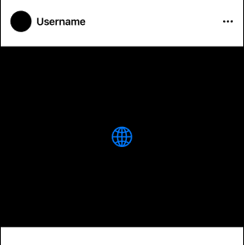

## 1.3 RotationGesture

`RotationGesture` is a SwiftUI gesture that lets you **rotate a view using two fingers** (like turning a knob). It gives you access to the angle of rotation in **radians**, which you can convert to degrees if needed.

- example: basic

```swift
import SwiftUI

struct RotationExample: View {
    @State private var rotation: Angle = .zero

    var body: some View {
        Image(systemName: "arrow.2.circlepath.circle.fill")
            .resizable()
            .frame(width: 150, height: 150)
            .rotationEffect(rotation)
            .gesture(
                RotationGesture()
                    .onChanged { value in
                        rotation = value
                    }
            )
    }
}


#Preview {
    RotationExample()
}
```

- example: basic (onEnd to .zero)

```swift
import SwiftUI

struct RotationExample: View {
    @GestureState private var rotationState: Angle = .zero
    @State private var finalRotation: Angle = .zero

    var body: some View {
        Image(systemName: "globe")
            .resizable()
            .frame(width: 150, height: 150)
            .rotationEffect(rotationState)
            .gesture(
                RotationGesture()
                    .updating($rotationState) { latestRotation, state, _ in
                        state = latestRotation
                    }
                    .onEnded { final in
                        finalRotation = .zero
                    }
            )
    }
}


#Preview {
    RotationExample()
}
```

## 1.4 DragGesture

`DragGesture` lets you track a user’s **finger movement across the screen**, capturing:

- **Start location**

- **Current translation**

- **End location**

This gesture is perfect for:

- Swiping cards

- Reordering items

- Moving views freely

- Creating custom sliders, drawers, or dismiss actions

---

- example: basic

```swift
import SwiftUI

struct DragExample: View {
    @State private var offset: CGSize = .zero

    var body: some View {
        Circle()
            .fill(Color.purple)
            .frame(width: 100, height: 100)
            .offset(offset)
            .gesture(
                DragGesture()
                    .onChanged { value in
                        offset = value.translation
                    }
                    .onEnded { _ in
                        // Snap back 
                        withAnimation {
                            offset = .zero
                        }
                    }
            )
    }
}


#Preview {
    DragExample()
}

// press the purple circle and move it to other place
// when open finger, purple ball snap back
```

`value.translation` gives you the distance moved **from the original touch point**. It’s a `CGSize`, with: 

- width = x-axis movement

- height = y-axis movement

---

- example: advance (move without snap back)

```swift
import SwiftUI

struct SmoothDragExample: View {
    @GestureState private var dragOffset: CGSize = .zero
    @State private var position: CGSize = .zero

    var body: some View {
        Rectangle()
            .fill(Color.blue)
            .frame(width: 100, height: 100)
            .offset(x: position.width + dragOffset.width,
                    y: position.height + dragOffset.height)
            .gesture(
                DragGesture()
                    .updating($dragOffset) { value, state, _ in
                        state = value.translation
                    }
                    .onEnded { value in
                        position.width += value.translation.width
                        position.height += value.translation.height
                    }
            )
    }
}


#Preview {
    SmoothDragExample()
}
```

- example: real-world (dating app)

```swift
import SwiftUI

struct SmoothDragExample: View {

    @State private var position: CGSize = .zero

    var body: some View {
        GeometryReader { geometry in
            let maxWidth = geometry.size.width / 2

            ZStack {
                VStack {
                    Text("\(position.width)")
                    Spacer()
                }

                RoundedRectangle(cornerRadius: 10)
                    .fill(Color.blue)
                    .frame(width: 300, height: 500)
                    .offset(position)
                    .scaleEffect(getScaleAmount(maxWidth: maxWidth)) // func scale
                    .rotationEffect(Angle(degrees: getRotationAmount(maxWidth: maxWidth))) // func rotation
                    .animation(.spring(), value: position) // apply animation when position change
                    .gesture(
                        DragGesture()
                            .onChanged { value in
                                position = value.translation
                            }
                            .onEnded { _ in
                                position = .zero
                            }
                    )
            }
            .frame(width: geometry.size.width, height: geometry.size.height)

        }
    }
    func getScaleAmount(maxWidth: CGFloat) -> CGFloat {
        let currentAmount = abs(position.width)
        let percentage = currentAmount / maxWidth
        return 1.0 - min(percentage, 0.5) * 0.5
    }

    func getRotationAmount(maxWidth: CGFloat) -> Double {
        let percentage = position.width / maxWidth
        let maxAngle: Double = 10
        return Double(percentage) * maxAngle
    }
}


#Preview {
    SmoothDragExample()
}
```


## 1.5 ScrollViewReader

Note: check `ScrollView()` in `swiftUI_p1.md part 6.2`

`ScrollViewReader` is a SwiftUI view that gives you **programmatic control over scrolling** inside a `ScrollView`. 

It works by: 

1. Wrapping your `ScrollView`

2. Giving you access to a `ScrollViewProxy`

3. Letting you scroll to specific views by **`id`**

Using Cases: 

1. scroll to new message in a chat app

2. scroll to a section on a form

3. scroll back to top or bottom

4. bring focus to a validation error

| Feature              | Description                                 |
| -------------------- | ------------------------------------------- |
| `.id()`              | assign a unique ID to the target view       |
| `proxy.scrollTo(id)` | scrolls to that view                        |
| `anchor`             | specifies alignment(.top, .center, .bottom) |

- example: 

```swift
import SwiftUI

struct ScrollViewReaderExample: View {
    @State private var scrollviewIndex: Int = 0
    @State private var textFieldText: String = ""

    var body: some View {
        ScrollViewReader { proxy in
            VStack {
                ScrollView {
                    ForEach(0..<50) { i in
                        Text("Item \(i)")
                            .font(.headline)
                            .frame(height: 200)
                            .frame(maxWidth: .infinity)
                            .background(Color.white)
                            .clipShape(RoundedRectangle(cornerRadius: 10))
                            .shadow(radius: 10)
                            .padding()
                            .id(i)
                    }
                }
                .onChange(of: scrollviewIndex) { _ , newValue in
                    withAnimation {
                        proxy.scrollTo(newValue, anchor: .top)
                    }
                }

                TextField("Enter a number here...", text: $textFieldText)
                    .frame(height: 55)
                    .border(Color.gray)
                    .padding(.horizontal)
                    .keyboardType(.numberPad)

                Button("Scroll to Item \(textFieldText)") {
                    withAnimation {
                        if let index = Int(textFieldText) {
                            scrollviewIndex = index
                        }
                    }
                }
                .padding()
            }
        }
    }
}

#Preview {
    ScrollViewReaderExample()
}
```

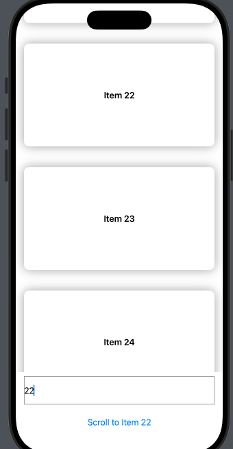

## 1.6 GeometryReader

`GeometryReader` is a **container view** that gives you access to **layout information** (like size and position) of the view it's wrapping.

It exposes a `GeometryProxy`, which lets you query:

- View **width & height**

- View **position in global/local coordinate space**

- Safe area insets

Using cases: 

1. adjusting layout based on screen size

2. animating views relative to their position

3. creating scroll effects (parallax, stickiness)

4. scaling views based on geometry 

Note: Don't use multi-geometryReader in one view or heavy ForEach loop. (it costs lots of computing power)

- example: basic 

```swift
import SwiftUI

struct GeometryExample: View {
    var body: some View {
        GeometryReader { geo in
            Text("Width: \(geo.size.width)")
                .frame(width: geo.size.width / 2, height: 100)
                .background(Color.blue)
        }
        .background(Color.yellow.opacity(0.3))
    }
}

#Preview {
    GeometryExample()
}
```

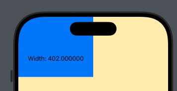

## 1.7 Multiple Sheets in a View

problem: 

When you press button 1 or button 2, the sheet does not display "one" or "two" because it is initially created with the title "Starting Title." Therefore, even though the button changes the title, the change is not applied immediately.

```swift
import SwiftUI

struct RandomModel: Identifiable {
    let id: UUID = UUID()
    let title: String
}

struct MultiSheet: View {

    @State private var selectedModel: RandomModel = RandomModel(title: "Starting Title")
    @State private var showSheet: Bool = false

    var body: some View {
        VStack(spacing: 20) {
            Button("button 1") {
                selectedModel = RandomModel(title: "One")
                showSheet.toggle()
            }
            Button("button 2") {
                selectedModel = RandomModel(title: "Two")
                showSheet.toggle()
            }
        }
        .sheet(isPresented: $showSheet, content: {
            NextScreen(selectedModel: selectedModel)
        })
    }
}

struct NextScreen: View {

    let selectedModel: RandomModel

    var body: some View {
        Text(selectedModel.title)
            .font(.headline)
    }
}

#Preview {
    MultiSheet()
}
```

- solution 1: (use a binding to fix the problem)

```swift
import SwiftUI

struct RandomModel: Identifiable {
    let id: UUID = UUID()
    let title: String
}

struct MultiSheet: View {

    @State private var selectedModel: RandomModel = RandomModel(title: "Starting Title")
    @State private var showSheet: Bool = false

    var body: some View {
        VStack(spacing: 20) {
            Button("button 1") {
                selectedModel = RandomModel(title: "One")
                showSheet.toggle()
            }
            Button("button 2") {
                selectedModel = RandomModel(title: "Two")
                showSheet.toggle()
            }
        }
        .sheet(isPresented: $showSheet, content: {
            NextScreen(selectedModel: $selectedModel)
        })
    }
}

struct NextScreen: View {

    @Binding var selectedModel: RandomModel

    var body: some View {
        Text(selectedModel.title)
            .font(.headline)
    }
}

#Preview {
    MultiSheet()
}
```

- solution 2: (multiple .sheets) 

Note: multiple .sheets MUST in the same hierarchy

```swift
import SwiftUI

struct RandomModel: Identifiable {
    let id: UUID = UUID()
    let title: String
}

struct MultiSheet: View {

    @State private var selectedModel: RandomModel = RandomModel(title: "Starting Title")
    @State private var showSheet: Bool = false
    @State private var showSheet2: Bool = false

    var body: some View {
        VStack(spacing: 20) {
            Button("button 1") {
                selectedModel = RandomModel(title: "One")
                showSheet.toggle()
            }
            .sheet(isPresented: $showSheet, content: {
                NextScreen(selectedModel: RandomModel(title: "One"))
            })
            Button("button 2") {
                selectedModel = RandomModel(title: "Two")
                showSheet2.toggle()
            }
            .sheet(isPresented: $showSheet2, content: {
                NextScreen(selectedModel: RandomModel(title: "Two"))
            })
        }

    }
}

struct NextScreen: View {

    let selectedModel: RandomModel

    var body: some View {
        Text(selectedModel.title)
            .font(.headline)
    }
}

#Preview {
    MultiSheet()
}
```

- solution 3: (use .sheet($item)) (best one)

```swift
import SwiftUI

struct RandomModel: Identifiable {
    let id: UUID = UUID()
    let title: String
}

struct MultiSheet: View {

    @State private var selectedModel: RandomModel? = nil

    var body: some View {
        VStack(spacing: 20) {
            Button("button 1") {
                selectedModel = RandomModel(title: "One")
            }
            Button("button 2") {
                selectedModel = RandomModel(title: "Two")
            }
        }
        .sheet(item: $selectedModel) { model in
            NextScreen(selectedModel: model)
        }
    }
}

struct NextScreen: View {

    let selectedModel: RandomModel

    var body: some View {
        Text(selectedModel.title)
            .font(.headline)
    }
}

#Preview {
    MultiSheet()
}
```

## 1.8 Mask

`.mask()` is a view modifier that uses **another view** to define which parts of the original view are **visible**. 

- example: basic

```swift
import SwiftUI

struct MaskExample: View {

    var body: some View {
        Image(systemName: "list.bullet.clipboard")
            .resizable()
            .frame(width: 100, height: 150)
            .mask(Circle())
    }
}

#Preview {
    MaskExample()
}
```


note: first image = no mask, second image = mask

- example: 

```swift
import SwiftUI

struct MaskExample: View {

    var body: some View {
        LinearGradient(colors: [.red, .orange], startPoint: .leading, endPoint: .trailing)
            .frame(height: 100)
            .mask(
                Text("HELLO")
                    .font(.system(size: 72, weight: .bold))
            )
    }
}

#Preview {
    MaskExample()
}
```


note: first one = no mask, second one = mask with text

- example: real-word (5 star system)

```swift
import SwiftUI

struct GradientStarRating: View {
    @State private var rating: Int = 3

    var body: some View {
        VStack {
            ZStack {
                LinearGradient(colors: [.yellow, .red], startPoint: .leading, endPoint: .trailing)
                    .frame(height: 50)
                    .mask(
                        HStack(spacing: 10) {
                            ForEach(1...5, id: \.self) { index in
                                Image(systemName: "star.fill")
                                    .font(.largeTitle)
                                    .opacity(index <= rating ? 1 : 0)
                            }
                        }
                    )
                    .allowsHitTesting(false)

                HStack(spacing: 10) {
                    ForEach(1...5, id: \.self) { index in
                        Image(systemName: "star.fill")
                            .font(.largeTitle)
                            .foregroundColor(index <= rating ? .clear : .gray)
                            .contentShape(Rectangle())
                            .onTapGesture {
                                withAnimation(.spring()) {
                                    rating = index
                                }
                            }
                    }
                }
            }
            .frame(height: 50)
            .padding()

            Text("Stars: \(rating)")
                .font(.headline)
        }
    }
}

#Preview {
    GradientStarRating()
}
```


# 2. Enhancing User Experience

## 2.1 How to add Sound Effects

- example: adding sounds in your app

```swift
import SwiftUI
import AVFoundation

class SoundManager: ObservableObject {

    private var player: AVAudioPlayer?

    enum SoundOption: String {
        case rain // sound 1
        case plane // sound 2
    }

    func playSound(_ sound: SoundOption) {
        guard let url = Bundle.main.url(forResource: sound.rawValue, withExtension: "mp3") else {
            print("Sound file not found: \(sound.rawValue)")
            return
        }

        do {
            player = try AVAudioPlayer(contentsOf: url)
            player?.prepareToPlay()
            player?.play()
        } catch {
            print("Failed to play sound: \(error.localizedDescription)")
        }
    }
}

struct SoundEffectExample: View {
    @StateObject private var soundManager = SoundManager()

    var body: some View {
        VStack(spacing: 20) {
            Button("Play Sound 1") {
                soundManager.playSound(.rain)
            }
            Button("Play Sound 2") {
                soundManager.playSound(.plane)
            }
        }
        .padding()
    }
}

#Preview {
    SoundEffectExample()
}
```

Note: 

1. store Sounds in a file 

2. AVAudioPlayer supports: `.mp3`, `.m4a`, `.wav`, `.caf`, etc. (`.wav` is often faster and lighter for sound effects than `.mp3`)

| Feature                | AVAudioPlayer | AVPlayer                 |
| ---------------------- | ------------- | ------------------------ |
| short sound effects    | preferred     | not ideal                |
| music or ambient audio | ok            | better for long/streamed |
| streaming audio        | NO            | YES                      |
| play local sounds      | YES           | YES                      |

## 2.2 How to add Haptics & Vibrations

- example: old version

```swift
import SwiftUI
import AVFoundation

class HapticManager {
    static let instance = HapticManager()

    func notification(type: UINotificationFeedbackGenerator.FeedbackType) {
        let generator = UINotificationFeedbackGenerator()
        generator.notificationOccurred(type)
    }

    func impact(style: UIImpactFeedbackGenerator.FeedbackStyle) {
        let generator = UIImpactFeedbackGenerator(style: style)
        generator.impactOccurred()
    }
}

struct HapticManagerExample: View {


    var body: some View {
        VStack(spacing: 20) {
            Button("success") {
                HapticManager.instance.notification(type: .success)
            }
            Button("warning") {
                HapticManager.instance.notification(type: .warning)
            }
            Button("error") {
                HapticManager.instance.notification(type: .error)
            }
            Divider()
            Button("soft") {
                HapticManager.instance.impact(style: .soft)
            }
            Button("medium") {
                HapticManager.instance.impact(style: .medium)
            }
        }
    }
}

#Preview {
    HapticManagerExample()
}
```

- example: IOS 17+ 

```swift
import SwiftUI

struct HapticManagerExample: View {
    @State private var tapCount = 0
    @State private var showSuccess = false

    var body: some View {
        VStack(spacing: 20) {
            Button("Success Haptic") {
                showSuccess.toggle()
            }
            .sensoryFeedback(.success, trigger: showSuccess)

            Button("Impact Haptic") {
                tapCount += 1
            }
            .sensoryFeedback(.impact(weight: .medium), trigger: tapCount)
        }
    }
}

#Preview {
    HapticManagerExample()
}
```

new: sensoryFeedback() modifier

This lets you declaratively attach haptic feedback to any view, using state changes as triggers — **no more manually invoking UIKit generators**. 

## 2.3 How to schedule Local Push Notifications

- example: time / calendar / location notifications

```swift
// VIEWS: 

import SwiftUI
import UserNotifications
import CoreLocation  // if setup for location (add this)

class NotificationManager: NSObject, UNUserNotificationCenterDelegate {

    static let instance = NotificationManager()

    func requestAuthorization() {
        let options: UNAuthorizationOptions = [.alert, .sound, .badge] // with alert , sound and badge
        UNUserNotificationCenter.current().requestAuthorization(options: options) { (success, error) in
            if let error = error {
                print("error: \(error)")
            } else {
                print("success")
            }

        }
    }

    func ScheduleNotification() {
        let content = UNMutableNotificationContent()
        content.title = "Notification A"
        content.subtitle = "Notification include.."
        content.sound = .default
        content.badge = 1

        //MARK: trigger ?  1. time, 2. calender 3. location (switch for different scenarios)
        //MARK: time
//        let trigger = UNTimeIntervalNotificationTrigger(timeInterval: 5.0, repeats: false)

        //MARK: calendar
        //(example: 2:09 pm -> .hour = 14, .minute = 9 (every day)

        var dateCompoents = DateComponents()
        dateCompoents.hour = 14    // 24 hr
        dateCompoents.minute = 9  // mins
        //dateCompoents.weekday = 2 // monday (Mon = 2, Tu = 3...)

         let trigger = UNCalendarNotificationTrigger(dateMatching: dateCompoents, repeats: true)


        //MARK: location

//        let coordinates = CLLocationCoordinate2D(
//            latitude: 40.00, longitude: 50.00
//        )
//        let region = CLCircularRegion(center: coordinates, radius: 100, identifier: UUID().uuidString)
//        region.notifyOnEntry = true
//        region.notifyOnExit = true
//        let trigger = UNLocationNotificationTrigger(region: region, repeats: true)


        let request = UNNotificationRequest(identifier: UUID().uuidString, content: content, trigger: trigger)
        UNUserNotificationCenter.current().add(request)

        print("schedule success")
    }

    func userNotificationCenter(_ center: UNUserNotificationCenter,
                                    willPresent notification: UNNotification,
                                withCompletionHandler completionHandler: @escaping (UNNotificationPresentationOptions) -> Void) {
        completionHandler([.banner, .sound])
    }
}

struct LocalNotification: View {

    @Environment(\.scenePhase) var scenephase
    var body: some View {
        VStack(spacing: 40) {
            Button("request permission") {
                NotificationManager.instance.requestAuthorization()
            }
            Button("schedule notification") {
                NotificationManager.instance.ScheduleNotification()
            }
        }
        .onChange(of: scenephase) { _ , newPhase in

            if newPhase == .active {
                UNUserNotificationCenter.current().setBadgeCount(0) { error in
                    if error != nil {
                        print("failed to clear badge count")
                    } else {
                        print("badge count success clear")
                    }
                }
            }
        }
    }
}

#Preview {
    LocalNotification()
}
```

```swift
// APP

import SwiftUI

@main
struct YOURAPP: App {

    init() {
            UNUserNotificationCenter.current().delegate = NotificationManager.instance
        }

    var body: some Scene {
        WindowGroup {
            LocalNotification()
        }
    }
}
```

## 2.4 VisualEffect viewModifier

`.visualEffect` lets you apply **Core Image-style visual effects** (like blur, saturation, vibrancy) to views **in a declarative way**.

| Effect Type     | How to use .visualEffect                       |
| --------------- | ---------------------------------------------- |
| blur            | `.blur(radius:)` inside `.visualEffect`        |
| vibrancy        | combine with `.background(ultraTinMaterial)`   |
| zoom effects    | Use `.scaleEffect()` or `.rotation3DEffect()`  |
| Dynamic Effects | Use `geometryProxy` to react to scrolling/size |

- example: 

```swift
import SwiftUI

struct VisualEffectExample: View {


    var body: some View {
        ScrollView {
            VStack(spacing: 30) {
                ForEach(0..<100) { index in
                    Rectangle()
                        .frame(width: 300, height: 100)
                        .frame(maxWidth: .infinity)
                        .background(Color.blue)
                        .visualEffect { content, geo in
                            content
                                .offset(x: geo.frame(in: .global).minY * 0.5)
                        }
                }
            }
        }
    }
}

#Preview {
    VisualEffectExample()
}
```

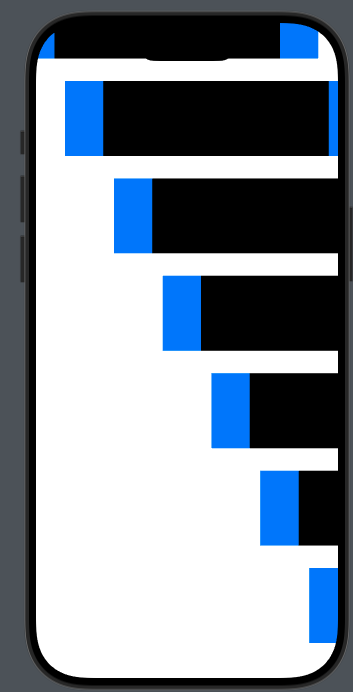

- example: 

```swift
import SwiftUI

struct VisualEffectExample: View {
    var body: some View {
        Text("Frosted Glass")
            .padding()
            .background(.ultraThinMaterial)
            .clipShape(RoundedRectangle(cornerRadius: 16))
            .visualEffect { content, proxy in
                content
                    .blur(radius: 2)
                    .saturation(1.5)
            }
            .padding()
    }
}

#Preview {
    VisualEffectExample()
}
```


# 3. Swift Language Essentials & Concurrency

## 3.1 Sorting, Filtering, and Mapping Data Arrays

- example: sort and filter

```swift
import SwiftUI

struct userModel: Identifiable {
    let id = UUID()
    let name: String
    let point: Int
    let isVerified: Bool
}

class ArrayModificationVM: ObservableObject {

    @Published var dataArray: [userModel] = []
    @Published var filteredArray: [userModel] = []

    init() {
        getUsers()
        updateFilteredArray()
    }

    func getUsers() {
        let user1 = userModel(name: "brian", point: 100, isVerified: true)
        let user2 = userModel(name: "yaro", point: 80, isVerified: false)
        let user3 = userModel(name: "amy", point: 90, isVerified: false)
        self.dataArray.append(contentsOf: [
            user1,
            user2,
            user3,
        ])
    }

    func updateFilteredArray() {
        // sort
        // filter
        // map

        //MARK: sort
        // example: sorted by point from hight to low
//        filteredArray = dataArray.sorted(by: {$0.point > $1.point})

        //MARK: filter
        // example: only show verified people
        filteredArray = dataArray.filter({ $0.isVerified })


    }
}

struct DataArray: View {

    @StateObject var vm = ArrayModificationVM()

    var body: some View {
        ScrollView {
            VStack(spacing: 20) {
                ForEach(vm.filteredArray) { user in
                    VStack(alignment: .leading) {
                        Text(user.name)
                        HStack {
                            Text("Points = \(user.point)")
                            Spacer()
                            if user.isVerified {
                                Image(systemName: "flame.fill")
                            }
                        }
                    }
                    .foregroundStyle(Color.white)
                    .padding()
                    .background(Color.blue)
                    .clipShape(RoundedRectangle(cornerRadius: 10))
                    .padding(.horizontal)

                }
            }
        }
    }
}

#Preview {
    DataArray()
}
```

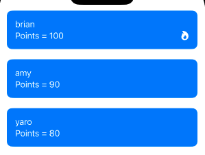

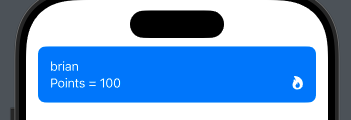

- example: map

```swift
import SwiftUI

struct userModel: Identifiable {
    let id = UUID()
    let name: String
    let point: Int
    let isVerified: Bool
}

class ArrayModificationVM: ObservableObject {

    @Published var dataArray: [userModel] = []
    @Published var filteredArray: [userModel] = []
    @Published var mapArray: [String] = []

    init() {
        getUsers()
        updateFilteredArray()
    }

    func getUsers() {
        let user1 = userModel(name: "brian", point: 100, isVerified: true)
        let user2 = userModel(name: "yaro", point: 80, isVerified: false)
        let user3 = userModel(name: "amy", point: 90, isVerified: false)
        self.dataArray.append(contentsOf: [
            user1,
            user2,
            user3,
        ])
    }

    func updateFilteredArray() {
        // sort
        // filter
        // map

        //MARK: sort
        // example: sorted by point from hight to low
        filteredArray = dataArray.sorted(by: {$0.point > $1.point})

        //MARK: filter
        // example: only show verified people
//        filteredArray = dataArray.filter({ $0.isVerified })

        //MARK: map
        mapArray = dataArray.map({$0.name})

    }
}

struct DataArray: View {

    @StateObject var vm = ArrayModificationVM()

    var body: some View {
        ScrollView {
            VStack(spacing: 20) {
                ForEach(vm.mapArray, id: \.self) { name in
                    Text(name)
                        .font(.title)
                }
            }
        }
    }
}

#Preview {
    DataArray()
}
```

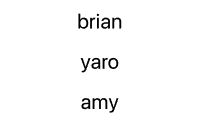

- example: mix all (sort, filter, map)

```swift
import SwiftUI

struct userModel: Identifiable {
    let id = UUID()
    let name: String
    let point: Int
    let isVerified: Bool
}

class ArrayModificationVM: ObservableObject {

    @Published var dataArray: [userModel] = []
    @Published var filteredArray: [userModel] = []
    @Published var mapArray: [String] = []

    init() {
        getUsers()
        updateFilteredArray()
    }

    func getUsers() {
        let user1 = userModel(name: "brian", point: 100, isVerified: true)
        let user2 = userModel(name: "yaro", point: 80, isVerified: false)
        let user3 = userModel(name: "amy", point: 90, isVerified: false)
        self.dataArray.append(contentsOf: [
            user1,
            user2,
            user3,
        ])
    }

    func updateFilteredArray() {
        // sort
        // filter
        // map

        //MARK: sort
        // example: sorted by point from hight to low
//        filteredArray = dataArray.sorted(by: {$0.point > $1.point})

        //MARK: filter
        // example: only show verified people
//        filteredArray = dataArray.filter({ $0.isVerified })

        //MARK: map
//        mapArray = dataArray.map({$0.name})


        //MARK: mix all
        mapArray = dataArray
            .sorted(by: {$0.point > $1.point})
            .filter({$0.isVerified})
            .map({$0.name})
    }
}

struct DataArray: View {

    @StateObject var vm = ArrayModificationVM()

    var body: some View {
        ScrollView {
            VStack(spacing: 20) {
                ForEach(vm.mapArray, id: \.self) { name in
                    Text(name)
                        .font(.title)
                }
            }
        }
    }
}

#Preview {
    DataArray()
}
```


## 3.2 Multi-threading with Background Threads and Queues

- Main Thread
  
  - handles all UI updates
  
  - must stay responsive
  
  - any long/blocking task here (laggy app)

- Background Thread
  
  - networking
  
  - file I/O
  
  - image processing
  
  - DB access

| Task Type           | Use                      | Why                          |
| ------------------- | ------------------------ | ---------------------------- |
| UI update           | `DispatchQueue.main`     | UI only works on main thread |
| Background task     | `DispatchQueue.global()` | Offload heavy work           |
| Async I/O / Network | `async/await` with Task  | Clean, modern concurrency    |
| Repeated/Timed work | `Timer`, `Task.sleep`    | Controlled scheduling        |

- example: 

```swift
import SwiftUI

class BackgroundThreadModel: ObservableObject {

    @Published var dataArray: [String] = []

    func fetchData() {

        DispatchQueue.global(qos: .background).async{
            let newData = self.downloadData()

            print("check 1: \(Thread.isMainThread)") // false
            print("check 1: \(Thread.current)")

            DispatchQueue.main.async {
                self.dataArray = newData

                print("check2: \(Thread.isMainThread)") // true
                print("check2: \(Thread.current)")
            }
        }
    }

    func downloadData() -> [String] {
        var data: [String] = []

        for x in 0..<10 {
            data.append("\(x)")
            print(data)
        }
        return data
    }
}

struct BackgroundThread: View {

    @StateObject var vm = BackgroundThreadModel()

    var body: some View {
        ScrollView {
            VStack(spacing: 20) {
                Text("Load Data")
                    .font(.title)
                    .fontWeight(.bold)
                    .onTapGesture {
                        vm.fetchData()
                    }
            }

            ForEach(vm.dataArray, id: \.self) { item in
                Text(item)
                    .font(.headline)
                    .foregroundStyle(.orange)
            }
        }

    }
}

#Preview {
    BackgroundThread()
}
```

Note: 

when loading data => using background thread (without Thread 1)

when scroll the view => using main thread (Thread 1)

## 3.3 Using Weak Self in Closures

```textile
NOTE: Important for data flow and memory control
```

In Swift, classes are **reference types**. If you create a **strong reference cycle** (where two objects strongly reference each other), they’ll never get deallocated → **memory leak**!

Closures **capture strong references** by default — including `self`.

```swift
class MyViewModel {
    func loadData() {
        DispatchQueue.global().async {
            self.doSomething() // Strong capture of self!
        }
    }

    func doSomething() { }
}
```

Now `self` is strongly held by the closure → if `self` also holds the closure (directly or indirectly), you get a **retain cycle**.

- example: 

```swift
import SwiftUI

class WeakSelfModel: ObservableObject {

    @Published var data: String? = nil

    init() {
        print("initial now")
        let currentCount = UserDefaults.standard.integer(forKey: "count")
        UserDefaults.standard.set(currentCount + 1, forKey: "count")
    }

    deinit {
        print("deinitial")
        let currentCount = UserDefaults.standard.integer(forKey: "count")
        UserDefaults.standard.set(currentCount - 1, forKey: "count")
    }

    func getData() {
        // simulate loading big data (cost 500s to download)
        DispatchQueue.main.asyncAfter(deadline: .now() + 500) { [weak self] in
            self?.data = "New data"
        }
    }


}

struct WeakSelf: View {

    @AppStorage("count") var count: Int?

    init() {
        count = 0
    }

    var body: some View {
        NavigationStack {
            NavigationLink("Navigate", destination: SecondWeakSelf())
                .navigationTitle("Screen 1")
        }
        .overlay(
            Text("\(count ?? 0)")
                .font(.title)
                .padding()
                .background(Color.red)
                .clipShape(RoundedRectangle(cornerRadius: 10)),
            alignment: .topTrailing
        )


    }
}

struct SecondWeakSelf: View {

    @StateObject private var vm = WeakSelfModel()

    var body: some View {
        VStack {
            Text("Second View")
                .font(.headline)
                .foregroundStyle(.orange)

            if let data = vm.data {
                Text(data)
            }
        }
        .onAppear{
            vm.getData()
        }
    }
}

#Preview {
    WeakSelf()
}
```

Note: 

count change from 0 to 1 (main view to second view) and change back from 1 to 0 (back from second view from main view). 

The Swift cleans it up even though function hasn't finished

Want function keeps loading until finish? (put WeakSelfModel to parent view) 

```swift
import SwiftUI

class WeakSelfModel: ObservableObject {

    @Published var data: String? = nil

    init() {
        print("initial now")
        let currentCount = UserDefaults.standard.integer(forKey: "count")
        UserDefaults.standard.set(currentCount + 1, forKey: "count")
    }

    deinit {
        print("deinitial")
        let currentCount = UserDefaults.standard.integer(forKey: "count")
        UserDefaults.standard.set(currentCount - 1, forKey: "count")
    }

    func getData() {
        // simulate loading big data (cost 500s to download)
        DispatchQueue.main.asyncAfter(deadline: .now() + 500) { [weak self] in
            self?.data = "New data"
        }
    }


}

struct WeakSelf: View {

    @StateObject private var vm = WeakSelfModel()

    @AppStorage("count") var count: Int?

    init() {
        count = 0
    }

    var body: some View {
        NavigationStack {
            NavigationLink("Navigate", destination: SecondWeakSelf(vm: vm))
                .navigationTitle("Screen 1")
        }
        .overlay(
            Text("\(count ?? 0)")
                .font(.title)
                .padding()
                .background(Color.red)
                .clipShape(RoundedRectangle(cornerRadius: 10)),
            alignment: .topTrailing
        )


    }
}

struct SecondWeakSelf: View {

    @ObservedObject var vm: WeakSelfModel

    var body: some View {
        VStack {
            Text("Second View")
                .font(.headline)
                .foregroundStyle(.orange)

            if let data = vm.data {
                Text(data)
            }
        }
        .onAppear{
            vm.getData()
        }
    }
}

#Preview {
    WeakSelf()
}
```

## 3.4 Using Typealias in Swift

- example: basic

```swift
import SwiftUI

struct MovieModel {
    let title: String
    let director: String
    let count: Int
}

typealias TVmodel = MovieModel

struct WeakSelf: View {

    @State private var item: TVmodel = TVmodel(title: "title", director: "brian", count: 10)

    var body: some View {
        VStack {
            Text(item.title)
            Text(item.director)
            Text("\(item.count)")
        }

    }
}


#Preview {
    WeakSelf()
}
```

## 3.5 Escaping Closures

- example: 

```swift
import SwiftUI

class EscapingVM: ObservableObject {

    @Published var text: String = "Hi"

    func getData() {
        Task {
            let newData = await downloadData2()
            await MainActor.run {
                self.text = newData
            }
        }
    }

    func downloadData() -> String { // return immediately
        return "New data"
    }

    func downloadData2() async -> String {
        return "new 2 data"
    }
}


struct EscapingExample: View {

    @StateObject var vm = EscapingVM()

    var body: some View {
        VStack {
            Text(vm.text)
                .font(.headline)
                .foregroundStyle(.orange)
                .onTapGesture {
                    vm.getData()
                }
        }

    }
}


#Preview {
    EscapingExample()
}
```

explain: 

1. func getData()

```swift
func getData() {
        Task {
            let newData = await downloadData2()
            await MainActor.run {
                self.text = newData
            }
        }
    }
```

2. func downloadData2()

```swift
func downloadData2() async -> String {
        return "new 2 data"
    }
```

For 1: 

the function initiates an asynchronous task to retrieve some data, then updates a `@published` property on the main thread

- `Task {...}` :
  
  - this creating a new concurrent unit of work
  
  - safe to use inside regular (non-async) function
  
  - NOT block current thread (run in background)
  
  - strongly captures self unless use [weak self]

- `let newData = await downloadData2()` 
  
  - suspends task and waits for func downloadData2() to return a value
  
  - since func is marked `async`, it could take some time
  
  - await tells Swift: *pause this task until the async func completes* 

- `await MainActor.run { ... }` 
  
  - ensure the following block runs on the main thread
  
  - UI updates and property changes to views must happen on main thread
  
  - avoid crashes or unexpected UI behavior

For 2: 

this is a simple `async` function that immediately returns a string. But the key part is that it's marked with `async`.

How dataflow work? 

```swift
getData() → starts a Task → calls await downloadData2() → waits for result → updates UI on main thread
```

# 4. Data Persistence with Core Data

## 4.1 Using Core Data with @FetchRequest

Great topic! `@FetchRequest` is a **SwiftUI property wrapper** that lets you **fetch Core Data records** directly into your view in a declarative, SwiftUI-friendly way.

It automatically:

- Fetches data from your Core Data store

- Keeps the view **in sync** when data changes

- Can be filtered, sorted, and even animated with SwiftUI transitions

Note: your project must select "USE CORE DATA"

| Feature       | UserDefaults                            | Core Data                                           |
| ------------- | --------------------------------------- | --------------------------------------------------- |
| Purpose       | store small pieces of app/user settings | Store large, complex structured data                |
| Data Type     | Key-value pairs                         | Objects/entities with attributes & relations        |
| Persistence   | YES (simple local)                      | Yes (SQLite default)                                |
| Sync Support  | Basic (iCloud key-value sync)           | Advanced (CloudKit + NSPersistentCloudKitContainer) |
| UI Reactivity | Manual / via `@AppStorage`              | Automatic via `@FetchRequest`                       |
| Best for      | setting, flags, preferences             | Lists, offline records, notes...                    |

- Xcode Example: 

inside Persistence: 

```swift
container = NSPersistentContainer(name: "CoreDataExample")
```


- example: (List) (Using app simulator not preview) (using preview will face 1. cannot add item 2. crash when edit)

```swift
// in Persistence.swift
import CoreData

struct PersistenceController {
    static let shared = PersistenceController()

    @MainActor
    static let preview: PersistenceController = { // just in preview not in app simulator
        let result = PersistenceController(inMemory: true)
        let viewContext = result.container.viewContext
        for x in 0..<10 {
            let newFruit = Fruits(context: viewContext)
            newFruit.name = "Apple \(x)"
        }
        do {
            try viewContext.save()
        } catch {
            // Replace this implementation with code to handle the error appropriately.
            // fatalError() causes the application to generate a crash log and terminate. You should not use this function in a shipping application, although it may be useful during development.
            let nsError = error as NSError
            fatalError("Unresolved error \(nsError), \(nsError.userInfo)")
        }
        return result
    }()

    let container: NSPersistentContainer

    init(inMemory: Bool = false) {
        container = NSPersistentContainer(name: "CoreDataExample")
        if inMemory {
            container.persistentStoreDescriptions.first!.url = URL(fileURLWithPath: "/dev/null")
        }
        container.loadPersistentStores(completionHandler: { (storeDescription, error) in
            if let error = error as NSError? {
                // Replace this implementation with code to handle the error appropriately.
                // fatalError() causes the application to generate a crash log and terminate. You should not use this function in a shipping application, although it may be useful during development.

                /*
                 Typical reasons for an error here include:
                 * The parent directory does not exist, cannot be created, or disallows writing.
                 * The persistent store is not accessible, due to permissions or data protection when the device is locked.
                 * The device is out of space.
                 * The store could not be migrated to the current model version.
                 Check the error message to determine what the actual problem was.
                 */
                fatalError("Unresolved error \(error), \(error.userInfo)")
            }
        })
        container.viewContext.automaticallyMergesChangesFromParent = true

        self.prepopulateIfNeeded()
    }
    private func prepopulateIfNeeded() { // show in app simulator
            let viewContext = container.viewContext
            let fetchRequest: NSFetchRequest<Fruits> = Fruits.fetchRequest()
            do {
                // If no fruits exist in the store, create sample fruits.
                let count = try viewContext.count(for: fetchRequest)
                if count == 0 {
                    for i in 0..<10 {
                        let newFruit = Fruits(context: viewContext)
                        newFruit.name = "Apple \(i)"
                        print("🍎 Pre-populated: Apple \(i)")
                    }
                    try viewContext.save()
                    print("✅ Pre-populated sample data saved.")
                }
            } catch {
                print("Error pre-populating sample data: \(error.localizedDescription)")
            }
        }
}
```

```swift
// in ContectView.swift
import CoreData
import SwiftUI

struct ContentView: View {
    @Environment(\.managedObjectContext) private var viewContext

    @FetchRequest(
        entity: Fruits.entity(),
        sortDescriptors: [
            NSSortDescriptor(keyPath: \Fruits.name, ascending: true)
        ]) private var fruits: FetchedResults<Fruits>

    @State private var textFieldText: String = ""

    var body: some View {
        NavigationView {
            VStack {

                TextField("Add fruit here...", text: $textFieldText)
                    .padding()
                    .font(.headline)
                    .frame(maxWidth: .infinity)
                    .frame(height: 55)
                    .background(Color.gray.opacity(0.3))
                    .clipShape(RoundedRectangle(cornerRadius: 10))
                    .padding(.horizontal)

                Button(
                    action: {
                        addItem()
                    },
                    label: {
                        Text("Save")
                            .font(.headline)
                            .foregroundStyle(.white)
                            .frame(maxWidth: .infinity)
                            .frame(height: 55)
                            .background(Color.blue)
                            .clipShape(RoundedRectangle(cornerRadius: 10))
                    }
                )
                .padding(.horizontal)

                List {
                    ForEach(fruits) { fruit in
                        Text(fruit.name ?? "")
                    }
                    .onDelete(perform: deleteItems)
                }
            }
            .navigationTitle("Core Data Example")
            .toolbar {
                ToolbarItem(placement: .navigationBarTrailing) {
                    EditButton()
                }
            }
        }
    }

    private func addItem() {

        withAnimation {
            guard
                !textFieldText.trimmingCharacters(
                    in: .whitespacesAndNewlines
                ).isEmpty
            else {
                return  // don't add empty or whitespace-only strings
            }

            let newFruit = Fruits(context: viewContext)
            newFruit.name = textFieldText
            print("🍊 Added new fruit: \(newFruit.name ?? "nil")")

            saveItems()
            textFieldText = ""
        }

    }

    private func deleteItems(offsets: IndexSet) {
        withAnimation {
            offsets.map { fruits[$0] }.forEach(viewContext.delete)

            saveItems()

        }
    }

    private func saveItems() {
        do {
            try viewContext.save()
            print("✅ Saved to context.")
        } catch {
            // Replace this implementation with code to handle the error appropriately.
            // fatalError() causes the application to generate a crash log and terminate. You should not use this function in a shipping application, although it may be useful during development.
            let nsError = error as NSError
            fatalError("Unresolved error \(nsError), \(nsError.userInfo)")
        }
    }
}

#Preview {
    ContentView().environment(
        \.managedObjectContext,
        PersistenceController.preview.container.viewContext)
}
```

```swift
in CoreDataExample dateset:
```

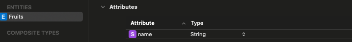

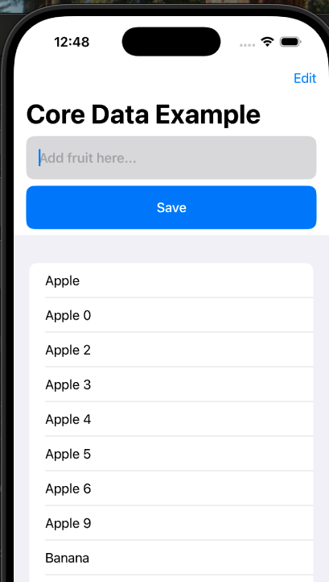

## 4.2 Implementing Core Data with MVVM Architecture

This example's function is similar with 4.1, but didn't use `@FetchRequest` 

- **@FetchRequest** is ideal for simple, declarative scenarios where you want the UI to automatically reflect changes in your Core Data store without additional boilerplate.

- **Manual Fetching in a View Model** gives you finer control and separation of concerns, which is useful when your logic is more complex, needs explicit error handling, or when you’re integrating with other business logic, even though it requires you to manage UI updates manually.

---

- example: Fruit list

```swift
// view.swift
import SwiftUI
import CoreData

// View - UI
// Model - data point
// ViewModel - manages the data for a view

class CoreDataViewModel: ObservableObject {
    let container: NSPersistentContainer
    @Published var savedEntities: [FruitEntity] = []

    init() {
        container = NSPersistentContainer(name: "FruitContainer")
        container.loadPersistentStores { (description, error) in
            if let error = error {
                print("error: \(error)")
            } else {
                print("success create data")
            }
        }
    }

    func fetchFruits() {
        let request = NSFetchRequest<FruitEntity>(entityName: "FruitEntity")
        do {
            savedEntities = try container.viewContext.fetch(request)
        } catch let error {
            print("error fetch. \(error)")
        }
    }

    func updateFruit(entity: FruitEntity) {
        let currentName = entity.name ?? ""
        let newName = currentName + "!"
        entity.name = newName
        saveData()
    }

    func addFruit(text: String) {
        let newFruit = FruitEntity(context: container.viewContext)
        newFruit.name = text

        saveData()
    }

    func deleteFruit(indexSet: IndexSet) {
        guard let index = indexSet.first else { return }
        let entity = savedEntities[index]
        container.viewContext.delete(entity)
        saveData()
    }

    func saveData() {
        do {
            try container.viewContext.save()
            fetchFruits()
        } catch let error {
            print("error saving. \(error)")
        }
    }
}

struct CoreDataEx: View {

    @StateObject private var vm = CoreDataViewModel()
    @State private var textFieldText: String = ""

    var body: some View {
        NavigationStack {
            VStack {
                TextField("Add fruit here...", text: $textFieldText)
                    .font(.headline)
                    .padding(.leading)
                    .frame(height: 55)
                    .frame(maxWidth: .infinity)
                    .background(Color(hue: 1.0, saturation: 0.026, brightness: 0.858))
                    .clipShape(RoundedRectangle(cornerRadius: 10))
                    .padding(.horizontal)

                Button(action: {
                    guard !textFieldText.isEmpty else { return }
                    vm.addFruit(text: textFieldText)
                    textFieldText = ""
                }, label: {
                    Text("Save")
                        .font(.headline)
                        .foregroundStyle(.white)
                        .frame(height: 55)
                        .frame(maxWidth: .infinity)
                        .background(Color.blue)
                        .clipShape(RoundedRectangle(cornerRadius: 10))
                        .padding(.horizontal)
                })

                List {
                    ForEach(vm.savedEntities) { entity in
                        Text(entity.name ?? "NO Name")
                            .onTapGesture {
                                vm.updateFruit(entity: entity)
                            }
                    }
                    .onDelete(perform: vm.deleteFruit)
                }
            }
            .navigationTitle("Fruit Shop")
            .onAppear{
                vm.fetchFruits()
            }
        }
    }
}

#Preview {
    CoreDataEx()
}
```

```swift
// APP.swift
import SwiftUI

@main
struct YourApp: App {

    var body: some Scene {
        WindowGroup {
            CoreDataEx()
        }
    }
}
```

```swift
dataset FruitContainer:
```

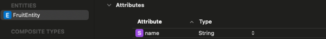

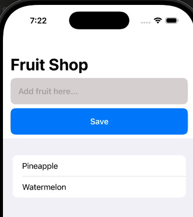

Appendix: (@MainActor) (good for light and moderate dataset)

```swift
import CoreData
import SwiftUI

// View - UI
// Model - data point
// ViewModel - manages the data for a view

@MainActor
class CoreDataViewModel: ObservableObject {
    let container: NSPersistentContainer
    @Published var savedEntities: [FruitEntity] = []

    init() {
        container = NSPersistentContainer(name: "FruitContainer")
        container.loadPersistentStores { (description, error) in
            if let error = error {
                print("error: \(error)")
            } else {
                print("success create data")
            }
        }
    }

    func fetchFruits() {
        let request = NSFetchRequest<FruitEntity>(entityName: "FruitEntity")
        do {
            savedEntities = try container.viewContext.fetch(request)
        } catch {
            print("error fetch: \(error)")
        }
    }

    func updateFruit(entity: FruitEntity) {
        let currentName = entity.name ?? ""
        let newName = currentName + "!"
        entity.name = newName
        saveData()
    }

    func addFruit(text: String) {
        let newFruit = FruitEntity(context: container.viewContext)
        newFruit.name = text

        saveData()
    }

    func deleteFruit(indexSet: IndexSet) {
        guard let index = indexSet.first else { return }
        let entity = savedEntities[index]
        container.viewContext.delete(entity)
        saveData()
    }

    func saveData() {
        do {
            try container.viewContext.save()
            fetchFruits()
        } catch let error {
            print("error saving. \(error)")
        }
    }
}

struct CoreDataEx: View {

    @StateObject private var vm = CoreDataViewModel()
    @State private var textFieldText: String = ""

    var body: some View {
        NavigationStack {
            VStack {
                TextField("Add fruit here...", text: $textFieldText)
                    .font(.headline)
                    .padding(.leading)
                    .frame(height: 55)
                    .frame(maxWidth: .infinity)
                    .background(
                        Color(hue: 1.0, saturation: 0.026, brightness: 0.858)
                    )
                    .clipShape(RoundedRectangle(cornerRadius: 10))
                    .padding(.horizontal)

                Button(
                    action: {
                        guard !textFieldText.isEmpty else { return }
                        vm.addFruit(text: textFieldText)
                        textFieldText = ""
                    },
                    label: {
                        Text("Save")
                            .font(.headline)
                            .foregroundStyle(.white)
                            .frame(height: 55)
                            .frame(maxWidth: .infinity)
                            .background(Color.blue)
                            .clipShape(RoundedRectangle(cornerRadius: 10))
                            .padding(.horizontal)
                    })

                List {
                    ForEach(vm.savedEntities) { entity in
                        Text(entity.name ?? "NO Name")
                            .onTapGesture {
                                vm.updateFruit(entity: entity)
                            }
                    }
                    .onDelete(perform: vm.deleteFruit)
                }
            }
            .navigationTitle("Fruit Shop")
            .onAppear {
                vm.fetchFruits()
            }
        }
    }
}

#Preview {
    CoreDataEx()
}
```

## 4.3 Handling Core Data Relationships, Predicates, and Delete Rules

- example: (run in app simulator not preview)

```swift
// in view
import SwiftUI
import CoreData

// 3 entities
// BusinessEntity
// DepartmentEntity
// EmployeeEntity

class CoreDataManager {

    static let instance = CoreDataManager()
    let container: NSPersistentContainer
    let context: NSManagedObjectContext

    init() {
        container = NSPersistentContainer(name: "CoreDataContainer")
        container.loadPersistentStores { (description, error) in
            if let error = error {
                print("Error loading core data: \(error)")
            }
        }
        context = container.viewContext
    }

    func save() {
        do {
            try context.save()
            print("Save success")
        } catch let error {
            print("error saving core data: \(error)")
        }
    }
}

class CoreDataRelationshipVM: ObservableObject {
    let manager = CoreDataManager.instance
    @Published var business: [BusinessEntity] = []
    @Published var departments: [DepartmentEntity] = []
    @Published var employees: [EmployeeEntity] = []

    init() {
        getBusiness()
        getDepartment()
        getEmployee()
    }

    func getBusiness() {
        let request = NSFetchRequest<BusinessEntity>(entityName: "BusinessEntity")

        // sort from A to Z
        let sort = NSSortDescriptor(keyPath: \BusinessEntity.name, ascending: true)
        request.sortDescriptors = [sort]

        // filter only show "Apple"
        let filter = NSPredicate(format: "name == %@", "Apple")
        request.predicate = filter

        do {
            business = try manager.context.fetch(request)
        } catch let error {
            print("error fetching business. \(error)")
        }
    }

    func getDepartment() {
        let request = NSFetchRequest<DepartmentEntity>(entityName: "DepartmentEntity")

        do {
            departments = try manager.context.fetch(request)
        } catch let error {
            print("error fetching department. \(error)")
        }
    }

    func getEmployee() {
        let request = NSFetchRequest<EmployeeEntity>(entityName: "EmployeeEntity")

        do {
            employees = try manager.context.fetch(request)
        } catch let error {
            print("error fetching employee. \(error)")
        }
    }

    func addBusiness() {
        let newBusiness = BusinessEntity(context: manager.context)
        newBusiness.name = "Apple"

        // add existing departments to the new business

        // add existing employees to the new business

        // add new business to existing department

        // add new business to exising employee

        save()

    }

    func addDepartment() {
        let newDepartment = DepartmentEntity(context: manager.context)
        newDepartment.name = "Marketing"
        newDepartment.businesses = [business[0]]
        save()
    }

    func addEmployee() {
        let newEmployee = EmployeeEntity(context: manager.context)
        newEmployee.name = "Brian"
        newEmployee.age = 25
        newEmployee.dateJoined = Date()
        newEmployee.business = business[0]
        newEmployee.department = departments[0]
        save()
    }

    // delete rule
    /*
     in CoreDataContainer:
     Nullify: delete the department, the employee's info still alive in employee place (only remove department info
     Cascade: delete the department, the employee's info also be deleted in employee palce
     Deny: if you want to delete department, the employee must be empty or cannot delete

     */
    func deleteDepartment() {
        let department = departments[1]
        manager.context.delete(department)
        save()
    }

    func save() {
        business.removeAll()
        departments.removeAll()
        employees.removeAll()


        DispatchQueue.main.asyncAfter(deadline: .now() + 1.0) {
            self.manager.save()
            self.getBusiness() // fetch it when save
            self.getDepartment() // fetch it when save
            self.getEmployee()
        }

    }


}

struct CoreDataCompany: View {

    @StateObject var vm = CoreDataRelationshipVM()

    var body: some View {
        NavigationStack {
            ScrollView {
                VStack {
                    Button(action: {
                        vm.addEmployee()
                    }, label: {
                        Text("perform Action")
                            .foregroundStyle(Color.white)
                            .frame(height: 55)
                            .frame(maxWidth: .infinity)
                            .background(Color.blue)
                            .clipShape(RoundedRectangle(cornerRadius: 10))
                    })

                    ScrollView(.horizontal, showsIndicators: true, content: {
                        HStack(alignment: .top) {
                            ForEach(vm.business) { business in
                                BusinessView(entity: business)
                            }
                        }
                    })

                    ScrollView(.horizontal, showsIndicators: true, content: {
                        HStack(alignment: .top) {
                            ForEach(vm.departments) { department in
                                DepartmentView(entity: department)
                            }
                        }
                    })

                    ScrollView(.horizontal, showsIndicators: true, content: {
                        HStack(alignment: .top) {
                            ForEach(vm.employees) { emp in
                                EmployeeView(entity: emp)
                            }
                        }
                    })
                }
                .padding()
            }
            .navigationTitle("Relationships")
        }
    }
}


struct BusinessView: View {

    let entity: BusinessEntity

    var body: some View {
        VStack(alignment: .leading, spacing: 20) {
            Text("name: \(entity.name ?? "")")
                .bold()

            if let departments = entity.departments?.allObjects as? [DepartmentEntity] {
                Text("Departments: ")
                    .bold()
                ForEach(departments) { dep in
                    Text(dep.name ?? "")
                }
            }

            if let employees = entity.employees?.allObjects as? [EmployeeEntity] {
                Text("Employees: ")
                    .bold()
                ForEach(employees) { emp in
                    Text(emp.name ?? "")
                }
            }
        }
        .padding()
        .frame(maxWidth: 300, alignment: .leading)
        .background(Color.gray.opacity(0.5))
        .clipShape(RoundedRectangle(cornerRadius: 10))
        .shadow(radius: 10)
    }
}

struct DepartmentView: View {

    let entity: DepartmentEntity

    var body: some View {
        VStack(alignment: .leading, spacing: 20) {
            Text("name: \(entity.name ?? "")")
                .bold()

            if let business = entity.businesses?.allObjects as? [BusinessEntity] {
                Text("Businesses: ")
                    .bold()
                ForEach(business) { bus in
                    Text(bus.name ?? "")
                }
            }

            if let employees = entity.employees?.allObjects as? [EmployeeEntity] {
                Text("Employees: ")
                    .bold()
                ForEach(employees) { emp in
                    Text(emp.name ?? "")
                }
            }
        }
        .padding()
        .frame(maxWidth: 300, alignment: .leading)
        .background(Color.green.opacity(0.5))
        .clipShape(RoundedRectangle(cornerRadius: 10))
        .shadow(radius: 10)
    }
}

struct EmployeeView: View {

    let entity: EmployeeEntity

    var body: some View {
        VStack(alignment: .leading, spacing: 20) {
            Text("name: \(entity.name ?? "")")
                .bold()

            Text("age: \(entity.age)")
                .bold()

            Text("Date Join: \(entity.dateJoined ?? Date())")
                .bold()

            Text("business:")
                .bold()

            Text(entity.business?.name ?? "")

            Text("department:")
                .bold()

            Text(entity.department?.name ?? "")
        }
        .padding()
        .frame(maxWidth: 300, alignment: .leading)
        .background(Color.orange.opacity(0.5))
        .clipShape(RoundedRectangle(cornerRadius: 10))
        .shadow(radius: 10)
    }
}


#Preview {
    CoreDataCompany()
}
```

```swift
in CoreDataCompany:
BusinessEntity
DepartmentEntity
EmployeeEntity
```

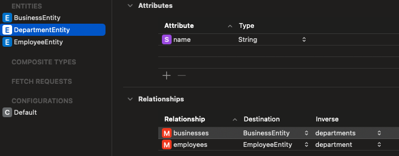

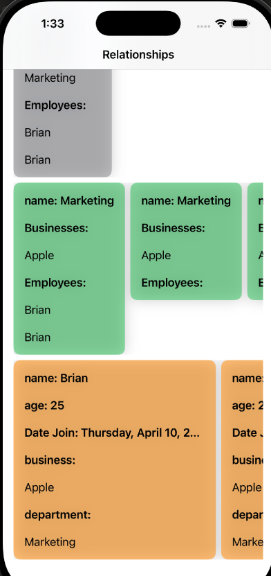

# 5. Networking and Reactive Data Handling

## 5.1 Codable, Decodable, and Encodable

- example: 

```swift
import SwiftUI

struct CustomerModel: Identifiable, Codable {
    let id: String
    let name: String
    let points: Int
    let isPremium: Bool
}

class CodableViewM: ObservableObject {
    @Published var customer: CustomerModel? = nil

    init() {
        getData()
    }

    // decode data
    func getData() {
        guard let data = getJSON() else { return }

        let decoder = JSONDecoder()
        do {
            let newCustomer = try decoder.decode(CustomerModel.self, from: data)
            customer = newCustomer
        } catch {
            print("Error decoding JSON: \(error)")
        }
    }

    // becasue come from internet -> Data (encode)
    func getJSON() -> Data? {

        let customer = CustomerModel(
            id: "25", name: "Brian", points: 5, isPremium: true)
        return try? JSONEncoder().encode(customer)
    }
}

struct CodableView: View {
    @StateObject private var vm = CodableViewM()

    var body: some View {
        VStack {
            if let customer = vm.customer {
                Text("ID: \(customer.id)")
                Text("Name: \(customer.name)")
                Text("Points: \(customer.points)")
                Text("Premium: \(customer.isPremium.description)")
            }
        }
    }
}

#Preview {
    CodableView()
}
```

Note: Using Codable in CustomerModel, decode when get data, encode when get json 

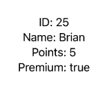

## 5.2 Download JSON with URLSession and @escaping Closures

```textile
Using: 
https://jsonplaceholder.typicode.com/
as an example
```

- example: download json from the internet and show in app

```swift
import SwiftUI

struct PostModel: Identifiable, Codable {
    let userId: Int
    let id: Int
    let title: String
    let body: String
}

@MainActor
class DownloadEscapingVM: ObservableObject {
    @Published var posts: [PostModel] = []

    init() {
        // Launch an async task in the initializer.
        Task {
            await getPosts()
        }
    }

    // Async version of the network call.
    func getPosts() async {
        guard let url = URL(string: "https://jsonplaceholder.typicode.com/posts") else {
            print("Invalid URL")
            return
        }

        do {
            // Use the async URLSession API.
            let (data, response) = try await URLSession.shared.data(from: url)
            guard let httpResponse = response as? HTTPURLResponse,
                  (200..<300).contains(httpResponse.statusCode) else {
                print("Invalid response or status code is not in the 2xx range")
                return
            }

            print("Success download")
            if let jsonString = String(data: data, encoding: .utf8) {
                print(jsonString)
            }
            // Note: the structure in the url is [{json 1}, {json 2}, ...] so add [] to [PostModel]. if the format is {json} no need to add [] for PostModel. 
            let newPost = try JSONDecoder().decode([PostModel].self, from: data)
            // Update the published property on the main thread.
            posts = newPost
        } catch {
            print("Error downloading posts: \(error)")
        }
    }


}

struct DownloadWithEscaping: View {
    @StateObject private var vm = DownloadEscapingVM()

    var body: some View {
        List {
            ForEach(vm.posts) { post in
                VStack(alignment: .leading, spacing: 8) {
                    Text(post.title)
                        .font(.headline)
                    Text(post.body)
                        .foregroundColor(.gray)
                }
                .padding(.vertical, 4)
            }
        }
    }
}

#Preview {
    DownloadWithEscaping()
}
```

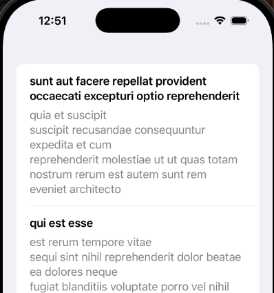

## 5.3 Download JSON with Combine

note: usually recommend to use 5.2 async/await approach 

- example: (same result with 5.2)

```swift
import SwiftUI
import Combine

struct PostModelCB: Identifiable, Codable {
    let userId: Int
    let id: Int
    let title: String
    let body: String
}

@MainActor
class DownloadCombineVM: ObservableObject {
    @Published var posts: [PostModelCB] = []  // Updated type to PostModelCB
    var cancellables = Set<AnyCancellable>()

    init() {
        Task {
            await getPosts()
        }
    }

    func getPosts() async {
        guard let url = URL(string: "https://jsonplaceholder.typicode.com/posts") else {
            print("Invalid URL")
            return
        }

        // keep get data from server each xx seconds or xx mins
        URLSession.shared.dataTaskPublisher(for: url)
            .subscribe(on: DispatchQueue.global(qos: .background))
            .receive(on: DispatchQueue.main)
            .tryMap { (data, response) -> Data in
                guard
                    let httpResponse = response as? HTTPURLResponse,
                    (200..<300).contains(httpResponse.statusCode) else {
                    throw URLError(.badServerResponse)
                }
                return data
            }
            .decode(type: [PostModelCB].self, decoder: JSONDecoder())
            .sink { completion in
                print("Completion: \(completion)")
            } receiveValue: { [weak self] returnPosts in
                self?.posts = returnPosts
            }
            .store(in: &cancellables)
    }
}

struct DownloadWithCombine: View {
    @StateObject var vm = DownloadCombineVM()

    var body: some View {
        NavigationView {
            List(vm.posts) { post in
                VStack(alignment: .leading, spacing: 8) {
                    Text(post.title)
                        .font(.headline)
                    Text(post.body)
                        .foregroundColor(.gray)
                }
                .padding(.vertical, 4)
            }
            .navigationTitle("Posts")
        }
    }
}

#Preview {
    DownloadWithCombine()
}
```

# 6. Timers and the Combine Framework

## 6.1 Using Timer

- example: (countdown timer from 10 to 0)

```swift
import SwiftUI

struct TimerExample: View {

    let startTime = Date()
    let duration: TimeInterval = 10

    var body: some View {

        TimelineView(.periodic(from: startTime, by: 1.0)) { context in
            let elapsedTime = context.date.timeIntervalSince(startTime)
            let remainingTime = max(0, duration - elapsedTime)

            let secondsRemaining = Int(ceil(remainingTime))

            ZStack {
                RadialGradient(
                    gradient: Gradient(colors: [.blue, .white]),
                    center: .center,
                    startRadius: 5,
                    endRadius: 500
                )
                .ignoresSafeArea()

                if remainingTime > 0 {
                    Text("\(secondsRemaining)")
                        .font(.system(size: 100, weight: .semibold, design: .rounded))
                        .foregroundStyle(.orange)
                        .lineLimit(1)
                        .minimumScaleFactor(0.1)
                } else {
                    Text("Time's up")
                        .font(.system(size: 50, weight: .semibold, design: .rounded))
                        .foregroundStyle(.red)
                }
            }
        }
    }
}

#Preview {
    TimerExample()
}
```


- example: (carousel)

```swift
import SwiftUI

struct AutoPagingTabViewTimeline: View {
    // The moment you start the timeline
    private let startTime = Date()

    var body: some View {
        TimelineView(.periodic(from: startTime, by: 1.0)) { context in
            // Determine how many seconds have passed
            let elapsedSeconds = Int(context.date.timeIntervalSince(startTime))

            // Derive the current index by modding against 6 to cycle from 0..5
            let currentIndex = elapsedSeconds % 6

            ZStack {
                RadialGradient(
                    gradient: Gradient(colors: [.blue, .white]),
                    center: .center,
                    startRadius: 5,
                    endRadius: 500
                )
                .ignoresSafeArea()

                // Note: We bind to a constant here because the index
                // is derived from time, not stored in @State
                TabView(selection: .constant(currentIndex)) {
                    Rectangle().foregroundColor(.red).tag(0)
                    Rectangle().foregroundColor(.blue).tag(1)
                    Rectangle().foregroundColor(.green).tag(2)
                    Rectangle().foregroundColor(.yellow).tag(3)
                    Rectangle().foregroundColor(.orange).tag(4)
                    Rectangle().foregroundColor(.pink).tag(5)
                }
                .frame(height: 200)
                .tabViewStyle(PageTabViewStyle())
            }
        }
    }
}

#Preview {
    AutoPagingTabViewTimeline()
}
```


note: extend the time from 1 to 3 seconds

```swift
TimelineView(.periodic(from: startTime, by: 3.0)) { context in
            // Determine how many seconds have passed
            let elapsedSeconds = Int(context.date.timeIntervalSince(startTime))

            // Derive the current index by modding against 6 to cycle from 0..5
            let currentIndex = elapsedSeconds / 3 % 6
```

## 6.2 Working with Publishers and Subscribers in Combine

- example: old version (but still work)

```swift
import SwiftUI
import Combine

class SubscriberVM: ObservableObject {

    @Published var count: Int = 0
    var cancellables = Set<AnyCancellable>()

    @Published var textFieldText: String = ""
    @Published var textIsValid: Bool = false

    @Published var showButton: Bool = false

    init() {
        setupTimer()
        addTextSub()
        addButtomSub()
    }

    func addTextSub() {
        $textFieldText
            .map { text in
                // Check if the text has more than 3 characters.
                return text.count > 3
            }
            .sink { [weak self] isValid in
                self?.textIsValid = isValid
            }
            .store(in: &cancellables)
    }

    func setupTimer() {
        Timer
            .publish(every: 1, on: .main, in: .common)
            .autoconnect()
            .sink { [weak self] _ in
                guard let self = self else { return }
                self.count += 1

                // If count >= 10, cancel the timer subscription only.
                if self.count >= 10 {
                    // Optionally cancel only the timer subscription, or if intended, cancel all.
                    for item in self.cancellables {
                        item.cancel()
                    }
                }
            }
            .store(in: &cancellables)
    }

    func addButtomSub() {
        $textIsValid
            .combineLatest($count)
            .sink { [weak self] isValid, count in
                guard let self = self else { return }
                // Show button only if text is valid and count is at least 10.
                self.showButton = isValid && count >= 10
            }
            .store(in: &cancellables)
    }
}

struct SubscriberExample: View {

    @StateObject private var vm = SubscriberVM()

    var body: some View {
        VStack(spacing: 20) {
            Text("\(vm.count)")
                .font(.largeTitle)

            Text("Text is valid: \(vm.textIsValid.description)")

            TextField("Type here...", text: $vm.textFieldText)
                .padding()
                .frame(height: 55)
                .font(.headline)
                .background(Color(hue: 1.0, saturation: 0.0, brightness: 0.875))
                .clipShape(RoundedRectangle(cornerRadius: 10))
                .overlay(
                    ZStack {
                        Image(systemName: "xmark")
                            .foregroundStyle(.red)
                            .opacity(vm.textFieldText.isEmpty ? 0.0 : (vm.textIsValid ? 0.0 : 1.0))

                        Image(systemName: "checkmark")
                            .foregroundStyle(.green)
                            .opacity(vm.textIsValid ? 1.0 : 0.0)
                    }
                    .font(.title)
                    .padding(.trailing),
                    alignment: .trailing
                )

            Button(action: {
                print("Submit success")
            }) {
                Text("Submit")
                    .font(.headline)
                    .foregroundStyle(.white)
                    .frame(height: 55)
                    .frame(maxWidth: .infinity)
                    .background(.blue)
                    .clipShape(RoundedRectangle(cornerRadius: 10))
            }
            .disabled(!vm.showButton)
        }
        .padding()
    }
}

#Preview {
    SubscriberExample()
}
```

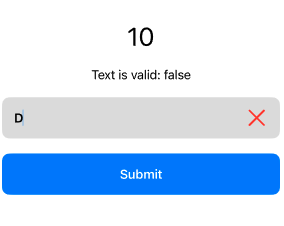

- example: using async/await

```swift
import SwiftUI
import Combine

@MainActor
class SubscriberVM: ObservableObject {
    @Published var count: Int = 0
    @Published var textFieldText: String = ""
    @Published var textIsValid: Bool = false
    @Published var showButton: Bool = false

    // Use Tasks instead of a cancellables set.
    private var timerTask: Task<Void, Never>?
    private var textTask: Task<Void, Never>?
    private var combinedTask: Task<Void, Never>?

    init() {
        startTimerTask()
        startTextTask()
        startCombinedTask()
    }

    deinit {
        timerTask?.cancel()
        textTask?.cancel()
        combinedTask?.cancel()
    }

    /// Uses async/await to update the count every second.
    func startTimerTask() {
        // Create a task that loops over timer events.
        timerTask = Task { [weak self] in
            // Create a timer publisher that publishes events every 1 second.
            let timerPublisher = Timer.publish(every: 1, on: .main, in: .common)
                .autoconnect()

            // Loop over the timer’s asynchronous values.
            for await _ in timerPublisher.values {
                // If the task is canceled, exit the loop.
                if Task.isCancelled { break }

                // Update count on the main actor.
                self?.count += 1

                // Break the loop if count reaches 10.
                if self?.count ?? 0 >= 10 {
                    break
                }
            }
        }
    }

    /// Uses async/await to update text validity whenever the textFieldText changes.
    func startTextTask() {
        textTask = Task { [weak self] in
            guard let self = self else { return }
            // Iterate over asynchronous textFieldText changes.
            for await newText in self.$textFieldText.values {
                let isValid = newText.count > 3
                self.textIsValid = isValid
            }
        }
    }

    /// Uses async/await to combine the textIsValid and count publishers.
    func startCombinedTask() {
        // Create a combined publisher using Combine’s `combineLatest`.
        let publisher = $textIsValid.combineLatest($count)

        combinedTask = Task { [weak self] in
            guard let self = self else { return }
            // Loop over the combined publisher's asynchronous values.
            for await (isValid, count) in publisher.values {
                // Show the button only if textIsValid is true and count is at least 10.
                self.showButton = isValid && count >= 10
            }
        }
    }
}

struct SubscriberExample: View {
    @StateObject private var vm = SubscriberVM()

    var body: some View {
        VStack(spacing: 20) {
            Text("\(vm.count)")
                .font(.largeTitle)

            Text("Text is valid: \(vm.textIsValid.description)")
                .font(.headline)

            TextField("Type here...", text: $vm.textFieldText)
                .padding()
                .frame(height: 55)
                .font(.headline)
                .background(Color(hue: 1.0, saturation: 0.0, brightness: 0.875))
                .clipShape(RoundedRectangle(cornerRadius: 10))
                .overlay(
                    ZStack {
                        Image(systemName: "xmark")
                            .foregroundStyle(.red)
                            .opacity(vm.textFieldText.isEmpty ? 0.0 : (vm.textIsValid ? 0.0 : 1.0))

                        Image(systemName: "checkmark")
                            .foregroundStyle(.green)
                            .opacity(vm.textIsValid ? 1.0 : 0.0)
                    }
                    .font(.title)
                    .padding(.trailing),
                    alignment: .trailing
                )

            Button(action: {
                print("Submit success")
            }) {
                Text("Submit")
                    .font(.headline)
                    .foregroundStyle(.white)
                    .frame(height: 55)
                    .frame(maxWidth: .infinity)
                    .background(.blue)
                    .clipShape(RoundedRectangle(cornerRadius: 10))
            }
            .disabled(!vm.showButton)
        }
        .padding()
    }
}

#Preview {
    SubscriberExample()
}
```

# 7. File Management and Image Caching

## 7.1 Saving Data and Images with FileManager

FileManager is a powerful, built‑in API in the Foundation framework that lets you work with files and directories on the file system. It's commonly used to read, write, move, copy, or delete files in your app's sandbox (for example, the Documents or Caches directories).

- **Accessing Directories**  
  You often work with directories like:
  
  - **Documents Directory:** Use this for user-generated content that should persist between app launches.
  
  - **Caches Directory:** Use this for transient data that can be recreated (e.g., downloaded images).

- **Listing Contents**  
  FileManager can list the contents of a directory with methods like `contentsOfDirectory(at:includingPropertiesForKeys:)`.

- **Creating, Writing, and Reading Files**  
  You can write to a file by creating a URL for where you want to save it, then writing data (or a string) to that URL. Similarly, you can read from a file using the appropriate API.

- **Copying, Moving, and Deleting Files**  
  Methods like `copyItem(at:to:)`, `moveItem(at:to:)`, and `removeItem(at:)` allow you to manipulate files and directories.

| Feature                | FileManager                                                                                              | Core Data                                                                                                         |
| ---------------------- | -------------------------------------------------------------------------------------------------------- | ----------------------------------------------------------------------------------------------------------------- |
| Explain                | A low-level API that lets you work directly with files and folders (like `.txt`, `.json`, `.png`, etc.). | An Apple framework for working with structured, relational, persistent data. Think of it like an object database. |
| Use for                | Saving raw files (text, image, JSON, documents...) manually                                              | Managing models/objects with relationships, querying, updating, deleting.                                         |
| Data format            | text, JSON, codable, binary, images                                                                      | Uses SQLite under the hood (by default).                                                                          |
| persistence / Querying | YES, you write/read/delete files yourself using file paths                                               | Powerful — filter, sort, relationships (like SQL).                                                                |
| structure              | Unstructured — no schema or relationships.                                                               | Strongly structured using entity models (like classes).                                                           |
| export/import          | Easy to integrate with Files app (via `.fileExporter`, `.fileImporter`).                                 | Not natively easy like FileManager (but can serialize to JSON).                                                   |
| best for               | User-generated files, logs, exportable data, temporary caches, media.                                    | Apps with models like users, items, projects, etc.                                                                |
| not good for           | Complex object graphs, large datasets, querying/filtering/searching.                                     | Files, documents, exporting user data to filesystem.                                                              |

summary: 

- You store the **metadata** in Core Data (e.g. filename, date)

- And store the **actual file** (e.g. image, video) using FileManager.

---

- example: store the data inside example.txt file and export to file app

```swift
import SwiftUI
import UniformTypeIdentifiers

class FileManagerViewModel: ObservableObject {
    let fileName = "example.txt"

    var fileURL: URL {
        FileManager.default.urls(for: .documentDirectory, in: .userDomainMask)[0].appendingPathComponent(fileName)
    }

    func saveToFile(_ text: String) {
        do {
            try text.write(to: fileURL, atomically: true, encoding: .utf8)
            print("File saved!")
        } catch {
            print("Error saving file: \(error)")
        }
    }

    func loadFromFile() -> String {
        do {
            let text = try String(contentsOf: fileURL, encoding: .utf8)
            return text
        } catch {
            print("Error loading file: \(error)")
            return "Failed to load"
        }
    }

    func deleteFile() {
        do {
            try FileManager.default.removeItem(at: fileURL)
            print("File deleted!")
        } catch {
            print("Error deleting file: \(error)")
        }
    }
}

struct FileManagerView: View {
    @StateObject private var vm = FileManagerViewModel()
    @State private var textInput = ""
    @State private var fileContent = ""
    @State private var isExporting = false

    var body: some View {
        VStack(spacing: 20) {
            TextField("Type something...", text: $textInput)
                .textFieldStyle(.roundedBorder)
                .padding()

            Button("Save") {
                vm.saveToFile(textInput)
            }

            Button("Load") {
                fileContent = vm.loadFromFile()
            }

            Button("Delete") {
                vm.deleteFile()
                fileContent = ""
            }

            Button("Download example.txt") {
                isExporting = true
            }

            Text("Loaded: \(fileContent)")
                .padding()
        }
        .padding()
        .fileExporter(
            isPresented: $isExporting,
            document: TextFileDocument(url: vm.fileURL),
            contentType: .plainText,
            defaultFilename: "example"
        ) { result in
            switch result {
            case .success(let url):
                print("Exported to:", url)
            case .failure(let error):
                print("Export error:", error)
            }
        }
    }
}

struct TextFileDocument: FileDocument {
    static var readableContentTypes: [UTType] { [.plainText] }

    var text: String

    init(text: String) {
        self.text = text
    }

    init(url: URL?) {
        if let url, let content = try? String(contentsOf: url, encoding: .utf8) {
            self.text = content
        } else {
            self.text = ""
        }
    }

    func fileWrapper(configuration: WriteConfiguration) throws -> FileWrapper {
        let data = text.data(using: .utf8) ?? Data()
        return .init(regularFileWithContents: data)
    }

    init(configuration: ReadConfiguration) throws {
        if let data = configuration.file.regularFileContents,
           let content = String(data: data, encoding: .utf8) {
            self.text = content
        } else {
            throw CocoaError(.fileReadCorruptFile)
        }
    }
}


#Preview {
    FileManagerView()
}

```

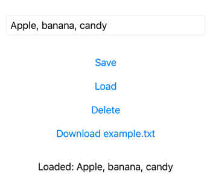

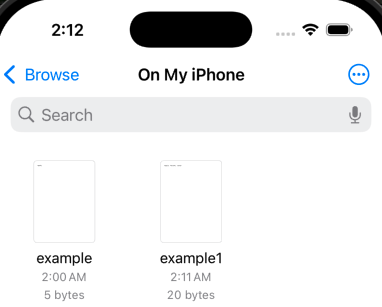

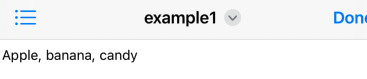

- example: create/delete folder to save images (image first stored in <u>Assets</u>)

```swift
import SwiftUI

class LocalFileManager {

    static let instance = LocalFileManager()
    let folderName = "Myapp_image"

    init() {
        createFolder()
    }

    func createFolder() {
        guard
            let cachesDirectory = FileManager.default.urls(
                for: .cachesDirectory, in: .userDomainMask
            ).first
        else {
            print("Failed to get caches directory.")
            return
        }

        let folderURL = cachesDirectory.appendingPathComponent(folderName)

        if !FileManager.default.fileExists(atPath: folderURL.path) {
            do {
                try FileManager.default.createDirectory(
                    atPath: folderURL.path, withIntermediateDirectories: true,
                    attributes: nil)
                print("success creating folder: \(folderURL.path)")
            } catch let error {
                print("error creating folder. \(error)")
            }
        }
    }

    func deleteFolder() {
        guard
            let cachesDirectory = FileManager.default.urls(
                for: .cachesDirectory, in: .userDomainMask
            ).first
        else {
            print("Failed to get caches directory.")
            return
        }

        let folderURL = cachesDirectory.appendingPathComponent(folderName)
        if FileManager.default.fileExists(atPath: folderURL.path) {
            do {
                // Using the URL-based removeItem method
                try FileManager.default.removeItem(at: folderURL)
                print("Successfully deleted folder at \(folderURL.path)")
            } catch {
                print("Error deleting folder: \(error)")
            }
        } else {
            print("Folder does not exist. Nothing to delete.")
        }
    }

    func saveImage(image: UIImage, name: String) -> String {

        guard let data = image.jpegData(compressionQuality: 1.0),
            let path = getPathImage(name: name)
        else {
            print("error get data")
            return "error get data"
        }

        // three common ways (.first to remove [])
        //        let directory = FileManager.default.urls(for: .documentDirectory, in: .userDomainMask)
        //        let directory2 = FileManager.default.urls(for: .cachesDirectory, in: .userDomainMask).first
        //        let directory3 = FileManager.default.temporaryDirectory

        do {
            try data.write(to: path)
            print("success saving")
            return "success saving"
        } catch let error {
            print("error saving: \(error)")
            return "error saving: \(error)"
        }

    }

    func getImage(name: String) -> UIImage? {
        guard let path = getPathImage(name: name)?.path,
            FileManager.default.fileExists(atPath: path)
        else {
            print("error get path.")
            return nil
        }
        return UIImage(contentsOfFile: path)
    }

    func getPathImage(name: String) -> URL? {
        guard
            let path = FileManager
                .default
                .urls(for: .cachesDirectory, in: .userDomainMask)
                .first?
                .appendingPathComponent("\(name).jpg")
        else {
            print("error getting path")
            return nil
        }
        return path
    }

    func deleteImage(name: String) -> String {
        guard let path = getPathImage(name: name),
            FileManager.default.fileExists(atPath: path.path)
        else {
            print("error get path.")
            return "error get path"
        }
        do {
            try FileManager.default.removeItem(at: path)
            print("delete success")
            return "delete success"
        } catch let error {
            print("error delete: \(error)")
            return "error delete: \(error)"
        }
    }
}

class FileManagerVM: ObservableObject {

    @Published var image: UIImage? = nil
    let imageName: String = "rocky_mountain1"

    let manager = LocalFileManager.instance

    @Published var infomessage: String = ""

    init() {
        //getImageFromFM()
        getImage()
    }

    func getImage() {
        image = UIImage(named: imageName)
    }

    func getImageFromFM() {
        image = manager.getImage(name: imageName)
    }

    func saveImage() {
        guard let image = image else { return }
        infomessage = manager.saveImage(image: image, name: imageName)
    }

    func deleteImage() {
        infomessage = manager.deleteImage(name: imageName)
        manager.deleteFolder()
    }

}

struct FileManagerExample2: View {

    @StateObject var vm = FileManagerVM()

    var body: some View {
        NavigationStack {
            VStack {
                if let image = vm.image {
                    Image(uiImage: image)
                        .resizable()
                        .scaledToFill()
                        .frame(width: 200, height: 200)
                        .clipped()
                        .clipShape(RoundedRectangle(cornerRadius: 10))
                }

                Button {
                    vm.saveImage()
                } label: {
                    Text("save to FM")
                        .font(.headline)
                        .foregroundStyle(.white)
                        .padding()
                        .padding(.horizontal)
                        .background(Color.blue)
                        .clipShape(RoundedRectangle(cornerRadius: 10))
                }

                Button {
                    vm.deleteImage()
                } label: {
                    Text("delete to FM")
                        .font(.headline)
                        .foregroundStyle(.white)
                        .padding()
                        .padding(.horizontal)
                        .background(Color.red)
                        .clipShape(RoundedRectangle(cornerRadius: 10))
                }

                Text(vm.infomessage)
                    .font(.headline)
                    .foregroundStyle(.purple)

                Spacer()
            }
            .navigationTitle("File Manager")
        }
    }
}

#Preview {
    FileManagerExample2()
}

```

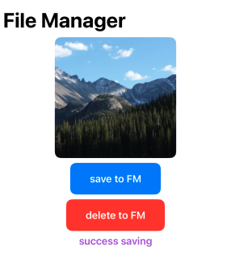


## 7.2 Saving and Caching Images

- example: (save image to cache and delete it from cache)

```swift
import SwiftUI

class CacheManager {
    
    static let instance = CacheManager()
    private init() {
        
    }
    
    var imageCache: NSCache<NSString, UIImage> = {
        let cache = NSCache<NSString, UIImage>()
        cache.countLimit = 100
        cache.totalCostLimit = 1024 * 1024 * 100 // 100 MB
        return cache
    }()
    
    func add(image: UIImage, name: String) {
        imageCache.setObject(image, forKey: name as NSString)
        print("add to cache")
    }
    
    func delete(name: String) {
        imageCache.removeObject(forKey: name as NSString)
        print("delete from cache")
    }
    
    func get(name: String) -> UIImage? {
        return imageCache.object(forKey: name as NSString)
    }

}

class CacheVM: ObservableObject {
    
    @Published var startingImage: UIImage? = nil
    @Published var cacheImage: UIImage? = nil
    let imageName: String = "rocky_mountain0"
    let manager = CacheManager.instance
    
    
    init() {
        getImageFromAsserts()
    }
    
    func getImageFromAsserts() {
        startingImage = UIImage(named: imageName)
    }
    
    func saveToCache() {
        guard let image = startingImage else { return }
        manager.add(image: image, name: imageName)
    }
    
    func deleteFromCache() {
        manager.delete(name: imageName)
    }
    
    func getFromCache() {
        cacheImage = manager.get(name: imageName)
    }
}

struct FileManagerNSCache:View {
    
    @StateObject private var vm = CacheVM()
    
    var body: some View {
        NavigationStack {
            VStack {
                Image("rocky_mountain0")
                    .resizable()
                    .scaledToFill()
                    .frame(width: 200, height: 200)
                    .clipped()
                    .clipShape(RoundedRectangle(cornerRadius: 10))
                
                Button {
                    vm.saveToCache()
                } label: {
                    Text("save to cache")
                        .font(.headline)
                        .foregroundStyle(.white)
                        .padding()
                        .background(Color.blue)
                        .clipShape(RoundedRectangle(cornerRadius: 10))
                }
                
                Button {
                    vm.deleteFromCache()
                } label: {
                    Text("delete from cache")
                        .font(.headline)
                        .foregroundStyle(.white)
                        .padding()
                        .background(Color.red)
                        .clipShape(RoundedRectangle(cornerRadius: 10))
                }
                
                Button {
                    vm.getFromCache()
                } label: {
                    Text("get from cache")
                        .font(.headline)
                        .foregroundStyle(.white)
                        .padding()
                        .background(Color.green)
                        .clipShape(RoundedRectangle(cornerRadius: 10))
                }
                
                if let image = vm.cacheImage {
                    Image(uiImage: image)
                        .resizable()
                        .scaledToFill()
                        .frame(width: 200, height: 200)
                        .clipped()
                        .clipShape(RoundedRectangle(cornerRadius: 10))
                }
                
                Spacer()

            }
            .navigationTitle("Cache image")
        }
    }
}

#Preview {
    FileManagerNSCache()
}

```

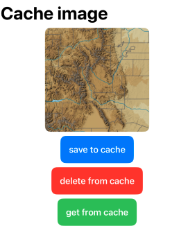


## 7.3 Downloading and Saving Images using FileManager and NSCache

Knowledge: 

1. background threads

2. weak self

3. Combine

4. Publishers and Subscribers

5. FileManager

6. NSCache

7. Codable

Note: JSON placeholder photos not exist

```swift
// model 
import Foundation

struct PhotoModel: Identifiable, Codable {
    let albumId: Int
    let id: Int
    let title: String
    let url: String
    let thumbnailUrl: String
}
```

```swift
// view 1
import SwiftUI

struct DownloadImageRow: View {

    let model: PhotoModel

    var body: some View {
        HStack {
            AsyncImage(url: URL(string: model.url)) { phase in
                switch phase {
                case .empty:
                    ProgressView()  // Loading indicator
                case .success(let image):
                    image
                        .resizable()
                        .scaledToFill()
                        .frame(width: 75, height: 75)
                        .clipShape(Circle())
                case .failure:
                    Image(systemName: "photo")  // Placeholder image on failure
                @unknown default:
                    EmptyView()
                }
            }
            VStack(alignment: .leading) {
                Text(model.title)
                    .font(.headline)
                Text(model.url)
                    .foregroundStyle(.gray)
                    .italic()
            }
            .frame(maxWidth: .infinity, alignment: .leading)
        }
    }
}
```

```swift
// view 2
import SwiftUI

struct DownloadingImages: View {
    
    @StateObject private var vm = DownloadImageVM()
    
    var body: some View {
        NavigationStack {
            List {
                ForEach(vm.dataArray) { model in
                    DownloadImageRow(model: model) 
                }
            }
            .navigationTitle("Downloading Images")
        }
        
    }
}


#Preview {
    DownloadingImages()
}
```

```swift
// viewmodel
import SwiftUI

@MainActor
class DownloadImageVM: ObservableObject {
    
    @Published var dataArray: [PhotoModel] = []
    
    let dataService = PhotoModelDataService.shared
    
    init() {
        Task {
            await self.fetchData()
            
        }
    }
    
    func fetchData() async {
        
        await dataService.downloadData()
        
        dataArray = dataService.photoModels
    }
}
```

```swift
// utilities

import Foundation

@MainActor
class PhotoModelDataService: ObservableObject {
    
    static let shared = PhotoModelDataService()
    
    @Published var photoModels: [PhotoModel] = []
    
    private init() {
        
    }
    
    func downloadData() async {
           guard let url = URL(string: "https://jsonplaceholder.typicode.com/photos") else {
               print("Invalid URL (Utilities/PhotoModelDataService/downloadData)")
               return
           }
           
           do {
               let (data, response) = try await URLSession.shared.data(from: url)
               guard let httpResponse = response as? HTTPURLResponse,
                     (200..<300).contains(httpResponse.statusCode) else {
                   throw URLError(.badServerResponse)
               }
               let decodedModels = try JSONDecoder().decode([PhotoModel].self, from: data)
               photoModels = decodedModels
           } catch {
               print("Error downloading data: \(error)")
           }
       }
    
}
```


# 8. Building Accessible Apps

Make sure your app is usable for Every Users

## 8.1 Accessibility: Dynamic Text

- example: 

```swift
import SwiftUI

struct AccessibleText: View {
    
    @Environment(\.dynamicTypeSize) private var dynamicTpyeSize
    var body: some View {
        NavigationStack {
            List {
                ForEach(0..<10) { _ in
                    VStack (alignment: .leading, spacing: 10) {
                        HStack {
                            Image(systemName: "heart.fill") // it usually auto scale
                                //.font(.system(size: 20)) // always 20 in all devices
                            Text("welcom to my app")
                        }
                        
                        Text("this is some longer text that expands to multiple lines.")
                            .font(.subheadline)
                            .frame(maxWidth: .infinity, alignment: .leading)
                            .lineLimit(3)
                            .minimumScaleFactor(dynamicTpyeSize.customMinScaleFactor) // dynamic sizes with different dynamic types
                    }
                    .background(Color.yellow)
                }
            }
            .listStyle(PlainListStyle())
            .navigationTitle("Dynamic Text")
        }
    }
}

extension DynamicTypeSize {
    var customMinScaleFactor: CGFloat {
        switch self {
        case .xSmall, .small, .medium:
            return 1.0
        case .large, .xLarge, .xxLarge, .xxxLarge:
            return 0.8
        case .accessibility1, .accessibility2, .accessibility3, .accessibility4, .accessibility5:
            return 0.6
        @unknown default:
            // fallback for any future DynamicTypeSize cases
            return 1.0
        }
    }
}

#Preview {
    AccessibleText()
}
```

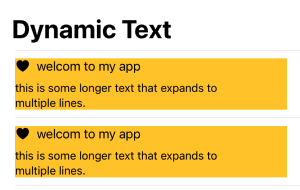

Note: 

1. try to avoid to use fix `.frame` in text

2. test in smallest and biggest texts in canvas

3. using "Dynamic Type Variants" to check it easier

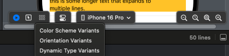


## 8.2 Accessibility: Dynamic Colors

WCAG 2.0 level AA requires a contrast ratio of at least `4.5:1` for normal text and `3:1` for large text. 

WCAG level AAA requires a contrast ratio of at least `7:1` for normal text and `4.5:1` for large text

how to find <u>Color Contrast Calculator</u> in Xcode? 

Xcode > open developer tool > Accessibility inspector 

Accessibility inspector > Window > show color contrast calculator

- Good: 

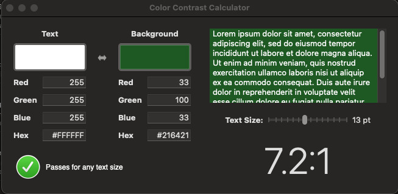

- bad: 

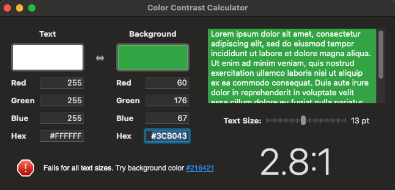

**Summary:** 

When designing the UI, ensure that the background color does not hinder readability.


## 8.3 Accessibility: Voice Over

Note: Need to use real device to test

- example: basic

```swift
import SwiftUI

struct VoiceOverExample: View {
    
    @State private var isActive: Bool = false
    
    var body: some View {
        NavigationStack {
            Form {
                Section {
                    Toggle("Volumn", isOn: $isActive)
                    
                    HStack {
                        Text("volumn")
                        Spacer()
                        
                        Text(isActive ? "ON" : "OFF")
                        
                    }
                    .accessibilityElement(children: .combine)
                    .accessibilityAddTraits(.isButton)
                    .accessibilityHint("Double tap to toggle setting.")
                    .onTapGesture {
                        isActive.toggle()
                    }
                } header: {
                    Text("preference")
                }
                
                Section {
                    
                    Button("Favorites") {
                        //
                    }
                    
                    Button {
                        //
                    } label: {
                        Image(systemName: "heart.fill")
                    }
                    
                    Text("Favorites")
                        .onTapGesture {
                            //
                        }

                } header: {
                    Text("Application")
                    
                }
                
                VStack {
                    Text("Content")
                        .frame(maxWidth: .infinity, alignment: .leading)
                        .foregroundStyle(.secondary)
                        .font(.caption)
                    
                    ScrollView(.horizontal, showsIndicators: false) {
                        HStack(spacing: 8) {
                            ForEach(0..<10) { x in
                                VStack {
                                    Image("rocky_mountain1")
                                        .resizable()
                                        .scaledToFill()
                                        .frame(width: 100, height: 100)
                                        .clipShape(RoundedRectangle(cornerRadius: 10))
                                    
                                    Text("Item\(x)")
                                }
                                .onTapGesture{
                                    //
                                }
                            }
                        }
                    }
                }
                
            }
            .navigationTitle("Settings")
        }
    }
}

#Preview {
    VoiceOverExample()
}

```
