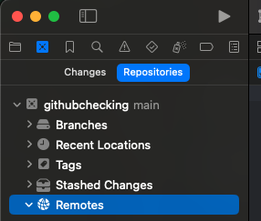
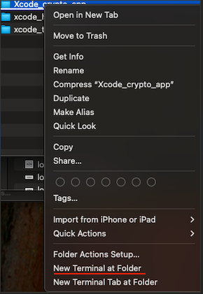

# 1. setup

Xcode part 1: 

1. go to Xcode(top menu bar) > setting

2. select "accounts" and log in your Github 

Github part 1: 

1. got to Settings > developer settings > personal access tokens > Tokens (classic) 

2. generate new token > generate new token (classic)

3. write down your "Note" for token and select expiration date (i use 1 year) and click all boxes

4. copy the code (must copy or you never see it again) > go to Xcode account (Github) > sign it into your Xcode (Xcode part1: 2)

Xcode part 2: 

1. go to "Source Control" > git > write down Author name and Author email (it will show in Commits when you push the code and also verify it is you) 

# 2. create new project

when you open a new project

Xcode part 1:

1. go to "Integrate"(top menu bar) > New git Repository 

2. Go to here: 
   
   

3. right click and select "New XXX Remote..." (XXX is your project name, such as `githubchecking` )

4. select Public or Private

Github part 1:

now you can see your new repository in your Github

# 3. download from Github

assume we don't have Xcode file in our local device

1. open Xcode app and select "Clone Git Repository"

2. find the repository you want to clone from your Github

# 4. push / pull / ignore file

`ignore file` is important to make sure some files will not disturb others local Xcode folder

1. Go to "Xcode" (top menu bar) > Settings > Source Control > Git

2. write down: `.xcuserdata/` and `.DS_Store` (**don't forget** "`.`")

when somebody wrote the code in the same repository, you should pull it to your project before push new code

you should add a commit to your code before push it to the repository

1. Go to "Integrate" (top menu bar) > Commits

2. when you finish commit press "Stage All"

3. when you press "Stage All" you can press "Commit"

4. Then press "Push"

How to push or pull? (bonus)

1. Go to "Integrate" (top menu bar) > Push... / Pull...

2. then just push or pull

# Bonus:

```textile
create a new repository or change project to new repository
```

1. create a new repository in your Github. (name: e.g. `yournewrepository`) (**Do not** initialize with a README and .gitignore and License)

2. go to your project folder > right click > select "new terminal at folder"
   
   

3. write in terminal: `git init`

4. write in terminal:`touch .gitignore` (create .gitignore file)

5. write in terminal: `open -a Xcode .gitignore` 

6. copy and paste to `.gitignore` file

```bash
# macOS metadata
.DS_Store

# Xcode user settings
*.xcuserstate
*.xcscmblueprint
*.xccheckout
*.moved-aside
*.xcuserdatad
*.xcuserdata/
*.xcworkspace/xcuserdata/

# Derived data & build
DerivedData/
build/
Build/
*.hmap
*.ipa
*.app

# Swift Package Manager
.swiftpm/
.build/
Package.resolved

# Carthage
Carthage/Build/

# CocoaPods
Pods/
Podfile.lock

# Fastlane
fastlane/report.xml
fastlane/screenshots
fastlane/test_output
fastlane/tmp

# Xcode project index
.idea/
*.xcworkspace/xcshareddata/WorkspaceSettings.xcsettings

# Simulator logs
core_simulator_device.log

# Archives
*.xcarchive

# Playgrounds
timeline.xctimeline
playground.xcworkspace

# Firebase / GoogleService Info
GoogleService-Info.plist

# Core Data
*.sqlite
*.sqlite-wal
*.sqlite-shm
```

6. when finish copy and paste close the file 

7. write in terminal: `git add .`

8. write in terminal: `git commit -m "Initial commit"` (note: you can customize commit content)

9. write in terminal: `git remote add origin https://github.com/your-username/yournewrepository.git` (**NOTE: customize your url**)

10. write in terminal: `git branch -M main`

11. write in terminal: `git push -u origin main`

You’re Done! 🎉

BUT: sometimes the folder: `xcuserdata/someone.xcuserdatad/xcschemems` still exist

you can manually delete it in your repository (under `yourprojectname.xcodeproj`) and in your Xcode, pull one time before push new code. 
